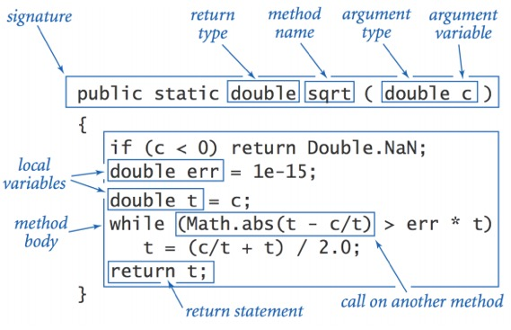
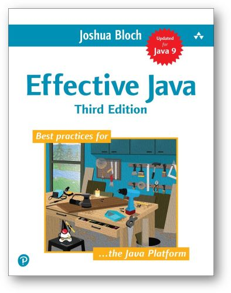

class: center, middle

# Въведение в Java

13.10.2021

---

### Какво е Java?

- Език за програмиране
- Java компилатор
- Java виртуална машина (JVM)
- Java Development Kit (JDK)
  - Java Runtime Environment (JRE)
- Java платформа

---

### Java Editions

- Java Edition е вариация на Java платформата (JDK-то), асемблирана за различна цел
  - Java Platform Standard Edition (Java SE)
  - Java Platform Enterprise Edition (Java EE)
  - Java Platform Micro Edition (Java ME)
      - vs. Android SDK
  - Java Card

---

### JDK инструменти

- Основни
  - javac
  - java
- Допълнителни
  - jshell 
  - javadoc
  - jar
  - ...

---

### Java: най-популярните IDE-та

- IntelliJ IDEA
- Eclipse
- NetBeans

---

### Езикът Java

- Създаден през 1995 от James Gosling (Sun Microsystems)
- Актуална версия: Java 17 (released 14.09.2021)


---

### Езикът Java

- Обектно-ориентиран
- Със C/C++ синтаксис
- "Write once, run anywhere"

---

### Hello world!

```java
public class HelloWorldApp {
    public static void main(String[] args) {
        System.out.println("Hello world!");
    }
}
```

<br>

```bash
$ javac HelloWorldApp.java
$ java HelloWorldApp
Hello world!
```

---

### Стандартно Java приложение

.center[


]

---

### Java виртуалната машина (JVM)

- Интерпретира и изпълнява byte код инструкции
- Компилира по време на изпълнението byte кода до машинен код
- Заделя памет за оперативните данни
- Автоматично изчиства паметта
- Зарежда класове
- Стартира нишки
- Взаимодейства с операционната система

---

### Ще започнем с езика Java от...

- Tиповете данни
- Оператори, изрази, statements
- Условия и разклонения
- Итерация / Цикли
- Низове и операции с тях
- Масиви
- Функции

---

### Tипове данни и променливи

- Тип данни == множество стойности + операции върху тях
- Java е статично типизиран език → всички променливи трябва да бъдат декларирани, преди да бъдат използвани, и типът на дадена променлива се фиксира в декларацията ѝ и не може да се променя
- Декларацията включва името и типа, и може да е съчетана (или не) с инициализация

---

### Tипове данни и променливи

.center[]

---

### Tипове данни

- Примитивни типове
  - Булев (boolean) тип
  - Числени (numeric) типове
      - Целочислени (integral) типове
      - Типове за числа с плаваща запетая (floating-point)
- Reference типове

---

### Примитивни типове данни

| Тип данни | Размер  | Минимум         | Максимум                   |
| :-------- | :------ | :-------------- | :------------------------- |
| boolean   | -       | -               | -                          |
| byte      | 8 бита  | -128            | +127                       |
| char      | 16 бита | Unicode 0       | Unicode 2<sup>16</sup> - 1 |
| short     | 16 бита | -2<sup>15</sup> | +2<sup>15</sup> - 1        |
| int       | 32 бита | -2<sup>31</sup> | +2<sup>31</sup> - 1        |
| long      | 64 бита | -2<sup>63</sup> | +2<sup>63</sup> - 1        |
| float     | 32 бита | IEEE754         | IEEE754                    |
| double    | 64 бита | IEEE754         | IEEE754                    |
| void      | -       | -               | -                          |

---

### Минимална и максимална стойност на примитивните типове

```java
Byte.MIN_VALUE // -128
Byte.MAX_VALUE // 127
Short.MIN_VALUE // -32768
Short.MAX_VALUE // 32767
Integer.MIN_VALUE // -2147483648
Integer.MAX_VALUE // 2147483647
Long.MIN_VALUE // -9223372036854775808
Long.MAX_VALUE // 9223372036854775807
(int) Character.MIN_VALUE // 0
(int) Character.MAX_VALUE // 65535
```
---

### Типът char

- цяло число без знак
- стойност (*code point*) от 0 до 65535 включително
- представя Unicode символ
- може да участва в аритметични операции (със своя code point)

---

### Типът char

| Code point | Unicode escape | Печатна репрезентация | Описание                  |
| ---------- | -------------- | --------------------- | :------------------------ |
| 33         | \u0021         | !                     | Символ за удивителна      |
| 50         | \u0032         | 2                     | Цифра 2                   |
| 65         | \u0041         | A                     | Главна латинска буква 'A' |

---

### Литерали на примитивните типове

```java
int i = 1;           // int by default
long l = 1L;         // L or l
double d = 0.1;      // d or D is optional
double d2 = 1e-1;    // same, in scientific
float f = 0.1;       // will not compile, why?
char c = 'A';
char c2 = '\u0041';  // again, 'A'
```

---

### Целочислени литерали

```java
// The number 26, in decimal
int decVal = 26;

// The number 26, in hexadecimal
int hexVal = 0x1a;

// The number 26, in binary
int binVal = 0b11010;

// The number 26, in octal
int octVal = 032;
```

---

### Литерали с подчертавка: syntactic sugar

```java
int thousand = 1_000;
int million  = 1_000_000;
long magic   = 0xCAFE_BABE;
int one      = 0b1;
int mask     = 0b1010_1010_1010;
```

---

### Стойности по подразбиране

Компилаторът **не** присвоява стойности по подразбиране на неинициализираните локални променливи!

---

### Стойности по подразбиране

| Тип данни        | Стойност по подразбиране |
| :--------------- | :----------------------- |
| boolean          | false                    |
| short            | 0                        |
| int              | 0                        |
| long             | 0L                       |
| float            | 0.0f                     |
| double           | 0.0d                     |
| char             | '\u0000'                 |
| Reference типове | null                     |

---

### Конвертиране на типовете

- Имплицитно - без загуба на точност
- Експлицитно - чрез cast

<br>

| Израз             | Тип на израза | Стойност на израза |
| :---------------- | :------------ | :----------------- |
| "1234" + 99       | String        | "123499"           |
| (int) 2.71828     | int           | 2                  |
| 11 \* 0.3         | double        | 3.3                |
| (int) 11 \* 0.3   | double        | 3.3                |
| 11 \* (int) 0.3   | int           | 0                  |
| (int) (11 \* 0.3) | int           | 3                  |

---

### Защо ни трябват типове?

- За да ни помага компилаторът в откриването на грешки


.font-xs[През 1996, ракетата Ариана 5 експлодира след излитане поради софтуерна грешка в конвертирането на типове (опит да „набута“ 64-битово число в 16 бита).]

---

<table style="width:100%">
  <tr>
    <th style="width:50%; font-size:1.3em;">Оператори</th>
    <th style="width:50%; font-size:1.3em;">Приоритет</th>
  </tr>
  <tr style="font-size:0.7em; text-align: left;">
    <td>postfix</td>
    <td>expr++ expr--</td>
  </tr>
  <tr style="font-size:0.7em; text-align: left;">
    <td>unary</td>
    <td>++expr --expr +expr -expr ~ !</td>
  </tr>
  <tr style="font-size:0.7em; text-align: left;">
    <td>multiplicative</td>
    <td>\* / %</td>
  </tr>
  <tr style="font-size:0.7em; text-align: left;">
    <td>additive</td>
    <td>+ -</td>
  </tr>
  <tr style="font-size:0.7em; text-align: left;">
    <td>shift</td>
    <td><< >> >>></td>
  </tr>
  <tr style="font-size:0.7em; text-align: left;">
    <td>relational</td>
    <td>< > <= >= instanceof</td>
  </tr>
  <tr style="font-size:0.7em; text-align: left;">
    <td>equality</td>
    <td>== !=</td>
  </tr>
  <tr style="font-size:0.7em; text-align: left;">
    <td>bitwise AND</td>
    <td>&</td>
  </tr>
  <tr style="font-size:0.7em; text-align: left;">
    <td>bitwise exclusive OR</td>
    <td>^</td>
  </tr>
  <tr style="font-size:0.7em; text-align: left;">
    <td>bitwise inclusive OR</td>
    <td>|</td>
  </tr>
  <tr style="font-size:0.7em; text-align: left;">
    <td>logical AND</td>
    <td>&&</td>
  </tr>
  <tr style="font-size:0.7em; text-align: left;">
    <td>logical OR</td>
    <td>||</td>
  </tr>
  <tr style="font-size:0.7em; text-align: left;">
    <td>ternary</td>
    <td>? :</td>
  </tr>
  <tr style="font-size:0.7em; text-align: left;">
    <td>assignment</td>
    <td>= += -= *= /= %= &= ^= |= <<= >>= >>>=</td>
  </tr>
</table>

---

### Scoping

```java
{
    int x = 12;
    // Only x available
    {
        int q = 96;
        // Both x & q available
    }
    // Only x available
    // q is "out of scope" 
}

```

---

### Wrapper types

- Представляват референтни аналози на примитивните типове
- Използват се
    - където синтаксисът на езика изисква обект, а не примитивен тип
    - когато ни трябват константи или помощни функции, които са имплементирани в съответния wrapper клас
- имплицитно се конвертират към съответния си примитивен тип, и обратно

---

### Примитивни типове и wrapper типове

| Тип данни | Размер  | Минимум         | Максимум                   | Wrapper   |
| :-------- | :------ | :-------------- | :--------------------------| :-------- |
| boolean   | -       | -               | -                          | Boolean   |
| char      | 16 бита | Unicode 0       | Unicode 2<sup>16</sup> - 1 | Character |
| byte      | 8 бита  | -128            | +127                       | Byte      |
| short     | 16 бита | -2<sup>15</sup> | +2<sup>15</sup> - 1        | Short     |
| int       | 32 бита | -2<sup>31</sup> | +2<sup>15</sup> - 1        | Integer   |
| long      | 64 бита | -2<sup>63</sup> | +2<sup>63</sup> - 1        | Long      |
| float     | 32 бита | IEEE754         | IEEE754                    | Float     |
| double    | 64 бита | IEEE754         | IEEE754                    | Double    |
| void      | -       | -               | -                          | Void      |

---

### Константи и utility методи във wrapper типовете

```java
Integer.MAX_VALUE // максималната стойност на типа
Integer.MIN_VALUE // минималната стойност на типа
Integer.valueOf(25) // връща Integer инстанция, "опаковаща" 25
Integer.intValue() // връща int стойността, "опакована" в дадената инстанция
Integer.parseInt(String) // конвертира низ с текстово представяне на цяло число към int
```

---

### Autoboxing

```java
// инициализиране на променлива от тип char с литерал
char c = 'a';

// инициализирне на Character обект с литерал
Character ch1 = new Character('a');

// autoboxing: char implicitly converted to Character
Character ch2 = 'x';

// wrapper to primitive conversion
char c2 = ch1;
```

---

### Низове в Java

- Низовете са reference тип, а не примитивен
- Инстанции са на `String` класа
- Immutable са: всяка промяна води до създаване на нов `String` обект, а старият остава непроменен

---

### Низовете в паметта: string pool vs heap

- `String` литералите се създават в специална област на паметта на JVM-a, наречена *string pool*
- При опит за добавяне на низ в string pool-a, ако там вече съществува низ със същото съдържание, не се създава нов обект, а се връща референция към съществуващия (→ пести се памет)

---

### Низовете в паметта: string pool vs heap

- `String` обектите, създадени с оператора `new`, се създават в динамичната памет (heap-a). Всеки низ в heap-a е отделна инстанция, дори съдържанието на два и повече низа да е идентично
- `String` обект може да се прехвърли от heap-a в string pool-a чрез извикване на метода му `intern()`

---

### Сравняване на низове

- Сравняването на низове с `==` е сравнение на съответните референции
- Сравняването на низове за идентичност като съдържание се прави с метода `equals()` на `String` класа

---

### Низовете в паметта: string pool vs heap

```java
String literalOne = "FMI"; // goes to the string pool
String literalTwo = "FMI"; // "FMI" is present in the String pool ->
                           // literalTwo will refer to the same object

System.out.println(literalOne == literalTwo); // true

String newString = new String("FMI"); // new object in the heap

System.out.println(literalOne == newString); // false
System.out.println(literalOne.equals(newString)); // true

String intern = newString.intern(); // adds the string to the pool
                                    // and returns a reference to it
System.out.println(literalOne == newString); // false, newString
                                             // is not reassigned
System.out.println(literalOne == intern); // true
```

---

### Низове - литерали, конкатениране

```java
String language = "Java";
String tbd = null;
String message = "I <3 " + language;
String year = "The current year is " + 2021;
```

---

### Многоредови низови литерали

```java
// multi-line string literals before
String html = "<html>\n" +
              "    <body>\n" +
              "        <p>Hello world!</p>\n" +
              "    <body>\n" +
              "</html>\n";

// new in Java 15: text blocks for multi-line string literals
String html = """
                       <html>
                           <body>
                               <p>Hello world!</p>
                           </body>
                       </html>
              """;
```

---

### Низове - обхождане

```java
String s = "Firebird";
char ic = s.charAt(i);
char[] ca = s.toCharArray();

for (int i = 0; i < ca.size(); i++) {...}
for (char c : ca) {...} // enhanced for-loop, a.k.a. for-each

Arrays.sort(ca);
String sorted = String.valueOf(ca); // "Fbdeiirr"
```

---

### String.split()

```java
String str1 = "Current year is 2021";

String[] tokens = str1.split(" "); // разделител – интервал

// tokens = ["Current", "year", "is", "2021"]

int year = Integer.parseInt(tokens[3]); 
// year == 2021
```

---

### Други операции с низове

Класът `String` има още много методи, реализиращи операции, които ще ни потрябват.
Разгледайте ги в [документацията](https://docs.oracle.com/en/java/javase/17/docs/api/java.base/java/lang/String.html) на класа.

---

### Mutable низове

Когато имаме нужда от mutable низове, т.е. такива, промяната на които да не води до създаване на нова инстанция, вместо `String` трябва да използваме класовете `StringBuilder` или `StringBuffer`.

<br>

| Class name    | Mutable | Performant        | Thread-safe |
| :------------ | :------ | :---------------- | :---------- |
| String        | no      | slow, if modified | yes         |
| StringBuilder | yes     | fast              | no          |
| StringBuffer  | yes     | slower            | yes         |

---

### Local variable type inference

```java
// since Java 10
var message = "FMI rulez!"; // local variable type inference

message = "Cool"; // variable can be reassigned

message = 1; // will not compile: type is fixed upon declaration
             // and cannot change

var mystery; // will not compile: type cannot be inferred
             // without initializer
```

---

### Булеви константи

- `true` или `false`
- За разлика от С/С++, не може да се използва число вместо булев израз

---

### Булеви логически оператори

```
|    the OR operator
&    the AND operator
^    the XOR operator
!    the NOT operator
||   the short-circuit OR operator
&&   the short-circuit AND operator
==   the EQUAL TO operator
!=   the NOT EQUAL TO operator
```

---

### Булеви логически оператори

<table style="width:100%">
  <tr style="text-align: left; background: #F0F0F0;">
    <th>A</th>
    <th>B</th>
    <th>A|B</th>
    <th>A&B</th>
    <th>A^B</th>
    <th>!A</th>
  </tr>
  <tr>
    <td>false</td>
    <td>false</td>
    <td>false</td>
    <td>false</td>
    <td>false</td>
    <td>true</td>
  </tr>
  <tr>
    <td>true</td>
    <td>false</td>
    <td>true</td>
    <td>false</td>
    <td>true</td>
    <td>false</td>
  </tr>
  <tr>
    <td>false</td>
    <td>true</td>
    <td>true</td>
    <td>false</td>
    <td>true</td>
    <td>true</td>
  </tr>
  <tr>
    <td>true</td>
    <td>true</td>
    <td>true</td>
    <td>true</td>
    <td>false</td>
    <td>false</td>
  </tr>
<table>

---

### if-else

```java
if (booleanExpression) {
    // statements
}

if (booleanExpression) {
    // statements
} else {
    // statements
}
```

---

### Операторът ? :

```java
// the only ternary (i.e. three-argument) operator in Java
condition ? statement1 : statement2

// the above is equivalent to
if (condition) {
    statement1
} else {
    statement2
}  
```

---

### Итерация - while

```java
while (booleanExpression) {
    statement
}
```

---

### Итерация - do-while

```java
do {
    statement
} while (booleanExpression);
```

---

### Итерация - for

```java
for (initialization; booleanExpression; step) {
    statement
}
```

---

### Безусловно разклонение на изпълнението

- `return [value]`
- `break [label]`
- `continue [label]`
- Няма `goto` (ключовата дума е запазена, но не е използвана)

---

### Switch

```java
switch (selector) {
    case value1 : statement; break; 
    case value2 : statement; break; 
    case value3 : statement; break; 
    // [... ]
    default: statement; 
}
```

---

### Подобрен `switch` (от Java 15)

```java
char ch = 'a';
int t;

// before
switch (ch) {
    case 'a'      : t = 1; break;
    case 'b', 'c' : t = 12; break;
    default       : t = 27;
}

// since Java 15
switch (ch) {
    case 'a'      -> t = 1;
    case 'b', 'c' -> t = 12;
    default       -> t = 27;
}
```

---

### Подобрен `switch` като израз (от Java 15)

```java
int z = switch (ch) {
    case 'a'      -> 1;
    case 'b', 'c' -> 12;
    default       -> 27;
};

int r = switch (ch) {
    case 'a' : yield 1;
    case 'b' : yield 12;
    default  : yield 27;
};
```

---

### Pattern matching for `switch` (Java 17 preview feature)

```java
String s = switch(obj) {
    case Integer i && i > 100 -> "It's an Integer > 100"; // "guarded pattern"
    case Integer i -> "It's an Integer";
    case String s -> "It's a String";
    case null -> "It's a null reference"; // able to handle null references
    default -> "It is none of the known data types";
};
```

---

### Масиви

.center[]

---

### Масиви

```java
int[] a;     // preferred syntax
int a[];     // also valid

// explicit initialization
// can be done only during declaration
int[] a = {1, 2, 3, 4};

int[] b = new int[7];
b.length;
```

---

### Масиви

- Декларация – не се заделя памет за елементите на масива
- Инициализация – заделя се памет за елементите на масива
- Масивите от примитивни типове се инициализират автоматично със стойността по подразбиране на съответния тип

---

### Многомерни масиви

```java
int[][] a;
a = new int[3][4];

int[][] b = {
    { 1, 0, 12, -1 },
    { 7, -3, 2, 5 },
    { -5, -2, 2, -9 },
};
```


---

### Многомерни масиви

```java
double[][] matrix = new double[7][];
// rows have not yet been created

for (int i = 0; i < 7; i++) {
    // Create row i with i + 1 elements.
    matrix[i] = new double[i+1];
}
```

---

### Операции с масиви

```java
System.arraycopy(src, srcPos, dest, destPos, length); // копиране

Arrays.equals(arr1, arr2); // проверка за еднаквост
Arrays.fill(arr, value); // запълване с дадена стойност
Arrays.toString(arr); // конвертиране в низ
```

---

### Операции с масиви

```java
Arrays.sort(arr); // сортиране
Arrays.sort(a, Collections.reverseOrder()); // сортиране в обратен ред
```

---

### Функции

.center[]

---

Писане на стандартния изход

```java
System.out.println("Something printed on the console");
```

<br>

Четене от стандартния вход

```java
import java.util.Scanner;
// [...]

Scanner sc = new Scanner(System.in);
String lineRead = sc.nextLine();

// [...]
```

---

.center[]

---

.center[]

---

## Въпроси?

.font-xl[.ri-github-fill.icon-inline[[fmi/java-course](https://github.com/fmi/java-course)]]

.font-xl[.ri-youtube-fill.icon-inline[[MJT2022](https://www.youtube.com/playlist?list=PLew34f6r0PxyUcIg370lv9jHDwFeMDa7e)]]
