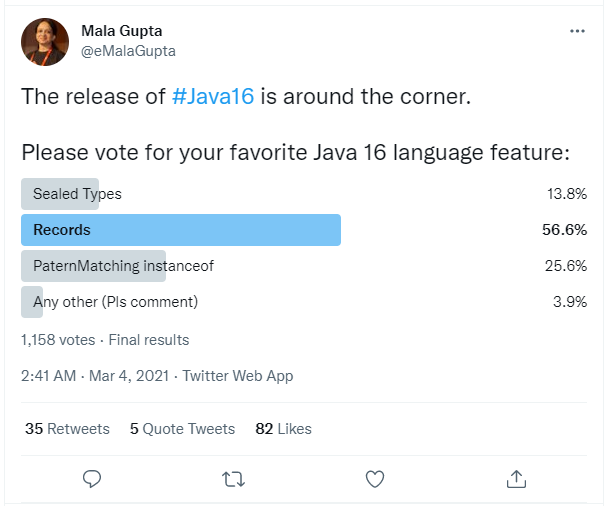

class: center, middle

# Обектно-ориентирано програмиране с Java

### Част II

27.10.2021

---

### Предната лекция говорихме за:

- Класове и обекти
- Абстрактни класове и интерфейси
- Фундаменталните ООП принципи
  - Енкапсулация
  - Наследяване
  - Полиморфизъм
  - Абстракция

---

### Днес ще разгледаме:

- Някои важни детайли
    - Предаване на аргументи
    - Stack vs. Heap
    - Създаване и инициализация на обектите
- Enums
- Records (от Java 16)
- Sealed класове и интерфейси (от Java 17)
- Изключения

---

### Предаване на аргументи в Java

- конструкторите и методите имат списък от (нула или повече) *параметри* (или *формални параметри*)
- параметрите са списък (наредена n-торка) от тип и име на параметъра
- при извикване на конструктора или метода, се подава списък от *аргументи* (или *фактически параметри*), които трябва да са съвместими като брой, подредба и тип със списъка параметри

---

### Предаване на примитивни типове като аргументи

Примитивните типове се предават по стойност, т.е. създават се техни копия и промяната на стойностите на параметрите вътре в конструктора или метода не се отразява на стойностите на променливите, подадени като аргументи.

---

### Предаване на примитивни типове като аргументи

```java
public class PassPrimitiveByValue {

    public static void main(String[] args) {
        int x = 3;
        // invoke passMethod() with 
        // x as argument
        passMethod(x);
        // print x to see if its 
        // value has changed
        System.out.println("After invoking passMethod(), x = " + x);
    }

    // change parameter in passMethod()
    public static void passMethod(int p) {
        p = 10;
    }

}
```

---

### Предаване на референтни типове като аргументи

Референтните типове (обекти, масиви) също се предават по стойност: референциите, подадени като аргументи, имат същата стойност (т.е. сочат към същото място в паметта), както и преди извикването.
Стойностите на член-данните на реферираните обекти обаче могат да се променят в метода, ако е налице необходимият достъп (в смисъл на енкапсулация) до тях.

---

### Предаване на референтни типове като аргументи

```java
public void moveCircle(Circle circle, int deltaX, int deltaY) {
    // code to move origin of circle to x+deltaX, y+deltaY
    circle.setX(circle.getX() + deltaX);
    circle.setY(circle.getY() + deltaY);
        
    // code to assign a new reference to circle
    circle = new Circle(0, 0);
}

// [...]

moveCircle(myCircle, 23, 56);
// myCircle reference remains unchanged,
// but coordinates of the referred circle are changed after the call
```

---

### Декларация vs. инициализация, stack vs. heap

```java
public class Person {
    int id;
    String name;

    public Person(int id, String name) {
        this.id = id;
        this.name = name;
    }
}
public class PersonBuilder {
    private static Person buildPerson(int id, String name) {
        return new Person(id, name);
    }

    public static void main(String[] args) {
        int id = 23;
        String name = "John";
        Person person = null;
        person = buildPerson(id, name);
    }
}
```

---

.center[]

---

### Характеристики на stack паметта

- автоматично се заделя при извикване на метод и освобождава при приключването му
- променливите в стека съществуват, докато трае изпълнението на метода, който ги е създал (като параметри и локални променливи)
- ако стек паметта се запълни, се хвърля `java.lang.StackOverFlowError`
- обикновенно е с по-малък размер от heap паметта
- достъпът до стек паметта е бърз в сравнение с достъпа до heap паметта

---

### Характеристики на heap паметта

- динамична памет за обекти и масиви
- заделя се явно с оператора `new` или неявно, и се освобождава от garbage collector-a
- новосъздаваните обекти стоят в heap-a, а референциите към тях - в stack-а
- ако heap паметта се запълни, се хвърля `java.lang.OutOfMemoryError`
- достъпът до heap паметта е по-бавен в сравнение с достъпа до stack паметта

---

### Създаване и инициализация на обектите

- член-променливите на даден клас се инициализират със стойността по подразбиране на дадения тип
- може да ги инициализираме явно, с присвояване, като част от декларацията им
  - това е подходящо, ако е с литерал или прост израз, но не и ако инициализацията има по-сложна логика, например включва обработка на грешки, завъртане на цикъл за масиви и т.н.
- нестатичните член-променливи могат да се инициализират и в конструкторите
- за статичните член-променливи обаче, няма такава възможност. Затова са измислени т.нар. инициализационни блокове (*initializers*)

---

### Initializer

- представлява блок код, който
  - не е свързан с име или тип данни
  - намира се в тяло на дефиниция на клас, но извън конструктор или метод
- в даден клас може да има нула, един или няколко инициализационни блока
- могат да се ползват за инициализация на член-данните на класа (статични и нестатични)
- алтернативата е, инициализационната логика да е отделена в методи

---

### Initializer

```java
public class InitializeMe {

    private int a;
    private static int b;

    static {
        // static initializer block
        b = 100;
    }

    {
        // initializer block
        a = 5;
    }

}
```

---

### Ред на инициализация на обектите

1. инициализират се статичните член-променливи и се изпълняват статичните инициализатори на базовия клас, в реда на срещането им в дефиницията на класа
2. инициализират се статичните член-променливи и се изпълняват статичните инициализатори на класа, в реда на срещането им в дефиницията му
3. изпълняват се инициализаторите на базовия клас, в реда на срещането им
4. изпълнява се конструкторът на базовия клас
5. изпълняват се инициализаторите на класа, в реда на срещането им
6. изпълнява се конструкторът на класа

---

class: center, middle

## Enums

---

### Enum

- Специален референтен тип (клас), представящ фиксирано множество от инстанции-константи
- Нарича се *enum(eration)*, защото инстанциите се дефинират чрез изброяване

---

### Enum

```java
public enum Day {
    SUNDAY,
    MONDAY,
    TUESDAY,
    WEDNESDAY,
    THURSDAY,
    FRIDAY,
    SATURDAY
}
```

---

### Enum

- Всеки `enum` неявно наследява абстрактния клас `java.lang.Enum`
  - не може да наследява явно друг клас, защото би било множествено наследяване
  - може да имплементира интерфейси
- Тялото на `enum` класа може да съдържа член-променливи и методи
- Ако има конструктор, той трябва да е package-private или `private`
- Той автоматично създава константите в дефиницията на `enum`-a. Не може да се извиква явно

---

### Enum

```java
public class EnumExample {
    private Day day;
    
    public EnumExample(Day day) { this.day = day; }

    public void tellItLikeItIs() {
        String message = switch (day) {
            case MONDAY -> "Mondays are bad.";
            case FRIDAY -> "Fridays are better.";
            case SATURDAY, SUNDAY -> "Weekends are best.";
            default -> "Midweek days are so-so.";
        };
        System.out.println(message);
    }

    public static void main(String[] args) {
        EnumExample example = new EnumExample(Day.TUESDAY);
        example.tellItLikeItIs();
    }
}
```

---

### Enum

- Компилаторът добавя автоматично и няколко специални статични методи:
  - `values()` - връща масив, съдържащ всички стойности в `enum`, в реда, в който са изброени в декларацията
  - `valueОf(String name)` - връща `enum` константата по даденото име

---

class: center, middle

## Records

---

### Records (от Java 16)

- една от най-честите критики към Java е, че се пише доста *boilerplate* код
- например, за почти всеки клас, се налага да дефинираме публичен конструктор, getter методи, `toString()`, `equals()` и `hashCode()`
- за много класове, те имат стандартни, тривиални имплементации и могат да бъдат генерирани автоматично (IDE-тата имат такава функционалност)
- дори като автори на класа да ги генерираме автоматично обаче, проблемът остава за четящите кода

---

### Records

- както enums, records са нов реферетен тип и са (ограничен) вид клас
- описват компактно т.нар *value objects* - класове, които имат само състояние: състоят се от "полетата, само полетата и нищо освен полетата"
- може да мислим за тях като за именувана наредена n-торка стойности
- те са (shallowly) immutable агрегации на фиксирано множество от стойности, известни като *компоненти* на record-a

---

### Records

```java
public record Point(int x, int y) {}

// [...]

Point p = new Point(-1, 2);
System.out.println(p.x() + ", " + p.y());
```

---

### Records

- компилаторът автоматично генерира boilerplate кода за
  - `private` `final` член-данна за всяко поле, със същото име и тип
  - *каноничен* конструктор: със списък с параметри, отговарящ на декларираното описание на състоянието
  - getter методи за полетата (имената им съвпадат с имената на съответните полета)
  - `equals()`, `hashCode()` и `toString()`
      - ако `r` е record от тип `R` с компоненти `c1, c2, ..., cN`, и създадем копие на инстанцията като `R copy = new R(r.c1(), r.c2(), ..., r.cN())`, то `r.equals(copy) == true`
  - компонентите на `record`-ите могат да имат анотации, например `@NotNull`

---

### Records

- инстанции се създават с оператора `new`
- всички records имплицитно наследяват абстрактния клас `java.lang.Record`, самите те са `final` и не могат да са `abstract`
- `java.lang.Record` не може да бъде явно наследяван
- той дефинира `equals()`, `hashCode()` и `toString()` като абстрактни методи

---

### Пример: без records

```java
public final class FXOrderClassic {

    private final int units;
    private final CurrencyPair pair;
    private final Side side;
    private final double price;
    private final LocalDateTime sentAt;

    public FXOrderClassic(int units, CurrencyPair pair, Side side,
                               double price, LocalDateTime sentAt) {
        this.units = units;
        this.pair = pair; // CurrencyPair is an enum, e.g. CurrencyPair.BGN_TO_EUR
        this.side = side; // Side is an enum, e.g. Side.BID or Side.ASK
        this.price = price;
        this.sentAt = sentAt;
    }

    // continues on next screen...
```

---

### Пример: без records

```java
    // ...continues from previous screen
    public int units() {
        return units;
    }

    public CurrencyPair pair() {
        return pair;

    }

    public Side side() {
        return side;
    }

    public double price() {
        return price;
    }

    public LocalDateTime sentAt() {
        return sentAt;
    }
    // continues on next screen...
```

---

### Пример: без records

```java
    // ...continues from previous screen

    @Override
    public boolean equals(Object o) {
        if (this == o) {
            return true;
        }
        if (!(o instanceof FXOrderClassic)) {
            return false;
        }

        FXOrderClassic that = (FXOrderClassic) o;
        return units == that.units &&
                Double.compare(that.price, price) == 0 &&
                pair == that.pair &&
                side == that.side &&
                sentAt.equals(that.sentAt);
    }

    // continues on next screen...
```

---

### Пример: без records

```java
    // ...continues from previous screen

    @Override
    public int hashCode() {
        return Objects.hash(units, pair, side, price, sentAt);
    }

    @Override
    public String toString() {
        return "FXOrderClassic{" +
                "units=" + units +
                ", pair=" + pair +
                ", side=" + side +
                ", price=" + price +
                ", sentAt=" + sentAt +
                '}';
    }

}
```

---

### Същия пример: с records
```java
public record FXOrder(int units,
                      CurrencyPair pair,
                      Side side,
                      double price,
                      LocalDateTime sentAt) {}
```

---

### Records

- опционално, освен едноредова декларация, record-ите могат да съдържат допълнителни конструктори, методи, статични член-данни и статични *factory* методи
- ако обаче се изкушаваме да дефинираме такива, да имплентираме допълнителни интерфейси и т.н., вероятно по-добро дизайн решение би било да създадем обикновен клас

---

### Records

- изключение са т.нар. *компактни конструктори*: в тялото на каноничния конструктор, добавяме само валидация и/или нормализация на параметрите, а останалата част от кода (присвояванията на полетата) се осигурява от компилатора
- компактните конструктори нямат параметри, пропускат се дори празните скоби `()`
- кодът в компактния конструктор се добавя като допълнителен код в началото на дефиницията на каноничния конструктор (а не е отделен конструктор)

---

### Пример: record с компактен конструктор

```java
public record FXOrder(int units, 
                      CurrencyPair pair, 
                      Side side, 
                      double price, 
                      LocalDateTime sentAt, 
                      int ttl) {

    public FXOrder {

        if (units < 1) {
            throw new IllegalArgumentException("FXOrder units must be positive");
        }

        if (price <= 0.0) {
            throw new IllegalArgumentException("FXOrder price must be positive");
        }

    }

}
```

---

### Пример: record със статичен factory метод

```java
public static FXOrder of(CurrencyPair pair, 
                             Side side, 
                             double price) {

    return new FXOrder(1, pair, side, price, LocalDateTime.now());

}
```

---

### Локални интерфейси, enums и records (от Java 16)

- Интерфейси, enums и records могат да бъдат дефинирани в тялото на метод, което ги прави локални за него
- Това подобрява енкапсулацията, ако въпросните типове са нужни само в имплементацията на метода

---

### Sealed класове и интерфейси (от Java 17)

 - `sealed` типовете ни позволяват да ограничим класовете или интерфейсите, които могат да ги наследяват или имплементират
 - така могат да се дефинират възможните йерархии в дадена проблемна област по декларативен начин

---

### Sealed класове и интерфейси

```java
// sealed класовете декларират, кои класове могат да ги наследяват
public abstract sealed class Shape
    permits Circle, Rectangle {...}

// дефиниране на класове - наследници на sealed клас
public class Circle extends Shape {...} // OK
public class Rectangle extends Shape {...} // OK
public class Triangle extends Shape {...} // Compile error

// sealed класове като селектор на switch
// No need for default case if all permitted types are covered
double area = switch (shape) {
    case Circle c    -> Math.pow(c.radius(), 2) * Math.PI
    case Rectangle r -> r.a() * r.b()
};
```

---

### Sealed класове и интерфейси

- Като разрешаваме само на предварително дефинирано множество от класове да наследяват даден клас, може да разделим *достъпността* (*accessibility*) от *разширяемостта* (*extensibility*) на класовете
- С други думи, може да направим `sealed` клас достъпен за други пакети, и въпреки това да контролираме, кой може да го наследява
- Преди Java 17, за постигнем подобен ефект, имаше две опции:
    - да направим класа package-private (което обаче ограничава достъпа до този клас)
    - да направим класа `public`, но с `private` или package-private конструктори (това прави класа видим, но дава много ограничен контрол върху конкретните типове, които могат да го наследят)
- При `sealed` класовете и интерфейсите, съществува изчерпателен списък от наследниците, който е известен на компилатора, IDE-то и JVM-a, което позволява по-мощен анализ на кода
    - например, `instanceof` и casts могат да проверяват цялата йерархия статично

---

### Sealed класове

- наследниците на `sealed` клас могат да бъдат `final`, `non-sealed` или `sealed`
- `sealed` клас може да бъде и абстрактен
- `sealed` класът и неговите permitted класове трябва да са в един пакет
- ако `sealed` класовете са кратки и малък брой, те могат да се дефинират в същия сорс файл като родителския клас
  - в този случай, `permits` клаузата може да се пропусне - компилаторът приема за имплицитно permitted класовете в дадения сорс файл

---

### Sealed класове

```java
public sealed class Plant permits Herb, Shrub, Climber {}


final class Herb extends Plant {}

non-sealed class Shrub extends Plant {}

sealed class Climber extends Plant permits Cucumber{}

final class Cucumber extends Climber {}
```

---

### Sealed интерфейси

- `sealed` интерфейсите могат да специфицират, кои интерфейси могат да ги наследяват и кои класове могат да ги имплементират
  - интерфейс - наследник на `sealed` интерфейс може да е деклариран като `non-sealed` или `sealed`. Интерфейсите не могат да са `final`
  - клас, имплементиращ `sealed` интерфейс, може да бъде `final`, `non-sealed` или `sealed`
  - `record` също може да имплементира `sealed` интерфейс
    - Тъй като всеки `record` е имплицитно `final`, той няма нужда от явен модификатор

---

### Sealed интерфейси

```java
sealed public interface Move permits Athlete, Person, Jump, Kick {}


final class Athlete implements Move {}

record Person(String name, int age) implements Move {}

non-sealed interface Jump extends Move {}

sealed interface Kick extends Move permits Karate {}

final class Karate implements Kick {}
```

---

### Сорс файлове на абстрактни класове, интерфейси, enums и records

- Важат същите правила като при конкретните класове:
  - абстрактните класове, интерфейсите, `enum`-ите и `record`-ите се записват във файл
    - с име, съвпадащо с името на абстрактния клас/интерфейс/`enum`/`record`
    - с разширение `.java`

---

### Нововъведенията в Java в 2021

.center[]

---

class: center, middle

## Изключения

---

### Изключение (Exception)

- Събитие (проблем), което се случва по време на изпълнение на дадена програма и нарушава нормалната последователност на изпълнение на инструкциите ѝ
- Още един начин за комуникация на метод с извикващите го: връщана стойност при нормално изпълнение и изключение при проблем

---

### Например...

- Подали сме невалидни входни данни
- Опитваме се да отворим несъществуващ файл
- Мрежата се е разкачила по време на комуникация
- Свършила е паметта на виртуалната машина
- ...

---

### Как се генерира ("хвърля") изключение?

```java
public Object pop() {

    if (size == 0) {
        throw new EmptyStackException();
    }

    // [...]
}
```

---

### Как се обработва ("лови") изключение?

```java
try {

    // код, който може да хвърли изключение

} catch (Exception e) {

    // обработваме изключението ("exception handler")
    // може да има повече от един catch блок

} finally {

    // при нужда, някакви заключителни операции
    // finally блокът е optional, но ако го има,
    // се изпълнява задължително щом влезем в try-a

}
```

---

### Catch block chain

```java
try { 
    // [...]
} catch (MostSpecificException mse) {
    // [...]
} catch (MoreGeneralException mge) {
    // [...]
} ... {
    // [...]
} catch (LeastSpecificException lse) {
    // [...]
}
```

---

### Multi catch block

```java
try {
    // [...]
} catch (IOException | SQLException e) {
    // [...]
}
```

---

### Стек на извикванията (call stack)

.center[]

---

### Видове изключения

- Изключителните събития могат да се дължат на грешка на потребителя, бъг в кода или физически ресурс, който не е достъпен
- Делят се на три вида:
  - Checked (Compile-time) exceptions
  - Unchecked (Runtime) exceptions
  - Errors

---

### Видове изключения

.center[]

---

### Checked vs. unchecked exceptions

.center[]

---

### Checked exceptions

- Наричат се още *compile-time* exceptions, защото компилаторът ни задължава да ги обработим
- Едно добре написано приложение, би трябвало да ги очаква и да се възстановява от тях

---

### Checked exceptions - примери

- `FileNotFoundException` при опит да отворим файл по име, какъвто не съществува
- `IOException` при проблем с четене или писане във файл

---

### Unchecked (Runtime) exceptions

- Възникват по време на изпълнение на приложението, затова се наричат още *runtime* exceptions
- Приложението обикновено не може да ги очаква или да се възстанови от тях
- Най-често, са резултат от бъгове (логически грешки) в кода, неправилно извикване на API-та и т.н.

---

###  Unchecked (Runtime) exceptions - примери

- `ArithmeticException` при опит за деление на нула
- `ArrayIndexOutOfBoundsException` при опит да достъпим елемент на масив по индекс извън размера на масива
- `NullPointerException` при опит за достъпване на член-данна или метод на обект по референция, която е `null`
- `ClassCastException` при опит да се cast-не обект към клас, на който обектът не е инстанция

---

### Errors

- Проблеми, които възникват извън приложението, и приложението обикновено не може да ги очаква или да се възстанови от тях
- Обикновено се генерират от самата виртуална машина

---

### Errors - примери

- `OutOfMemoryError` при опит да заделим heap памет, когато свободната памет не е достатъчна (и не може да освободи с garbage collection)
- `StackOverflowError` когато метод извиква свое копие твърде много пъти (напр. при безкрайна рекурсия)

---

### Деклариране на хвърляни изключения

Ако метод не прехваща/обработва даден checked exception, който може да се хвърли в тялото му, той трябва да го декларира в сигнатурата си, за да "предупреди" тези, които го викат:

<br>

```java
public void writeList() throws IOException, FileNotFoundException {
    // [...]
}
```

---

### Chained exceptions

```java
try {
    // [...]
} catch (IOException e) {
    // прехващаме изключение, обработваме го 
    // и хвърляме ново, към което го "закачаме"
    throw new SampleException("Oopss..", e); 
}
```

---

### Finally – не само за обработка на изключения

```java
try { 
    // тук може да се хвърлят изключения
    // или да има return/continue/break
} finally {
    // някакъв важен cleanup code -
    // ще се изпълни винаги*, независимо какво се случи в try блока
}
```

---

### Подобрен NullPointerException (от Java 14)

```java
public class HelpfulNPE {
    class A {
        public B b;
    }
    class B {
        public C c;
    }
    class C {
        public int number;
    }
    public void helpfulNPEDemo() {
        A a = new A();
        a.b.c.number = 100; // Line 13: will throw NullPointerException at runtime
    }
    public static void main(String[] args) {
        new HelpfulNPE().helpfulNPEDemo();
    }
}
```

---

### Подобрен NullPointerException (от Java 14)

before:
```bash
Exception in thread "main" java.lang.NullPointerException
    at HelpfulNPE.helpfulNPEDemo(HelpfulNPE.java:13)
    at HelpfulNPE.main(HelpfulNPE.java:16)
```

<br>

since Java 14:
```bash
Exception in thread "main" java.lang.NullPointerException:
                            Cannot read field "c" because "a.b" is null
    at HelpfulNPE.helpfulNPEDemo(HelpfulNPE.java:13)
    at HelpfulNPE.main(HelpfulNPE.java:16)
```

---

### Защо да ползваме изключения?

- Отделяме кода за обработка на грешки от останалия ⇨ става по-четим
- "Препредаване" на грешки по стека на извикванията
- Групиране и диференциране на различните типове грешки

---

## Въпроси?

.font-xl[.ri-github-fill.icon-inline[[fmi/java-course](https://github.com/fmi/java-course)]]

.font-xl[.ri-youtube-fill.icon-inline[[MJT2022](https://www.youtube.com/playlist?list=PLew34f6r0PxyUcIg370lv9jHDwFeMDa7e)]]
