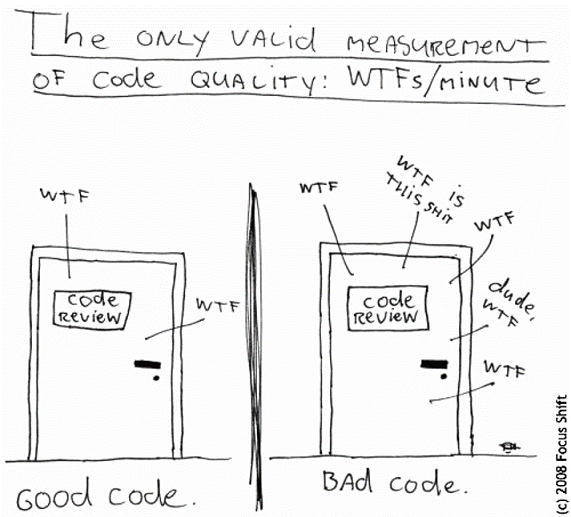
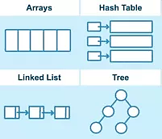
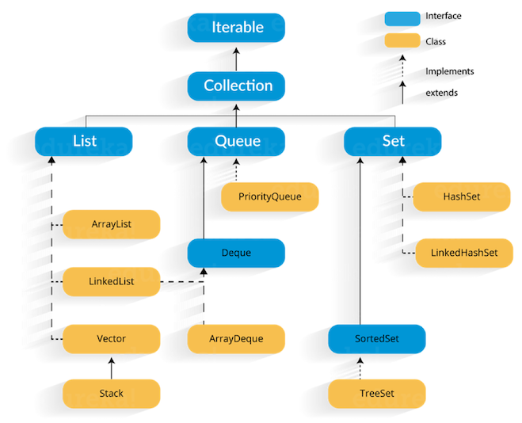
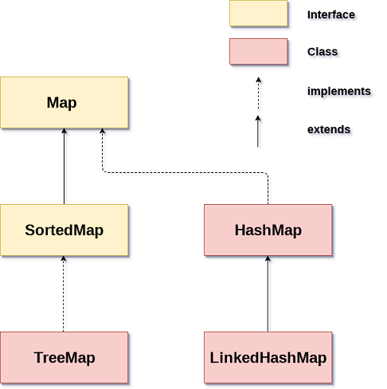

---

## Качествен (Clean) Code

_04.11.2020_


---

#### Как мерим качеството на кода?



---

#### Принципи на чистия код - именуване, конвенции и добри практики

@ul

- Имената на пакети, класове, интерфейси, член-променливи, методи, локални променливи трябва да са говорещи и да спазват установените конвенции

@ulend

---

#### Принципи на чистия код - именуване, конвенции и добри практики

@ul

- пакети
  - само малки букви, със смислена йерархия
  - `bg.sofia.uni.fmi.mjt`
- класове, абстрактни класове, интерфейси, enums, records
  - съществителни, започващи с главна буква (upper camel case)
    - `Student`, `GameBoard`
    - имената на интерфейси често са отглаголни съществителни
      - `Runnable`, `Serializable`

@ulend

---

#### Принципи на чистия код - именуване, конвенции и добри практики

@ul

- методи
  - глаголи, започващи с малка буква (camel case), без подчертавки
  - `reverseString()`, `calculateSalary()`
- променливи
  - започващи с малка буква (camel case)
- константи
  - all-caps, с подчертавки между думите
  - `MAX_NAME_LENGTH`

@ulend

---

#### Принципи на чистия код - Спазвай ООП принципите

- Енкапсулация
  - Свеждай публичните части до минимум
- Наследяване
  - Не допускай code duplication

---

#### Принципи на чистия код - Спазвай ООП принципите

- Полиморфизъм
  - Ползвай полиморфизъм винаги, когато е възможно
  - Използвай интерфейс за декларация, конкретна имплементация за инициализация
  - Предпочитай интерфейс вместо имплементация в сигнатурите на публичните ти методи

---

#### Стреми се към хубав ОО дизайн

@ul

- Използвай само по изключение пакета по подразбиране
- Един клас трябва да прави едно нещо
- Ако имаш "and" в името на класа, вероятно не е така
- Ако имаш "Helper", "Manager", "Utility" в името, *може би* има по-добър дизайн
- Един метод трябва да прави едно нещо
- Методът трябва да е кратък: < 20 реда код

@ulend

---

#### Стреми се към хубав ОО дизайн

@ul

- Ако имаш "and" в името на метод, може би той прави повечко неща: раздели го на няколко
- Ако имаш много параметри на метод:
  - може би не му е мястото в този клас (а там, откъдето се взимат стойностите за тези параметри)
  - или трябва да направиш *data object* / `record`, който да групира семантично свързаните от тях
- Не злоупотребявай със `static`

@ulend

---

#### Принципи на чистия код - форматирай

- Форматирай си кода
- Нямаш никакво оправдание да не го правиш: има IDE shortcuts
    - Ctrl+Alt+L (IntelliJ)
    - Ctrl+Shift+F (Eclipse)

---

#### Не използвай "magic numbers"

<small>Вместо "магически числа" в кода, ползвай подходящо именувани константи</small>

```java
// Bad
for (int i = 0; i < 16; i++) { /* what is 16?! */ }

if (message.startsWith("[ERROR] ")) { /* ?! */ }

// Good
public static final int MAX_PASSWORD_LENGTH = 16;
//  [...]
for (int i = 0; i < MAX_PASSWORD_LENGTH; i++) { /* do something */ }

private static final String ERROR_MESSAGE_PREFIX = "ERROR: ";
//  [...]
if (message.startsWith(ERROR_MESSAGE_PREFIX)) { /* do something */ }
```

---

#### Принципи на чистия код

```java
// Bad
if (x % 2 == 0)
    return x / 2;

// Good: Винаги ограждай в блок телата на if-else и цикли,
// дори да са с по един statement
if (x % 2 == 0) {
    return x / 2;
}
```

---

#### Принципи на чистия код

```java
// Bad
public int calculateSalary()
{

}

// Good: отварящата фигурна скоба на блок не стои на отделен ред
// Изключение: initializer блоковете
public int calculateSalary() {

}

```

---

#### Принципи на чистия код

```java
// Bad
if (x % 2 == 0) {
    return true;
} else {
    return false;
}
```
<p><p>

```java
// Good: Изразявай се кратко. Малко код == малко бъгове
return x % 2 == 0;
```

---

#### Принципи на чистия код

@ul

- Слагай коментари, без да прекаляваш
- Хубавият код е self-explanatory, и все пак, на места си трябва коментар
- Разделяй нормалната логика от exception логиката
- Ползвай изключения вместо error codes и печатане на съобщения в конзолата
- Не suppress-вай / swallow-вай exceptions
    - Никога не оставяй празен `catch`, или `catch` само с `e.printStackTrace()`

@ulend

---

```java
// Bad
try {
    // do something with the file system
} catch (FileNotFoundException e) {
    // I hope someone reads the logs
    e.printStackTrace();
} catch (IOException e) {
    // the admin should see this
    System.err.println("I/O exception accessing the file system.");
}
```

---

```java
// Good
try {
    // do something with the file system
} catch (FileNotFoundException e) {
    // catalog file is missing -
    // this is OK, first access should create an empty catalog
    createEmptyShoppingCatalog();
} catch (IOException e) {
    // catalog file is there but cannot be opened or read
    // calling method knows how to handle this
    throw new ShoppingException("Cannot get shopping catalog", e);
}
```

---

#### Разделяй I/O логиката от *бизнес* логиката

```java
// Bad
public static void factorial() { // swiss knife: all-in-one
    Scanner sc = new Scanner(System.in);
    int n = -1; long result = 1;
    do {
        System.out.println("Въведи число:");
        try {
            n = Integer.parseInt(sc.nextLine());
        } catch (Exception e) {
            continue;
        }
    } while (n < 0);
    for (int i = 2; i <= n; i++) {
        result *= i;
    }
    System.out.println("n! = " + result);
}

public static void main(String... args) {
    factorial();
}
```

---

#### Разделяй I/O логиката от *бизнес* логиката

```java
// Good
private static int readAndValidate(Scanner sc) { // handle input
    int n = -1;
    do {
        System.out.println("Въведи число:");
        try {
            n = Integer.parseInt(sc.nextLine());
        } catch (Exception e) {
            continue;
        }
    } while (n < 0);
    return n;
}

private static void printOutput(long result) { // handle output
    System.out.println("n! = " + result);
}
```

---

#### Разделяй I/O логиката от *бизнес* логиката

```java
    //Good
    public static long factorial(int n) { // business logic
        long result = 1;
        for (int i = 2; i <= n; i++) {
            result *= i;
        }
        return result;
    }

    public static void main(String... args) {
        int input = readAndValidate(new Scanner(System.in));
        long result = factorial(input);
        printOutput(result);
    }
```

---

#### Java код конвенции

<small>
Запознай се с цялостна Java код конвенция и се придържай към нея.
Две от най-популярните:
<p><p>
[Oracle Code Conventions for the Java Programming Language](https://www.oracle.com/technetwork/java/javase/documentation/codeconvtoc-136057.html)
<p>
[Google Java Style Guide](https://google.github.io/styleguide/javaguide.html)
</small>


---

#### Инструменти за статичен код анализ

@ul

- Има инструменти за статичен код анализ, които
  - автоматизират придържането към код конвенции
  - намират и бъгове

@ulend

---

#### Най-популярните open-source инструменти

<small>
[checkstyle](http://checkstyle.sourceforge.net/index.html)<p>
[PMD](https://pmd.github.io/)<p>
[FindBugs](http://findbugs.sourceforge.net/index.html)
</small>


---

#### Библията


---

“Writing clean code is what you must do in order to call yourself a professional.
There is no reasonable excuse for doing anything less than your best.”

― Robert C. Martin, Clean Code: A Handbook of Agile Software Craftsmanship

---

#### PlanetGeek

[Clean Code Cheat Sheet](https://www.planetgeek.ch/wp-content/uploads/2014/11/Clean-Code-V2.4.pdf)

---

## Въпроси

@snap[south span-100]
@fab[github] [fmi/java-course](https://github.com/fmi/java-course)
@fab[youtube] [MJT2021](https://www.youtube.com/playlist?list=PLew34f6r0Pxy8PvaJ83pa4r76XCmZR657)
@snapend

---

## Структури от данни

_04.11.2020_


---

## Структури от данни

@ul

- Хранилища за данни
- Основни операции
  - добавяне
  - триене
  - търсене
  - обхождане

@ulend

---

#### Масиви - предимства

@ul

- пределно прост "интерфейс"
- най-ефективни от гледна точка на използвана памет*
- бърз достъп на елемент по индекс: O(1)

@ulend

---

#### Масиви - недостатъци

@ul

- размерът им е фиксиран при инициализацията
- добавянето или изтриването на елемент (с изключение на последна позиция) е скъпа операция
- търсенето на елемент по стойност е бавно:
    - О(N) за произволен масив
    - O(logN) за сортиран масив

@ulend

---

#### Колекции

@ul

- Java предоставя т.нар. collections framework, съдържащ интерфейси, имплементации и алгоритми върху най-използваните структури от данни
- За разлика от масивите,
    - размерът им е динамичен
    - съдържат само референтни типове
- Всички* интерфейси и класове се намират в пакета `java.util`

@ulend

---

#### Колекции

Някои ползи от наличието на collections framework:
- Не се налага да преоткриваме топлата вода
- Увеличават се скоростта и качеството на програмите ни
- Стимулира се преизползването на код

---

#### Итератори

- Итераторите предоставят унифициран начин за обхождане на елементите на дадена колекция.
- Колекциите (както и масивите) могат да се обхождат с foreach loop

---

#### Интерфейси `Iterator` и `Iterable`

```java
public interface Iterator<E> {
    boolean hasNext();
    E next();
    void remove();
}

public interface Iterable<T> {
    Iterator<T> iterator();
}
```

---

#### `java.util.Iterator`

@ul

- Методът `remove()` премахва от колекцията елемента, последно върнат от `next()`
- Ако колекцията бъде модифицирана докато бъде итерирана, по какъвто и да е начин, различен от извикване на `remove()` на итератора, поведението на итератора е недефинирано
    - В частност, може да се хвърли `ConcurrentModificationException` (дори в еднонишков код)

@ulend

---

Основните структури от данни, използвани в имплементациите на колекциите, са

- Масиви
- Свързани списъци
- Хеш таблици
- Дървета

<br/>



---



---



---

#### Обхождане на колекции

```java
List<Float> nums = Arrays.asList(4.999f, 0.271f, 7.1f, -1f);
```

- Чрез enhanced for-loop:

```java
for (float current : nums) {
    System.out.printf("%.2f%n", current);
}
```

- Чрез итератор:

```java
Iterator<Float> iterator = nums.iterator();
while (iterator.hasNext()) {
    System.out.printf("%.2f%n", iterator.next());
}
```

---

#### Обхождане на `Map`

Според това какво ни е нужно, може да вземем от `Map`-a:

- множеството от ключовете
```java
Set<Integer> keys = map.keySet();
```
- колекция от стойностите
```java
Collection<String> values = map.values();
```

- колекция от двойките ключ-стойност
```java
Set<Entry<Integer, String>> s = map.entrySet();
```

---

__java.util.Collection__

```java
int size()
boolean isEmpty()
boolean contains(Object element)
boolean add(E element)
boolean remove(Object element)
Iterator<E> iterator()

boolean containsAll(Collection<?> c)
boolean addAll(Collection<? extends E> c)
boolean removeAll(Collection<?> c)
boolean retainAll(Collection<?> c)
void clear()

Object[] toArray()
<T> T[] toArray(T[] a)
```

@[1-6]
@[8-12]
@[14-15]

---

__List__

```java
boolean add(E e)
boolean contains(Object o)
E get(int index)
int indexOf(Object o)
boolean remove(Object o)
E remove(int index)
int size()
boolean isEmpty()
Object[] toArray()
List<E> subList(int fromIndex, int toIndex)
```

---

#### Имплементации на `List`

- `ArrayList` - resize-ващ се (динамичен) масив
- `LinkedList` - двойно свързан списък
- `Vector` - resize-ващ се (динамичен) масив. Synchronized. Legacy -> замества се от `ArrayList`
- `Stack` - наследява Vector. Legacy -> замества се от `Dequeue`

---

#### Алгоритмична сложност на основните операции


---

__Queue__


| Операция | хвърля изключение   | връща специална стойност |
|:---------|:--------------------|:-------------------------|
| Insert   | `add(e)`            | `offer(e)`               |
| Remove   | `remove()`          | `poll()`                 |
| Examine  | `element()`         | `peek()`                 |

---

#### Имплементации на Queue

- `PriorityQueue` - heap (пирамида)
- `LinkedList`
- `ArrayDeque` - resize-ващ се (динамичен) масив

---

#### Алгоритмична сложност на основните операции


---

__Set__

```java
boolean add(E e)
boolean contains(Object o)
boolean remove(Object o)
int size()
boolean isEmpty()
Object[] toArray()
```

---

#### Имплементации на `Set`

- `TreeSet` - `TreeMap`. Червено-черно дърво
- `HashSet` - хеш таблица
- `LinkedHashSet` - хеш таблица + двойно свързан списък
- `EnumSet` - битов масив

---

#### Конструктори на `HashSet`

```java
HashSet(); // default initial capacity (16) and load factor (0.75).
HashSet(Collection<? extends E> c);
HashSet(int initialCapacity);
HashSet(int initialCapacity, float loadFactor);
```

---

#### Конструктори на `TreeSet`

```java
TreeSet(); // natural ordering
TreeSet(Collection<? extends E> c);
TreeSet(Comparator<? super E> comparator);
TreeSet(SortedSet<E> s);
```

---

__java.lang.Comparable vs java.util.Comparator__


```java
// естествена подредба
public interface Comparable<T> {
    public int compareTo(T o);
}

public interface Comparator<T> {
    public int compare(T o1, T o2);
}
```

@[2-4]
@[6-8]

---

#### Консистентност на естествената подредба с `equals()`

Естествената подредба на клас С се нарича консистентна с `equals()`, ако и само ако
`e1.compareTo(e2) == 0` има същата булева стойност като `e1.equals(e2)`, за всеки два обекта e1 и е2 на С.

<br/>
Силно препоръчително е (макар и не задължително) естествената подредба да бъде консистентна с `equals()`.

---

#### `LinkedHashSet`


```java
Set<Character> sc = new LinkedHashSet<>();
Collections.addAll(sc, 'a', 'b', 'j');
```

---

#### Алгоритмична сложност на основните операции


<small>*h* - капацитет на хеш таблицата</small>

---

Операции над множества със __Set__

```java
Set<String> one = new HashSet<>();
one.add("foo");
one.add("bar");
Set<String> two = new HashSet<>();
two.add("foo");
two.add("baba");

Set<String> union = new HashSet<>(one);
union.addAll(two); // union = [baba, bar, foo]

Set<String> intersection = new HashSet<>(one);
intersection.retainAll(two); // intersection = [foo]

Set<String> difference = new HashSet<>(one);
difference.removeAll(two); // difference = [bar]
```

---

__Map__

```java
V put(K key, V value)
V get(Object key)
V remove(Object key)
boolean containsKey(Object key)
int size()
boolean isEmpty()
Set<K> keySet()
Collection<V> values()
```

@[1](Добавя двойка key-value. Ако има вече такъв ключ в Map-а, променя само value-то, и връща старото value като резултат)

---

#### Имплементации на `Map`

- `HashMap` - хеш таблица
- `LinkedHashMap` - хеш таблица + двойно свързан списък
- `EnumMap` - битов масив
- `TreeMap` - червено-черно дърво

---

#### Алгоритмична сложност на основните операции


<small>*h* - капацитет на хеш таблицата</small>

---

#### Колекции с наредба vs Колекции без наредба

@ul

- `TreeMap`/`TreeSet` - червено-черни дървета. Запазват естествена наредба. Елементите трябва да имплементират интерфейса `Comparable` (или да се подава имплементация на `Comparator`). Логаритмична сложност за повечето операции
- `HashMap`/`HashSet` - хеш таблици. Нямат естествена наредба. Елементите трябва да имплементират методите `hashCode()` и `equals()`. Константна сложност за повечето операции

@ulend

---


---

### Колекции - операции

- Сортиране

```java
List<Integer> nums = new ArrayList<>();
nums.add(4);
nums.add(9);
nums.add(0);
nums.add(7);
nums.add(-1);

// nums = [4, 9, 0, 7, -1]
Collections.sort(nums);
// nums = [-1, 0, 4, 7, 9]
Collections.sort(nums, Collections.reverseOrder());
// nums = [9, 7, 4, 0, -1]
```

---

- Търсене: indexOf(), binarySearch()

```java
List<Integer> nums = Arrays.asList(4, 9, 0, 7, -1);

// nums = [4, 9, 0, 7, -1]
int index = nums.indexOf(7);
// index = 3

Collections.sort(nums);
index = Collections.binarySearch(nums, -1);
// index = 0
```

---

- Разбъркване: shuffle()

```java
List<Integer> nums = Arrays.asList(4, 9, 0, 7, -1);

// nums = [4, 9, 0, 7, -1]
Collections.shuffle(nums);
// nums = [?, ?, ?, ?, ?]
```

---

- Манипулации __copy()__, __fill()__, reverse(), swap()

```java
List<String> from = new ArrayList<>();
from.add("foo");
from.add("bar");
List<String> to = new LinkedList<>();
to.add("a");
to.add("b");

Collections.copy(to, from);
// to = [foo, bar]
```

```java
List<String> list = new ArrayList<>();
list.add("foo");
list.add("bar");
list.add("baz");

Collections.fill(list, "a");
// list = [a, a, a]
```

---

- Манипулация copy(), fill(), __reverse()__, __swap()__)

```java
List<String> list = new ArrayList<>();
list.add("1");
list.add("2");
list.add("3");

Collections.reverse(list);
// list = [3, 2, 1]

Collections.swap(list, 0, 1);
// list = [2, 3, 1]
```

---

- Статистики: min(), max(), frequency()

```java
Set<Integer> nums = Set.of(4, 9, 0, 7, -1);

int min = Collections.min(nums); // -1
int max = Collections.max(nums); // 9
int frequency = Collections.frequency(nums, 7); // 1
```

---

Намиране на всички уникални думи от дадено множество:

```java
import java.util.*;

public class FindDistinctWords {

  public static void main(String[] words) {
    Set<String> distinctWords = new TreeSet<>();
    for (String word : words) {
      distinctWords.add(word);
    }

    System.out.printf("%d distinct words: %s%n",
      distinctWords.size(), distinctWords);
  }
}
```

```bash
$ javac FindDistinctWords.java && \
  java FindDistinctWords "foo" "bar" "foo" "baz" "bar" "foo"
3 distinct words: [bar, baz, foo]
```

---

#### Премахване на елементи на колекция при итериране

```java
private static void filter(Collection<String> collection) {
  for (Iterator<String> it = collection.iterator();
     it.hasNext();) {
      if (it.next().charAt(1) == 'a') {
        it.remove();
      }
  }
}
```

```java
Set<String> words = new HashSet<>();
words.add("foo");
words.add("bar");
words.add("baz");

filter(words);
// words = [foo]
```

---

#### Collection factory методи

```java
List<String> list = List.of("Java", "9", "rulez");

Set<Integer> set = Set.of(1, 2, 3, 5, 8);

Map<String, Integer> cities = Map.of(
      "Brussels", 1_139_000,
      "Cardiff", 341_000
);

cities = Map.ofEntries(
      Map.entry("Brussels", 1_139_000),
      Map.entry("Cardiff", 341_000)
);
```

---

#### Collection factory методи

- Колекциите, създавани с factory методите, са immutable
- Заемат по-малко памет от mutable събратята си
- Не могат да съдържат null елементи
- При едно и също съдържание, могат да връщат нови инстанции или референции към съществуващи

---

#### Принципи на чистия код - ползвай интерфейс за декларация и конкретен клас за инициализация

```java
// Bad
ArrayList<String> stringList = new ArrayList<>();
public HashSet<Integer> filterPrimes(HashSet<Integer>);

// Good
List<String> stringList = new ArrayList<>();
public Collection<Integer> filterPrimes(Collection<Integer>);
```

---

## Въпроси

@snap[south span-100]
@fab[github] [fmi/java-course](https://github.com/fmi/java-course)
@snapend
