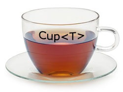
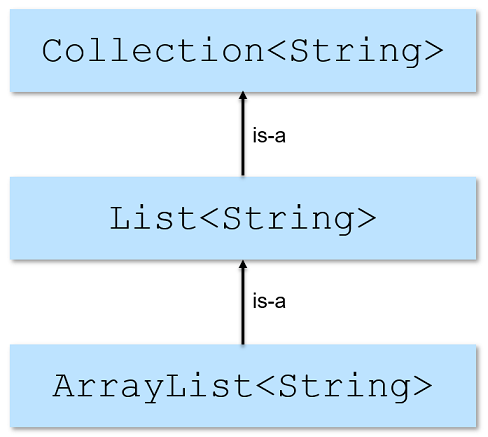
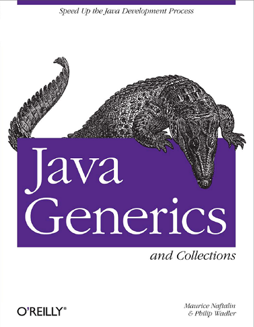

class: center, middle

# Generics

10.11.2021

.center[]

---

### Предната лекция говорихме за:

- Качествен (Clean) Code
- Колекции (Collections)

---

### Днес продължаваме с:

- Generics

---

### Нуждата от Generics

- Generic типовете ни позволяват да създадем обща имплементация на клас или метод, която работи с различни типове данни
    - това позволява преизползване на кода

---

### Нуждата от Generics

```java
List list = new LinkedList();
list.add(new Integer(1));
Integer i = list.iterator().next(); // няма да се компилира
```

---

### Нуждата от Generics

```java
List list = new LinkedList();
list.add(new Integer(1)); 
Integer i = (Integer) list.iterator().next(); // explicit type cast
```

<br>
- трябва експлицитно да кастваме, което е досадно
- има вероятност да сгрешим в предположението си за типа и cast-ът да "гръмне" с `ClassCastException` по време на изпълнение

---

### Нуждата от Generics

- би било много по-удобно
    - програмистът да може изрази намерението си да ползва определен тип и
    - компилаторът да може да гарантира коректността на програмата за този тип

---

### Нуждата от Generics

```java
List list = new LinkedList();
list.add(new Integer(1)); 
Integer i = (Integer) list.iterator().next(); // explicit type cast
```

<br>

```java
List<Integer> list = new LinkedList<>();
list.add(1); // autoboxing; compiler checks type compatibility
Integer i = list.iterator().next(); // no explicit cast needed
```

---

### Generics

```java
List<E>
// Чете се "списък от E"
```

<br>

Клас или интерфейс, в декларацията на който има един или повече параметри за тип, се нарича *generic* клас/интерфейс.

---

### Пример: не-generic кутия

Съдържа какъв да е обект

```java
public class Box {
    private Object value;

    public Object getValue() {
        return value;
    }

    public void setValue(Object value) {
        this.value = value;
    }
}
```

---

### Пример: generic кутия

```java
public class Box<T> {
    private T value;

    public T getValue() {
        return value;
    }

    public void setValue(T value) {
        this.value = value;
    }
}

```

---

### Създаване на инстанции

```java
// The long way
Box<Integer> integerBox = new Box<Integer>();
```

<br>

```java
// Diamond operator
Box<Integer> integerBox = new Box<>();
```

---

### Конвенция за именуване на параметрите за тип

- E - Element
- T - Type
- K - Key
- V - Value
- N - Number
- S, U, V etc. - 2-ри, 3-ти, 4-ти тип

---

### Generic методи

- Могат да ползват типовите параметри на класа/метода
- Могат да добавят нови параметри за тип, недекларирани от класа
- Новите параметри за тип са видими единствено за метода, който ги декларира
- Generic методите могат да са статични, нестатични или конструктори

---

### Generic методи – примери

```java
public class Pair<K, V> {

    private K key;
    private V value;

    // Generic constructor
    public Pair(K key, V value) {
        this.key = key;
        this.value = value;
    }

    // Generic methods
    public K getKey() { return key; }
    public void setKey(K key) { this.key = key; }
    public V getValue() { return value; }
    public void setValue(V value) { this.value = value; }

}
```

---

### Generic методи – примери

```java
public class Util {

    // Generic static method
    public static <K, V> boolean areEqual(Pair<K, V> p1, Pair<K, V> p2) {
        return p1.getKey().equals(p2.getKey()) &&
                   p1.getValue().equals(p2.getValue());
    }

}
```

---

### Generic методи - извикване

```java
Pair<Integer, String> p1 = new Pair<>(1, "apple");
Pair<Integer, String> p2 = new Pair<>(2, "pear");

// Full syntax
boolean areEqual = Util.<Integer, String>areEqual(p1, p2);

// Short syntax
areEqual = Util.areEqual(p1, p2);
```

---

### Ковариантност, контравариантност и инвариантност

- *Вариантност* (*Variance*) е понятие, свързано с това, как наследяването между по-сложните типове е свързано с наследяването между техните компоненти
- Лесна за запомняне (и изключително неформална) дефиниция на ковариантност и контравариантност е:
    - *Ковариантност*: приемат се типове-наследници (subtypes)
    - *Контравариантност*: приемат се типове-родители (supertypes)

---

### Ковариантност, контравариантност и инвариантност

- Например, в Java масивите за ковариантни. Това има две следствия:
    - `T[]` може да съдържа елементи от тип `T` и негови наследници
    - `S[]` е наследник на `T[]`, ако `S` е наследник на `T`

<br>
```java
Integer[] intArr = new Integer[5];
Number[] numArr = intArr; // OК

numArr[0] = 1.23; // Not OK: will compile but will throw an ArrayStoreException at runtime
```

---

### Generic типове и наследяване

- `Integer` is-a `Object`
- `Integer` is-a `Number`
- `Double` is-a `Number`
- Обаче `Box<Integer>` is-not-а `Box<Number>`. Техният общ родител е `Object`
- Казваме, че параметризираният тип е *инвариантен*
    - Какъв би бил проблемът, ако не беше?

---

### Generic типове и наследяване

- Подтип на generic клас или интерфейс получаваме чрез разширяване или имплементиране
- Ако аргументът за тип е еднакъв, то *is-a* релацията е в сила

---

### Пример от Collections framework-a

.center[]

---

### Ограничени (bounded/restricted) generic типове

Може да се специфицира, че generic тип е съвместим само с даден тип или негови наследници/имплементации (upper bound).

<br>

```java
public <T extends Number> List<T> fromArrayToList(T[] a) {
    // [...]
}

// Ако типовете са повече от един, те се разделят с &, като в този случай
// най-много един може да бъде клас (останалите трябва да са интерфейси)
// и ако има клас, той трябва да стои първи в списъка.
// Обърнете внимание, че въпреки че Comparable е интерфейс, а не клас,
// ключовата дума е пак extends.
public <T extends Number & Comparable> List<T> anotherMethod(T[] a) {
    // [...]
}
```

---

### Проблемът с липсата на общ родител

Представете си, че ви трябва метод, който извежда всички елементи на дадена колекция.
Ето как може да се направи без generics:

<br>

```java
private void printCollection(Collection c) {
    for (Object e : c) {
        System.out.println(e);
    }
}
```

---

### Проблемът с липсата на общ родител

Наивно може да предположим, че с generics може да го реализираме така:

<br>

```java
void printCollection(Collection<Object> c) {
    for (Object e : c) {
        System.out.println(e);
    }
}

// Проблемът е, че тази реализация всъщност е по-малко полезна от предната.
// Докато версията без generics може да се извиква с произволна колекция,
// тази версия може да приема само Collection<Object>, който тип, както
// видяхме вече, не е родител на Collection<Т> за никое T,
// т.е. не може да викнем метода с Collection<Integer> да речем.
```

---

### Решението: wildcards

- Имат ли всички видове `Collection<T>` общ родител, различен от `java.lang.Object`?
- Отговорът е положителен
  - типът се записва `Collection<?>` и се чете "колекция от неизвестен тип". Такъв тип се нарича *wildcard* тип
- Чрез wildcards става възможно generic типовете да поддържат ковариантност и контравариантност

---

### Решението: wildcards

```java
// този метод може да се извика с аргумент - произволна колекция
void printCollection(Collection<?> c) {
    for (Object e : c) {
        System.out.println(e);
    }
}
```

---

### Generic типове с wildcards

- `?` – означава неизвестен тип
- Може да се използва за тип на:
  - параметър на метод
  - член-данна на клас
  - локална променлива
  - тип на връщаната стойност
- Не може да се използва за аргумент за тип при извикване на:
  - generic метод
  - създаването на инстанция на generic клас

---

### Wildcards, ограничени отгоре

Искаме да създадем метод, който намира сумата на елементите в списък от `Integer`, `Double`, `Float`, `Number`

<br>

```java
public static double sumOfList(List<? extends Number> list) {
    double sum = 0.0;
    for (Number current : list) {
        sum += current.doubleValue();
    }
    return sum;
}
```

---

### Wildcards, ограничени отдолу

Искаме да създадем метод, който да добавя `Integer` обекти към списък.
Искаме методът да работи с колекции от `Integer`, `Number`, `Object`

<br>

```java
public static void addNumbers(List<? super Integer> list) {
    for (int i = 1; i <= 10; i++) {
        list.add(i);
    }
}
```

---

### Неограничени wildcards

- Списък елементи от неизвестен тип - `List<?>`
- `List<?>` е еквивалентно на `List<? extends Object>`
- Използва се, когато:
  - Функционалността, която пишем, може да се имплементира единствено със знанието за методите в `java.lang.Object`
  - Не се интересуваме от типа на елементите в списъка, а се интересуваме от характеристики на самия списък – например размер на списъка

---

### The Get & Put Principle

- Използвай `extends` wildcard, когато само ще get-ваш стойности от структура
- Използвай `super` wildcard, когато само ще put-ваш стойности в структура
- Не използвай wildcard, когато ще правиш и двете

<br>

С други думи, ковариантните типове са read-only, а контравариантните типове са write-only.

---

### Generics

- Подвеждащо приличат на шаблоните в C++, но се различават от тях:
    - синтактично: при влагане, в Java не е нужно да се разделят съседните `>>` с интервал

    ```c++
    // C++: space between the two >> was mandatory until C++11
    list<list<string> > list;

    // Java: spaces between < and List and between the two >> are optional
    List<List<String>> list;
    ```

    - семантично: в Java се реализират чрез изтриване (*erasure*) на типовата информация, а не чрез създаване на отделна версия на класа за всяка употреба на шаблона с конкретен тип (*expansion*) като в C++

---

### Изтриване на информацията за типовите аргументи

- Java компилаторът изтрива информацията за типовите аргументи и тази информация не е налична по време на изпълнение
- Всички типови параметри в generic класове и интерфейси се заместват...

---

### Ако са неограничени или ограничени отдолу – заместват се с `java.lang.Object`:

```java
public class Box<T> {
    private T value;
    public T getValue() { return value; }
    public void setValue(T value) { this.value = value; }
}


public class Box {
    private Object value;
    public Object getValue() { return value; }
    public void setValue(Object value) { this.value = value; }
}
```

---

### Ако са ограничени отгоре – заместват се с техния ограничителен тип

```java
class Shape { /* ... */ }
class Circle extends Shape { /* ... */ }
class Rectangle extends Shape { /* ... */ }
```

<br>

```java
public static <T extends Shape> void draw(T shape) { /* ... */ }


public static void draw(Shape shape) { /* ... */ }
```

---

### Сурови типове (Raw types)

```java
Box rawBox = new Box();
```

<br>

Представляват името на generic клас или интерфейс без аргументите за тип.
Raw type на `Box<T>` е `Box`.
Отнемат възможността на компилатора да открива грешки. Оставени са в езика по backward compatibility причини. Избягвайте ги


---

### Сурови типове (Raw types)

Може безопасно да се присвои инстанция на параметризиран тип на суровия му тип.
Обратното присвояване се компилира с предупреждение

<br>

```java
Box<String> stringBox = new Box<>();
Box rawBox = stringBox;

// rawBox is a raw type of Box<T>
Box rawBox = new Box();

// warning: unchecked conversion
Box<Integer> intBox = rawBox;
```

---

### Сурови типове (Raw types)

Също се генерира предупреждение, ако се опитаме да изпълним generic метод през инстанция на суров тип:

<br>

```java
Box<String> stringBox = new Box<>();
Box rawBox = stringBox;

rawBox.setValue(8); // warning: unchecked invocation to setValue(T)
```

---

### Raw types и съвместимост на типовете

```java
List raw;
// warning: List is a raw type.
// References to generic type List<E> should be parameterized

List<Object> objects;
List<String> strings = new ArrayList<>();

raw = strings; // it's OK: List-of-Strings is-a List
objects = strings; // will not compile: incompatible types
```

---

### Предпочитай `List` вместо масив

```java
// Fails at runtime
Object[] array = new Long[1];
array[0] = "I don't fit in"; // Throws ArrayStoreException

// Won't compile
List<Object> list = new ArrayList<Long>(); // Incompatible types
list.add("I don't fit in");
```

---

### Ограничения при generic класове и интерфейси

Не могат да се създават инстанции от типов параметър.
Не могат да се декларират статични полета на клас от типа на типов параметър

<br>

```java
public static <E> void append(List<E> list) {
    E elem = new E(); // compile-time error: type parameter E
                      // cannot be instantiated directly
    list.add(elem); 
}

public class MobileDevice<T> {
    private static T os; // compile-time error
}
```

---

### Ограничения при generic класове и интерфейси

Не може да се правят конвертирания между типове (casts).
Не може да се прилага `instanceof` операторът с generic типове

<br>

```java
public static <E> void rtti(List<E> list) {
    if (list instanceof ArrayList<Integer>) { // compile-time error
        // ...
    }
}
```

---

### Ограничения при generic класове и интерфейси

Не може да се създават масиви от параметризиран тип

<br>

```java
// compile-time error
List<Integer>[] arrayOfLists = new List<Integer>[2];

// compiler error, but pretend it's allowed
Object[] stringLists = new List<String>[10];

// OK
stringLists[0] = new ArrayList<String>();

// An ArrayStoreException should be thrown,
// but the runtime can't detect it
stringLists[1] = new ArrayList<Integer>();
```

---

### Ограничения при generic класове и интерфейси

Не може да се дефинират два метода с формални параметри, които след изтриване на типовите параметри имат еднакви сигнатури

<br>

```java
public class Example {
    // Compilation error: 'print(Set<String>)' clashes with
    // 'print(Set<Integer>)': both methods have same erasure
    public void print(Set<String> strSet) { }

    public void print(Set<Integer> intSet) { }
}
```

---

### Литература

.center[]

---

## Въпроси?

.font-xl[.ri-github-fill.icon-inline[[fmi/java-course](https://github.com/fmi/java-course)]]

.font-xl[.ri-youtube-fill.icon-inline[[MJT2022](https://www.youtube.com/playlist?list=PLew34f6r0PxyUcIg370lv9jHDwFeMDa7e)]]
