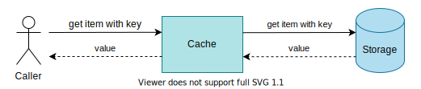

# Unit Testing and Mocking

Освен писане на code from scratch, в практиката много често се налага и да поддържаме, fix-ваме или пишем тестове за вече съществуващ код.

Целта на упражнението е да създадете и изпълните JUnit тестове, спрямо налична имплементация.

## Generic In-Memory Cache :package:

Кеширането (caching) в паметта е често използван подход за подобряване на бързодействието на алгоритми, използващи интензивно данни, съхранявани на бавно устройство.
Ще създадем собствена имплементация на generic кеш (cache).

Достъпът до кеширани данни е в порядъци по-бърз, но за съжаление, кешът си има фиксиран капацитет, който не може да се надвишава. По тази причина, всеки кеш има т.нар. *eviction policy*, т.е. правило, по което се определя, кои елементи се изтриват от кеша при опит за добавяне на нов елемент при запълнен капацитет.


### Current Implementation

В [./resources](./resources) ще намерите две имплементации на интерфейса `Cache`, различаващи се по това, какво *eviction policy* използват:

- [Least-Recently Used (LRU)](https://en.wikipedia.org/wiki/Cache_replacement_policies#Least_recently_used_(LRU))
- [Least-Frequently Used (LFU)](https://en.wikipedia.org/wiki/Cache_replacement_policies#Least-frequently_used_(LFU))

Конкретна имплементация на интерфейса `Cache`, използваща избрано от нас eviction policy, създаваме чрез следните статични методи на интерфейса `CacheFactory`:

```java
static <K, V> Cache<K, V> getInstance(Storage<K, V> storage, int capacity, EvictionPolicy policy)
static <K, V> Cache<K, V> getInstance(Storage<K, V> storage, EvictionPolicy policy) 
```

където `EvictionPolicy`, както вече се досещате, е от изброим тип, a `Storage<K, V>` е интерфейс на storage (например база данни, файлова система и т.н.), който стои зад нашия кеш. Ако липсва стойност за ключ, който търсим, пробваме да я вземем от storage-a и ако успеем, я добавяме в кеша и я връщаме.



#### Уточнения за имплементацията

:point_right: При Least Frequently Used имплементацията:
- за "използване" смятаме всяко извикване на `get` или `set` за даден елемент.
- когато се извика `set` за вече съществуващ key с ново или същото value, броят пъти, в които сме използвали този елемент, се увеличава с 1, а не се занулява.
- ако съществуват два или повече елемента с равна (минимална) честота на използване, при добавяне на нов елемент при пълен кеш, трием произволен от тях.

#### Важно:

:warning: Имайте предвид, че имплементацията съдържа някои бъгове, които трябва да отстраните в процеса на тестване. За да бъде той ефективен, първо напишете тест за някой сценарий, след това оправете бъга, който сте намерили с него.
:warning: Не сме предоставили имплементация на интерфейса `Storage` - вместо такава, в Unit тестовете си трябва да използвате *Mockito* и да "мокнете" storage-a, който ще се използва от кеша. Алтернативно, може да направите и свой прост stub за storage-a.

Проектът ви трябва да има следната структура:

```
src
└─ bg/sofia/uni/fmi/mjt/cache/
    ├─ factory/
    |    ├─ CacheFactory.java
    |    └─ EvictionPolicy.java
    ├─ storage/
    |    └─ Storage.java
    ├─ exception/
    |    └─ ItemNotFound.java
    |
    ├─ CacheBase.java
    ├─ Cache.java
    ├─ LeastFrequentlyUsedCache.java
    └─ LeastRecentlyUsedCache.java
test
└─ bg/sofia/uni/fmi/mjt/cache/
    └─ (...)
```

Успех и не се притеснявайте да задавате въпроси! :star: 
