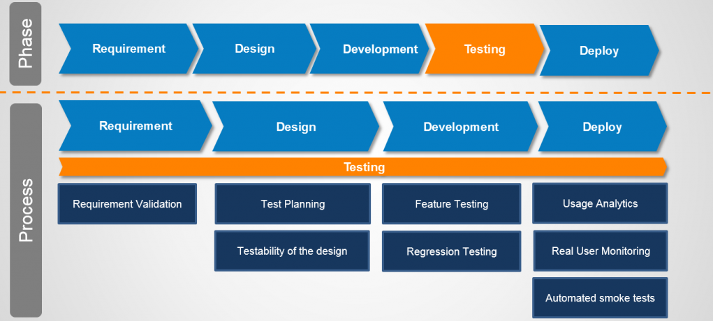

## Unit Testing & Mocking

_18.11.2020_

---

#### Предната лекция говорихме за:

@ul

- Generics

@ulend

---

#### Днес ще разгледаме:

@ul

- Как се тества софтуер, и кому е нужно
- Какво е unit testing
- JUnit
- Test-Driven Development (TDD)
- Stubbing и mocking

@ulend

---

#### Защо е нужно да си тестваме кода?

<small>
*Chuck Norris doesn’t need unit tests because his code always works. ALWAYS.<p><p>
                                                                    — Wisdom of the Internet ;)*
</small>

---

#### Кога да тестваме?


---

#### Тестването не е фаза, а е процес



---

#### Основни видове тестове

@ul

- Ръчни
  - В професионалната софтуерна разработка, липса на автоматични тестове == липса на тестове въобще

- Автоматични
  - функционални
  - нефункционални

@ulend

---

@ul

- Функционални тестове
  - unit тестове
  - integration тестове

- Нефункционални тестове
  - performance тестове
  - stress тестове
  - crash тестове
  - security тестове
  - usability тестове

@ulend

---

#### Още видове тестове


---

#### Unit Testing

@ul

- Unit test е код, който изпълнява специфична, „атомарна“ (т.е. която не може да се разбие по смислен начин на по-малки) функционалност на кода, която да бъде тествана
- Един unit test цели да тества малък фрагмент код - обикновено един метод или най-много един клас

@ulend

---

@ul

- Unit тестовете гарантират, че кодът работи както очакваме
- Подсигуряват, че кодът ще продължи да работи, както се очаква, в случай че го модифицираме, за да оправим бъг, рефакторираме или разширяваме функционалността

@ulend

---

#### Малко дефиниции

@ul

- *Продуктивен код* (a.k.a. *code under test*) – това е кодът, който реализира потребителските изисквания и удовлетворява сценариите на клиентите

- Процентът на продуктивния код, който се тества от автоматични тестове, се нарича *test coverage* или *code coverage*. Високият test coverage на кода ни дава увереност да разработваме функционалности, без да се налага да правим много ръчни тестове

@ulend

---

#### Още дефиниции

@ul

- *Test Driven Development* (TDD) е методология, при която кодът на тестовете се пише преди продуктивния код, така че щом даден тест бъде удовлетворен (т.е. минава успешно, стане „зелен“), съответният use-case е реализиран („done“)
- *Test fixture* е фиксирано състояние на софтуера, който тестваме, което е началното условие (предусловието) за изпълняване на тестовете

@ulend

---

@ul

- *Integration test* тества интеграцията на няколко класа (компонента)
- *Performance test* измерва бързодействието (ефективността) на даден софтуер по repeatable начин

@ulend

---

## JUnit

---

#### JUnit Framework

@ul

- JUnit е най-популярният и *de facto* стандартният testing framework в Java
- Open source проект в [GitHub](https://github.com/junit-team/junit5)
- Актуалната версия е [JUnit 5](https://junit.org/junit5/)
- Засега в курса ще ползваме [JUnit 4](https://junit.org/junit4/) (защо?)

@ulend

---

#### Защо ни трябват testing frameworks?

@ul

- Улесняват ни да пишем и изпълняваме тестове
- Стандартизират разработката и поддръжката на тестове

@ulend

---

#### JUnit

@ul

- JUnit се базира на анотации
- Всеки JUnit тест е метод, анотиран с `@Test`, съдържащ се в клас, който се използва само за тестване
- Такъв клас се нарича *test case*

@ulend

---

#### Пример за JUnit тест

```java
import static org.junit.Assert.assertEquals;

@Test
public void multiplicationOfZeroIntegersShouldReturnZero() {
	// MyClass is tested
	MyClass tester = new MyClass();

	// Tests
	assertEquals("10 x 0 must be 0", 0, tester.multiply(10, 0));
	assertEquals("0 x 10 must be 0", 0, tester.multiply(0, 10));
	assertEquals("0 x 0 must be 0", 0, tester.multiply(0, 0));
} 
```

---

#### Конвенции за именуване

@ul

- Прието е името на тестовия клас да се получава от името на класа, който тества, с добавяне на суфикса `Test`
- Популярна конвенция за имената на тестовите методи е, да започват с `test`, следвано от името на метода, който се тества, и кратко описание на тестовия сценарий, например `testLoginWithInvalidUserPassword`. Към нея се придържаме в нашите тестове за курса
- Името на теста трябва достатъчно ясно да описва сценария

@ulend

---

#### Статични методи на Assert класа

JUnit предоставя статични методи в класа `org.junit.Assert` за тестване на определени условия

---

__fail()__

@ul

- `fail(String message)` – фейлва теста
- Може да се използва за проверка, че определена част от кода не се достига или като временна dummy имплементация, която да се замести от реален тест

@ulend

---

@ul

- `assertTrue(String message, boolean condition)` – проверява, че булевото условие е истина
- `assertFalse(String message, boolean condition)` – проверява, че булевото условие е лъжа

@ulend

---

@ul

- `assertNull(String message, Object o)` – проверява, че обектът е null
- `assertNotNull(String message, Object о)` – проверява, че обектът не е null

@ulend

---

@ul

- `assertEquals(String message, expected, actual)` – проверява за равенство на два обекта
  - масивите се сравняват по референции, не по съдържание
- `assertArrayEquals(String message, expected, actual)` - проверява за равенство на два масива по дължина и съдържание

@ulend

---

@ul

- `assertEquals(String message, expected, actual, delta)` – проверява за равенство на числа с плаваща точка
  - делтата (delta) определя точността на сравнението

@ulend

---

@ul

- `assertSame(String message, expected, actual)` – проверява, че двете референции съвпадат
- `assertNotSame(String message, expected, actual)` – проверява, че двете референции са различни

@ulend

---

@ul

- Във всички assert методи, `String` параметърът (message) е опционален
- Добра практика да го подавате винаги и съобщението да е конкретно, подробно и смислено
- Важно е в случаите, в които различни програмисти пишат продуктивния код и тестовете

@ulend

---

#### Ред на изпълнение

@ul

- JUnit предполага, че всички тестови методи могат да се изпълняват в произволен ред
- Добре написаните тестове не трябва да разчитат на конкретен ред на изпълнение
    - т.е. тестовете не трябва да зависят от други тестове

@ulend

---

#### Ред на изпълнение

<small>От JUnit 4.11 натам, може явно, с анотация на класа, да определите реда на изпълнение да е лексикографският ред на имената на тестовите методи.</small>

```java
@FixMethodOrder(MethodSorters.NAME_ASCENDING)
```

---

#### JUnit анотации

- `@Test`
  - обозначава метод като тестов метод. Методът трябва да е `public` и `void`
<p>
- `@Test(expected = Exception.class)`
  - фейлва, ако методът не хвърли указаното изключение
<p>
- `@Test(timeout = 100)`
  - фейлва, ако изпълнението на метода продължи повече от 100 милисекунди

---

#### JUnit анотации

- `@Before public void method()` 
  - този метод се изпълнява преди всеки тест
  - използва се за подготовка на тестовата среда
<p>
- `@After public void method()`
  - този метод се изпълнява след всеки тест
  - използва се да зачисти тестовата среда

---

#### JUnit анотации

- `@BeforeClass public static void method()`
  - този метод се изпълнява еднократно преди стартиране на всички тестове
  - използва се за операции (особено, "скъпи") по инициализация на тестовата среда
  - методите с тази анотация трябва да са статични
<p><p>
- `@AfterClass public static void method()`
  - този метод се изпълнява еднократно след завършване на изпълнението на всички тестове
  - използва се за зачистване на ресурсите, създадени в `@BeforeClass` метода
  - методите с тази анотация трябва да са статични

---

#### Test Suites

Ако имате няколко тестови класа, може да ги обедините в *test suite*. Изпълнението на test suite ще изпълни всички тестови класове в него в указания ред.

---

#### Пример за JUnit test suite

```java
import org.junit.runner.RunWith;
import org.junit.runners.Suite;
import org.junit.runners.Suite.SuiteClasses;

@RunWith(Suite.class)
@SuiteClasses({
    MyClassTest.class,
    MySecondClassTest.class
})
public class AllTests {

}
```

---

#### Къде "живеят" unit тестовете?

@ul

- Обикновено unit тестовете се разполагат в отделен проект или в отделна source директория, за да са отделени от продуктивния код
- Няма единен стандарт - зависи с какви други tools (например за build) искате интеграция

@ulend

---

- Един вариант (maven)

```bash
fancy-project
  └─ src/main/java
    └─ (...)
  └─ src/test/java
    └─ (...)
```

- Друг вариант

```bash
fancy-project
  └─ src
    └─ (...)
  └─ test
    └─ (...)
```

---

#### Как се изпълняват?

@ul

- През IDE
- През конзола
- През build системи (maven, gradle)
- През Continuous Integration (CI) системи (Jenkins, Travis)
- Засега ще се ограничим да ги изпълняваме през IDE-то

@ulend

---

#### Code coverage plug-ins

@ul

- [EclEmma](https://www.eclemma.org/) for Eclipse
  - базирана е на open source проекта [JaCoCo](https://www.jacoco.org/jacoco/)
- [Code coverage runner](https://www.jetbrains.com/help/idea/code-coverage.html) for IntelliJ

@ulend

---

#### Best practices

@ul

- Не тествайте тривиален код като getters/setters
- Тествайте `private` методи само косвено
- Стремете се към 70-80% code coverage
- Пишете кратки, ясни и бързи unit тестове

@ulend

---

## JUnit 4 vs. JUnit 5

---

|                   | JUnit 4     | JUnit 5                 |
| ----------------- | ----------- | ----------------------- |
| Пакет             | `org.junit` | `org.junit.jupiter.api` |
| Анотиране на тест | `@Test`     | `@Test`                 |

---

#### Инициализация

|                    | JUnit 4        | JUnit 5       |
| ------------------ | -------------- | ------------- |
| Обща               | `@BeforeClass` | `@BeforeAll`  |
| Преди всеки тест   | `@Before`      | `@BeforeEach` |

---

#### Заключителни операции

|                 | JUnit 4       | JUnit 5      |
| --------------- | ------------- | ------------ |
| След всеки тест | `@After`      | `@AfterEach` |
| Общи            | `@AfterClass` | `@AfterAll`  |

---

#### Временно изключване на тестов метод или клас

| JUnit 4   | JUnit 5     |
| --------- | ----------- |
| `@Ignore` | `@Disabled` |

---

## Stubbing and mocking

---

#### Unit тестване на класове със зависимости

@ul

- Често клас използва в себе си други класове: има член-данни - референции към обект на друг клас
- Това се нарича *композиция* на класове
- Това е съвсем очаквано и нормално :)
- Как unit тестваме такива класове?
- Да разгледаме един такъв пример

@ulend

---

```java
public class UserService {

    private UserRepository repository;
    private MailService mailService;

    public User register(String email, String password) {
        if (repository.exists(email)) {
            throw new UserAlreadyExistsException();
        }

        User user = new User(email, password);
        repository.save(user);
        mailService.sendWelcomeMail(email);
        return user;
    }

}
```

@[3-4]
@[7]
@[12]
@[13]

---

@ul

- Нека `UserRepository` е интерфейс, чиято задача е да съхранява `User`-и (in-memory, file system, database, etc.)
- Нека `MailService` също е интерфейс, чиято задача е да праща мейли

@ulend

---

#### Test cases for register()

@ul

- Методът `register()` има 2 exit point-a - следователно имаме 2 сценария за покриване
- [TC1] `register()` хвърля подходящо изключение, когато мейл адресът вече съществува в хранилището
- [TC2] `register()` запазва подходящия user в хранилището и изпраща welcome мейл, когато мейл адресът не съществува в хранилището
- Как unit тестваме `UserService` класа?

@ulend

---

@ul

- При unit тестване се интересуваме от функционалната коректност само на класа, който се тества
- Трябват ни инструменти, чрез които да "изолираме" композираните класове
- Композираните класове могат да бъдат трудни за инстанциране
- Например, `UserRepository` изисква connectivity към база от данни

@ulend

---

@ul

- Доброто unit тестване се базира на изолация
- Изолацията се постига чрез т.нар *stub* или *mock* обекти

@ulend

---

#### Stubbing

@ul

- *Stub* наричаме клас, който отговаря на дадени извиквания на методи с предварително зададени отговори
- В unit тестването ни служат за справяне с проблема с композираните класове

@ulend

---

#### Stubbing

@ul

- Обикновено имплементират по минимален начин даден интерфейс и се подават на класа, който се тества
- Извън unit тестването, могат да бъдат използвани и като заместител на код, който още не е разработен

@ulend

---

__PositiveUserRepositoryStubImpl__

```java
public class PositiveUserRepositoryStubImpl implements UserRepository {

    @Override
    public boolean exists(String email) {
        return true;
    }

    @Override
    public void save(User user) {
        // Do nothing
    }
}
```

---

__InMemoryUserRepositoryStubImpl__

```java
public class InMemoryUserRepositoryStubImpl implements UserRepository {

    private Map<String, User> users = new HashMap<>();

    @Override
    public boolean exists(String email) {
        return users.containsKey(email);
    }

    @Override
    public void save(User user) {
        users.put(user.getEmail(), user);
    }

}
```

---

#### The stub way

```java
@Test(expected = UserAlreadyExistsException.class)
public void testRegisterThrowsAppropriateException() {
    UserService service =
            new UserService(new PositiveUserRepositoryStubImpl());

    service.register("test@test.com", "weak");
}
```

@[3-4]
@[6]
@[1]

---

#### Жизнен цикъл на тестване със stub

1. Setup data - подготвяме обекта, който ще се тества, както и stub събратята му
2. Exercise - извикваме метода, който искаме да тестваме
3. Verify state - използваме assertions, за да проверим състоянието на обекта
4. Teardown - освобождаваме използваните ресурси

---

#### Характеристики на stub-овете

@ul

- Могат да съдържат логика, която не е тривиална (напр. `InMemoryUserRepositoryStubImpl`) (+)
- Броят на stub-овете расте експоненциално (-)
- Не може да проверим дали даден метод на stub-a е извикан определен брой пъти (-)

@ulend

---

#### Mocking

@ul

- *Mock* наричаме конфигуриран обект с предварително зададени отговори на дадени извиквания на методи
- Динамични wrapper-и за композираните класове
- По подобие на stub-овете, ни служат за справяне с проблема с композираните класове

@ulend

---

#### The mock way

```java
@Test(expected = UserAlreadyExistsException.class)
public void testRegisterThrowsAppropriateException() {
    UserRepository mock = mock(UserRepository.class);
    when(mock.exists("test@test.com")).thenReturn(true);

    UserService service = new UserService(mock);
    service.register("test@test.com", "weak");

}
```

@[3]
@[6]
@[4]
@[7]
@[1]

---

#### Жизнен цикъл на тестване с mock

1. Setup data - подготвяме обекта, който ще се тества, както и mock събратята му
2. Setup expectations - задаваме желаните отговори
3. Exercise - извикваме метода, който искаме да тестваме
4. Verify expectations - уверяваме се, че правилният метод на mock-a се е извикал
5. Verify state - използваме assertions, за да проверим състоянието на обекта
6. Teardown - освобождаваме използваните ресурси

---

#### To mock or not to mock?

```java
public class Cinema {
    private Map<String, Projection> projections;

    public Cinema(Map<String, Projection> projections) {
        this.projections = projections;
    }

    public boolean buyTicket(String projection, int amount) {
        if (!projections.containsKey(projection)) {
            return false;
        }
        // [...]
        return true;
    }

}
```

---

#### Do not mock

```java
@Test
public void testBuyTicket() {
    Map<String, Projection> projections =
            Map.of("foo", new Projection("foo"));
    Cinema cinema = new Cinema(projections);

    boolean actual = cinema.buyTicket("bar", 3);
    assertFalse(actual);
}
```

---

#### To mock or not to mock?

```java
public class Cinema {
    private ProjectionService service;

    public Cinema(ProjectionService service) {
        this.service = service;
    }

    public boolean buyTicket(String projection, int amount) {
        if (!service.contains(projection)) {
            return false;
        }
        // [...]
        return true;
    }
}
```

---

#### Mock

```java
@Test
public void testBuyTicket() {
    ProjectionService mock = mock(ProjectionService.class);
    when(mock.contains("bar")).thenReturn(false);

    Cinema cinema = new Cinema(mock);

    boolean actual = cinema.buyTicket("bar", 3);
    assertFalse(actual);
}
```

---

#### Използвайте mock-ове, когато:

@ul

- Композираният клас се обръща към външен ресурс (мрежа, база данни, файлова система и т.н.)
- Логиката в композирания клас не е тривиална
- Не може да настроите test environment-a по тривиален начин

@ulend

---

#### Не използвайте mock-ове, когато:

@ul

- Композираният клас представлява value object, който може да подадете отвън
- Може тривиално да настроите test environment-a

@ulend

---

#### Mocking библиотеки

@ul

- [Mockito](https://github.com/mockito/mockito)
- [EasyMock](https://github.com/easymock/easymock)
- [PowerMock](https://github.com/powermock/powermock)
    - *Putting it in the hands of junior developers may cause more harm than good.*

@ulend

---

#### Mockito

<small>
    <ul>
        <li>Ще разглеждаме mockito (3.6.0) като mocking библиотека</li>
        <li>Възниква като разширение на функционалността на EasyMock</li>
        <li>Една от 10-те най-популярни Java библиотеки изобщо</li>
        <li>Open-source</li>
    </ul>
</small>


---

#### Setup

@ul

- Mockito е външна библиотека
- Може да я изтеглите от [тук](https://mvnrepository.com/artifact/org.mockito/mockito-core/3.6.0)
- Изтеглете mockito-core jar-a и 3-те му compile dependency-та
- Ако ползвате IDE, добавете въпросните jar-ки в class path-a на проекта си
- Алтернативно, ако сте запознати с maven/gradle, ползвайте тях :)

@ulend

---

#### Setup

```bash
fancy-project
  └─ src/
    └─ (...)
  └─ test/
    └─ (...)
  └─ lib/
    └─ byte-buddy-1.10.15.jar
    └─ byte-buddy-agent-1.10.15.jar
    └─ mockito-core-3.6.0.jar
    └─ objenesis-3.1.jar
```

---

__mock() и verify()__

```java
import static org.mockito.Mockito.*;

List mockedList = mock(List.class);

mockedList.add("one");
mockedList.clear();
mockedList.get(0);

verify(mockedList).add("one");
verify(mockedList, atLeastOnce()).clear();
verify(mockedList, never()).add("two");
```

@[1]
@[3]
@[5-7]
@[9-11]

---

__when()__

```java
LinkedList mockedList = mock(LinkedList.class);

when(mockedList.get(0)).thenReturn("first");
when(mockedList.get(1)).thenThrow(new RuntimeException());

mockedList.get(0);
mockedList.get(1);
```

---

__Argument matchers__

```java
when(mockedList.get(anyInt())).thenReturn("element");

mockedList.get(999);
```

---

__@Mock анотацията__

```java
@RunWith(MockitoJUnitRunner.class)
public class UserServiceTest {
    @Mock
    private UserRepository repositoryMock;

    @Test(expected = UserAlreadyExistsException.class)
    public void testRegisterThrowsAppropriateException() {
        when(repositoryMock.exists("test@test.com"))
                .thenReturn(true);

    UserService service =
            new UserService(repositoryMock);

        service.register("test@test.com", "weak");
    }
}

```

---

#### Ограничения на Mockito

@ul

- Не може да mock-ва `static` методи (static is evil)
- Не може да mock-ва конструктори
- Не може да mock-ва `final` класове и методи (*)
- Не може да mock-ва методите `equals()` и `hashCode()`

@ulend

---

#### Добри практики

@ul

- Не правете йерархии от тестови класове
- Mock-вайте само толкова колкото ви трябва за конкретния тест
- Не mock-вайте value обекти
- Keep it short and simple (KISS)
- Redesign when you cannot test it

@ulend

---

#### Полезни четива

@ul

- [JUnit javadoc](https://junit.org/junit4/javadoc/latest/index.html)
- [Unit Testing with JUnit](http://www.vogella.com/tutorials/JUnit/article.html)
- [Mocks aren't stubs](https://martinfowler.com/articles/mocksArentStubs.html) by Martin Fowler
- [Writing good tests](https://github.com/mockito/mockito/wiki/How-to-write-good-tests) by Mockito team

@ulend

---

#### Полезни четива


---

## Въпроси

@snap[south span-100]
@fab[github] [fmi/java-course](https://github.com/fmi/java-course)
@fab[youtube] [MJT2021](https://www.youtube.com/playlist?list=PLew34f6r0Pxy8PvaJ83pa4r76XCmZR657)
@snapend
