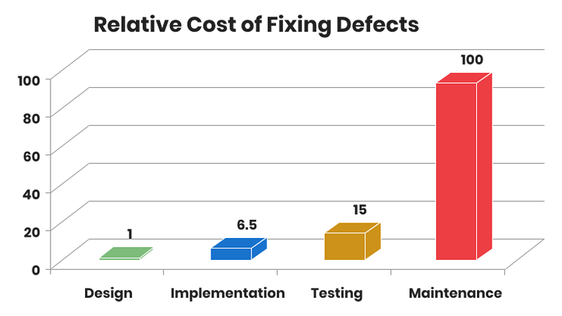

class: center, middle

# Unit Testing & Mocking

17.11.2021

.center[]

---

### Предната лекция говорихме за:

- Generics

---

### Днес ще разгледаме:

- Как се тества софтуер, и кому е нужно
- Какво е unit testing
- JUnit
- Test-Driven Development (TDD)
- Stubbing и mocking

---

### Защо е нужно да си тестваме кода?

> Chuck Norris doesn't need unit tests because his code always works. ALWAYS.
>
>&emsp;&emsp;&emsp;&emsp;— Wisdom of the Internet ;)

---

### Кога да тестваме?

.center[]

---

### Тестването не е фаза, а е процес

.center[]

---

### Основни видове тестове

- Ръчни
    - В професионалната софтуерна разработка, липса на автоматични тестове == липса на тестове въобще

- Автоматични
    - функционални
    - нефункционални

---

### Основни видове тестове

- Функционални тестове
    - unit тестове
    - integration тестове

- Нефункционални тестове
    - performance тестове
    - stress тестове
    - crash тестове
    - security тестове
    - usability тестове

---

### Още видове тестове

.center[]

---

### Unit Testing

- Unit test е код, който изпълнява специфична, "атомарна" (т.е. която не може да се разбие по смислен начин на по-малки) функционалност на кода, която да бъде тествана
- Един unit test цели да тества малък фрагмент код - обикновено един метод или най-много един клас

---

### Unit Testing

- Unit тестовете гарантират, че кодът работи както очакваме
- Подсигуряват, че кодът ще продължи да работи, както се очаква, в случай че го модифицираме, за да оправим бъг, рефакторираме или разширяваме функционалността

---

### Малко дефиниции

- *Продуктивен код* (a.k.a. *code under test*) – това е кодът, който реализира потребителските изисквания и удовлетворява сценариите на клиентите

- Процентът на продуктивния код, който се тества от автоматични тестове, се нарича *test coverage* или *code coverage*. Високият test coverage на кода ни дава увереност да разработваме функционалности, без да се налага да правим много ръчни тестове

---

### Малко дефиниции

- *Test Driven Development* (TDD) е методология, при която кодът на тестовете се пише преди продуктивния код, така че щом даден тест бъде удовлетворен (т.е. минава успешно, стане "зелен"), съответният use-case е реализиран ("done")
- *Test fixture* е фиксирано състояние на софтуера, който тестваме, което е началното условие (предусловието) за изпълняване на тестовете

---

### Малко дефиниции

- *Integration test* тества интеграцията на няколко класа (компонента)
- *Performance test* измерва бързодействието (ефективността) на даден софтуер по възпроизводим (repeatable) начин

---

class: center, middle

# JUnit

---

### JUnit Framework

- JUnit е най-популярният и *de facto* стандартният testing framework в Java
- Open source проект в [GitHub](https://github.com/junit-team/junit5)
- Актуалната версия е [JUnit 5](https://junit.org/junit5/)

.center[]

---

### Защо ни трябват testing frameworks?

- Улесняват ни да пишем и изпълняваме тестове
- Стандартизират разработката и поддръжката на тестове

---

### JUnit

- JUnit се базира на анотации
- Всеки JUnit тест е метод, анотиран с `@Test`, съдържащ се в клас, който се използва само за тестване
- Такъв клас се нарича *test case*

---

### Пример за JUnit тест

```java
public class Calc {
    public int multiply(int a, int b) {
        return a * b;
    }
}
```

<br>

```java
import org.junit.jupiter.api.Test;

import static org.junit.jupiter.api.Assertions.assertEquals;

public class CalcTest {
    @Test
    void testMultiplyByZeroShouldReturnZero() {
        Calc calc = new Calc(); // Calc is tested
        assertEquals(0, calc.multiply(10, 0), "10 x 0 must be 0");
        assertEquals(0, calc.multiply(0, 10), "0 x 10 must be 0");
        assertEquals(0, calc.multiply(0, 0), "0 x 0 must be 0");
    }
}
```

---

### Конвенции за именуване

- Прието е името на тестовия клас да се получава от името на класа, който тества, с добавяне на суфикса `Test`
- Популярна конвенция за имената на тестовите методи е, да започват с `test`, следвано от името на метода, който се тества, и кратко описание на тестовия сценарий, например `testLoginWithInvalidUserPassword`. Към нея се придържаме в нашите тестове за курса
- Името на теста трябва достатъчно ясно да описва сценария

---

### Статични методи на `Assertions` класа

- JUnit предоставя статични методи в класа `org.junit.jupiter.api.Assertions` за тестване на определени условия
- Ще се запознаем с най-използваните от тях, а може да разгледате всички в [документацията](https://junit.org/junit5/docs/current/api/org.junit.jupiter.api/org/junit/jupiter/api/Assertions.html) му

---

### Статични методи на `Assertions` класа

- `fail(String message)` – фейлва теста
    - Може да се използва за проверка, че определена част от кода не се достига или като временна dummy имплементация, която да се замести от реален тест
- `assertTrue(boolean condition, String message)` – проверява, че булевото условие е истина
- `assertFalse(boolean condition, String message)` – проверява, че булевото условие е лъжа
- `assertNull(Object o, String message)` – проверява, че обектът е null
- `assertNotNull(Object о, String message)` – проверява, че обектът не е null
- `assertSame(expected, actual, String message)` – проверява, че двете референции съвпадат
- `assertNotSame(expected, actual, String message)` – проверява, че двете референции са различни

---

### Статични методи на `Assertions` класа

- `assertEquals(expected, actual, String message)` – проверява за равенство на два обекта
    - масивите се сравняват по референции, не по съдържание
- `assertEquals(expected, actual, delta, String message)` – проверява за равенство на числа с плаваща точка
    - делтата (`delta`) определя точността на сравнението
- `assertArrayEquals(expected, actual, String message)` - проверява за равенство на два масива по дължина и съдържание. Ако и двата са null, се приемат за равни
- `assertIterableEquals(Iterable<?> expected, Iterable<?> actual, String message)` - (нов в JUnit 5) проверява дали двата `Iterable` връщат едни и същи (по съдържание) елементи, в един и същи ред. Не е нужно да са от един и същи вид, например може да сравним `LinkedList` с `ArrayList`

---

### Статични методи на `Assertions` класа

- Във всички assert методи, `String` параметърът (message) е опционален
- Добра практика да го подавате винаги и съобщението да е конкретно, подробно и смислено
- Особено важно е в случаите, в които различни програмисти пишат продуктивния код и тестовете

---

### JUnit анотации: `@Test`

```java
import static java.time.Duration.ofMillis;
import static org.junit.jupiter.api.Assertions.*;

public class InvestmentWalletTest {
    @Test
    void testDepositSuccessful() { // a test method could be public, protected or package-private
        assertEquals(5.0, wallet.deposit(5.0), 0.001, "If balance is 0, return the amount deposited");
    }

    @Test
    void testDepositNegativeAmount() {
        assertThrows(IllegalArgumentException.class, () -> wallet.deposit(-1.0),
            "Deposit amount cannot be negative");
    }

    @Test
    void testDepositPerformance() {
        assertTimeout(ofMillis(100), () -> wallet.deposit(1250.0),
            "Deposit too slow"); // "Deposit too slow ==> execution exceeded timeout of 100 ms by 33 ms"
    }
}
```

---

### JUnit анотации за жизнен цикъл: `@BeforeEach` и `@AfterEach`

```java
public class InvestmentWalletTest {

    @BeforeEach
    void setUp() {
        // този метод се изпълнява преди всеки тестов метод
        // използва се за подготовка на тестовата среда
    }

    @AfterEach
    void tearDown() {
        // този метод се изпълнява след всеки тестов метод
        // използва се да зачисти тестовата среда
    }
}
```

---

### JUnit анотации за жизнен цикъл: `@BeforeAll` и `@AfterAll`

```java
public class InvestmentWalletTest {

    @BeforeAll
    static void setUpTestCase() {
        // този метод се изпълнява еднократно преди стартиране на всички тестове
        // използва се за операции (особено, "скъпи") по инициализация на тестовата среда
        // методите с тази анотация трябва да са статични
    }

    @AfterAll
    static void tearDownTestCase() {
        // този метод се изпълнява еднократно след завършване на изпълнението на всички тестове
        // използва се за зачистване на ресурсите, създадени в @BeforeAll метода
        // методите с тази анотация трябва да са статични
    }
}
```

---

### Ред на изпълнение

- JUnit предполага, че всички тестови методи могат да се изпълняват в произволен ред
- Добре написаните тестове не трябва да разчитат на конкретен ред на изпълнение
    - т.е. тестовете не трябва да зависят от други тестове

---

### Ред на изпълнение

- Може явно, с анотацията `@TestMethodOrder` на ниво клас, да определите реда на изпълнение на тестовите му методи. Например, чрез параметризираната анотацията `@Order` на всеки тест:

  ```java
  @TestMethodOrder(MethodOrderer.OrderAnnotation.class)
  public class OrderedTest {

      @Test
      @Order(3)
      void testNullValues() {} // will execute third

      @Test
      @Order(1)
      void testEmptyValues() {} // will execute first

      @Test
      @Order(2)
      void testValidValues() {} // will execute second
  }
  ```

---

### Ред на изпълнение

- Може явно, с анотацията `@TestMethodOrder` на ниво клас, да определите реда на изпълнение да е лексикографският по имената на тестовите методи (`MethodOrderer.MethodName.class`):

  ```java
  @TestMethodOrder(MethodOrderer.MethodName.class)
  public class OrderedTest {

      @Test
      void testNullValues() {} // will execute second

      @Test
      void testEmptyValues() {} // will execute first

      @Test
      void testValidValues() {} // will execute third
  }
  ```

---

### JUnit: advanced възможности

- Тестови класове и методи могат смислово да се обединяват в *test suites*
- Може временно да изключваме/игнорираме даден тест с анотацията `@Disabled`
- Може да изпълняваме дадени тестове, само ако са налице някакви условия (например за тестовата среда), чрез т.нар. *assumptions*
- Може да даваме *human-friendly* имена на тестовите класове и/или методи с анотацията `@DisplayName`
- Поддържа се многократно изпълнение на даден тест с параметризираната анотация `@RepeatedTest`
- Поддържат се *параметризирани* и *динамични* тестове

---

### Къде "живеят" unit тестовете?

- Обикновено unit тестовете се разполагат в отделен проект или в отделна source директория, за да са отделени от продуктивния код
- Няма единен стандарт - зависи с какви други tools (например за build) искате интеграция

---

### Къде "живеят" unit тестовете?

- Един вариант (maven)

  ```bash
  fancy-project
      ├─ src/main/java
      │   └─ (...)
      └─ src/test/java
          └─ (...)
  ```

- Друг вариант

  ```bash
  fancy-project
      ├─ src
      │   └─ (...)
      └─ test
          └─ (...)
  ```

---

### Как се изпълняват?

- През IDE
- През конзола
- През build системи (maven, gradle)
- През Continuous Integration (CI) системи (Jenkins, Travis)
- Засега ще се ограничим да ги изпълняваме през IDE-то

---

### Code coverage plug-ins

- [Code coverage runner](https://www.jetbrains.com/help/idea/code-coverage.html) for IntelliJ
- [EclEmma](https://www.eclemma.org/) for Eclipse
    - базирана е на open source проекта [JaCoCo](https://www.jacoco.org/jacoco/)

---

### Best practices

- Не тествайте тривиален код като getters/setters
- Тествайте `private` методи само косвено
- Стремете се към 70-80% code coverage
- Пишете кратки, ясни и бързи unit тестове

---

class: center, middle

# JUnit 4 vs. JUnit 5

Основните разлики, стъпките за миграция и някои предимства на новата версия може да разгледате [тук](https://blogs.oracle.com/javamagazine/post/migrating-from-junit-4-to-junit-5-important-differences-and-benefits)

---

class: center, middle

# Stubbing and mocking

---

### Unit тестване на класове със зависимости

- Често клас използва в себе си други класове: има член-данни - референции към обект на друг клас
- Това се нарича *композиция* на класове
- Това е съвсем очаквано и нормално :)
- Как unit тестваме такива класове?
- Да разгледаме един такъв пример

---

### Unit тестване на класове със зависимости

```java
public class UserService {

    private UserRepository repository;

    public User register(String email, String password) {
        if (repository.exists(email)) {
            throw new UserAlreadyExistsException();
        }

        User user = new User(email, password);
        repository.save(user);
        return user;
    }

}
```

---

### Unit тестване на класове със зависимости

- Нека `UserRepository` е интерфейс, чиято задача е да съхранява `User`-и (in-memory, file system, database, etc.)
- Нека `UserService` е клас, който борави с `User`-и и съдържа бизнес логиката на нашето приложение

---

### Test cases for `register()`

- Методът `register()` има 2 exit point-a - следователно имаме 2 сценария за покриване
- [TC1] `register()` хвърля подходящо изключение, когато мейл адресът вече съществува в хранилището
- [TC2] `register()` запазва подходящия user в хранилището, когато мейл адресът не съществува в хранилището
- Как unit тестваме `UserService` класа?

---

### Unit тестване на класове със зависимости

- При unit тестване се интересуваме от функционалната коректност само на класа, който се тества
- Трябват ни инструменти, чрез които да "изолираме" композираните класове
- Композираните класове могат да бъдат трудни за инстанциране
- Например, `UserRepository` изисква connectivity към база от данни

---

### Unit тестване на класове със зависимости

- Доброто unit тестване се базира на изолация
- Изолацията се постига чрез т.нар *stub* или *mock* обекти

---

### Stubbing

- *Stub* наричаме клас, който отговаря на дадени извиквания на методи с предварително зададени отговори
- В unit тестването ни служат за справяне с проблема с композираните класове

---

### Stubbing

- Обикновено имплементират по минимален начин даден интерфейс и се подават на класа, който се тества
- Извън unit тестването, могат да бъдат използвани и като заместител на код, който още не е разработен

---

### `PositiveUserRepositoryStubImpl`

```java
public class PositiveUserRepositoryStubImpl implements UserRepository {

    @Override
    public boolean exists(String email) {
        return true;
    }

    @Override
    public void save(User user) {
        // Do nothing
    }
}
```

---

### `InMemoryUserRepositoryStubImpl`

```java
public class InMemoryUserRepositoryStubImpl implements UserRepository {

    private Map<String, User> users = new HashMap<>();

    @Override
    public boolean exists(String email) {
        return users.containsKey(email);
    }

    @Override
    public void save(User user) {
        users.put(user.getEmail(), user);
    }

}
```

---

### The stub way

```java
@Test
public void testRegisterThrowsAppropriateException() {
    UserService service =
            new UserService(new PositiveUserRepositoryStubImpl());

    assertThrows(UserAlreadyExistsException.class, () -> service.register("test@test.com", "weak"),
            "UserAlreadyExistsException expected");
}
```

---

### Жизнен цикъл на тестване със stub

1. Setup data - подготвяме обекта, който ще се тества, както и stub събратята му
2. Exercise - извикваме метода, който искаме да тестваме
3. Verify state - използваме assertions, за да проверим състоянието на обекта
4. Teardown - освобождаваме използваните ресурси

---

### Характеристики на stub-овете

- Могат да съдържат логика, която не е тривиална (напр. `InMemoryUserRepositoryStubImpl`) (+)
- Броят на stub-овете расте експоненциално (-)
- Не може да проверим дали даден метод на stub-a е извикан определен брой пъти (-)

---

### Mocking

- *Mock* наричаме конфигуриран обект с предварително зададени отговори на дадени извиквания на методи
- Динамични wrapper-и за композираните класове
- По подобие на stub-овете, ни служат за справяне с проблема с композираните класове

---

### The mock way

```java
@Test
public void testRegisterThrowsAppropriateException() {
    UserRepository mock = mock(UserRepository.class);
    when(mock.exists("test@test.com")).thenReturn(true);

    UserService service = new UserService(mock);

    assertThrows(UserAlreadyExistsException.class, () -> service.register("test@test.com", "weak"),
        "UserAlreadyExistsException expected");
}
```

---

### Жизнен цикъл на тестване с mock

1. Setup data - подготвяме обекта, който ще се тества, както и mock събратята му
2. Setup expectations - задаваме желаните отговори
3. Exercise - извикваме метода, който искаме да тестваме
4. Verify expectations - уверяваме се, че правилният метод на mock-a се е извикал
5. Verify state - използваме assertions, за да проверим състоянието на обекта
6. Teardown - освобождаваме използваните ресурси

---

### To mock or not to mock?

```java
public class Cinema {
    private Map<String, Projection> projections;

    public Cinema(Map<String, Projection> projections) {
        this.projections = projections;
    }

    public boolean buyTicket(String projection, int amount) {
        if (!projections.containsKey(projection)) {
            return false;
        }
        // [...]
        return true;
    }

}
```

---

### Do not mock

```java
@Test
public void testBuyTicket() {
    Map<String, Projection> projections =
            Map.of("foo", new Projection("foo"));
    Cinema cinema = new Cinema(projections);

    boolean actual = cinema.buyTicket("bar", 3);
    assertFalse(actual);
}
```

---

### To mock or not to mock?

```java
public class Cinema {
    private ProjectionService service;

    public Cinema(ProjectionService service) {
        this.service = service;
    }

    public boolean buyTicket(String projection, int amount) {
        if (!service.contains(projection)) {
            return false;
        }
        // [...]
        return true;
    }
}
```

---

### Mock

```java
@Test
public void testBuyTicket() {
    ProjectionService mock = mock(ProjectionService.class);
    when(mock.contains("bar")).thenReturn(false);

    Cinema cinema = new Cinema(mock);

    boolean actual = cinema.buyTicket("bar", 3);
    assertFalse(actual);
}
```

---

### Използвайте mock-ове, когато:

- Композираният клас се обръща към външен ресурс (мрежа, база данни, файлова система и т.н.)
- Логиката в композирания клас не е тривиална
- Не може да настроите test environment-a по тривиален начин

---

### Не използвайте mock-ове, когато:

- Композираният клас представлява value object, който може да подадете отвън
- Може тривиално да настроите test environment-a

---

### Mocking библиотеки

- [Mockito](https://github.com/mockito/mockito)
- [EasyMock](https://github.com/easymock/easymock)
- [PowerMock](https://github.com/powermock/powermock)
    - *Putting it in the hands of junior developers may cause more harm than good.*

---

### Mockito

- Ще разглеждаме mockito (4.0.0) като mocking библиотека
- Възниква като разширение на функционалността на EasyMock
- Една от 10-те най-популярни Java библиотеки изобщо
- Open-source

.center[]

---

### Setup

- Mockito е външна библиотека
- Може да я изтеглите от [тук](https://mvnrepository.com/artifact/org.mockito/mockito-core/4.0.0)
- Изтеглете mockito-core jar-a и 3-те му dependency-та, както и [mockito-junit-jupiter](https://mvnrepository.com/artifact/org.mockito/mockito-junit-jupiter/4.0.0)
- Ако ползвате IDE, добавете въпросните jar-ки в class path-a на проекта си
- Алтернативно, ако сте запознати с maven/gradle, ползвайте тях :)

---

### Setup

```bash
fancy-project
    ├─ src/
    │   └─ (...)
    ├─ test/
    │   └─ (...)
    └─ lib/
        ├─ byte-buddy-1.12.1.jar
        ├─ byte-buddy-agent-1.12.1.jar
        ├─ mockito-junit-jupiter-4.0.0.jar
        ├─ mockito-core-4.0.0.jar
        └─ objenesis-3.2.jar
```

---

### `mock()` и `verify()`

```java
import static org.mockito.Mockito.*;

List mockedList = mock(List.class);

mockedList.add("one");
mockedList.clear();
mockedList.get(0);

verify(mockedList).add("one");
verify(mockedList, atLeastOnce()).clear();
verify(mockedList, never()).add("two");
```

---

### `when()`

```java
LinkedList mockedList = mock(LinkedList.class);

when(mockedList.get(0)).thenReturn("first");
when(mockedList.get(1)).thenThrow(new RuntimeException());

mockedList.get(0);
mockedList.get(1);
```

---

### Argument matchers

```java
when(mockedList.get(anyInt())).thenReturn("element");

mockedList.get(999);
```

---

### `@Mock` анотацията

```java
@ExtendWith(MockitoExtension.class)
public class UserServiceTest {
    @Mock
    private UserRepository repositoryMock;

    @Test
    public void testRegisterThrowsAppropriateException() {
        when(repositoryMock.exists("test@test.com")).thenReturn(true);

        UserService service = new UserService(repositoryMock);

        assertThrows(UserAlreadyExistsException.class, () -> service.register("test@test.com", "weak"),
            "UserAlreadyExistsException expected");
    }
}
```

---

### Добри практики

- Не правете йерархии от тестови класове
- Mock-вайте само толкова колкото ви трябва за конкретния тест
- Не mock-вайте value обекти
- Keep it short and simple (KISS)
- Redesign when you cannot test it

---

### Полезни четива

- [JUnit 5 User Guide](https://junit.org/junit5/docs/current/user-guide/index.html)
- [JUnit 5 javadoc](https://junit.org/junit5/docs/current/user-guide/index.html)
- [Unit Testing with JUnit](http://www.vogella.com/tutorials/JUnit/article.html)
- [Mocks aren't stubs](https://martinfowler.com/articles/mocksArentStubs.html) by Martin Fowler
- [Writing good tests](https://github.com/mockito/mockito/wiki/How-to-write-good-tests) by Mockito team

---

### Полезни четива

.center[]

---

## Въпроси?

.font-xl[.ri-github-fill.icon-inline[[fmi/java-course](https://github.com/fmi/java-course)]]

.font-xl[.ri-youtube-fill.icon-inline[[MJT2022](https://www.youtube.com/playlist?list=PLew34f6r0PxyUcIg370lv9jHDwFeMDa7e)]]
