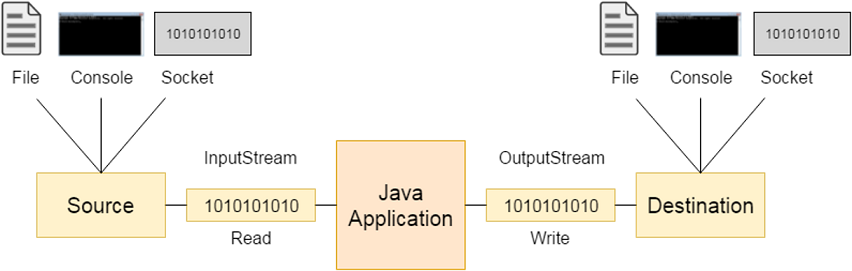
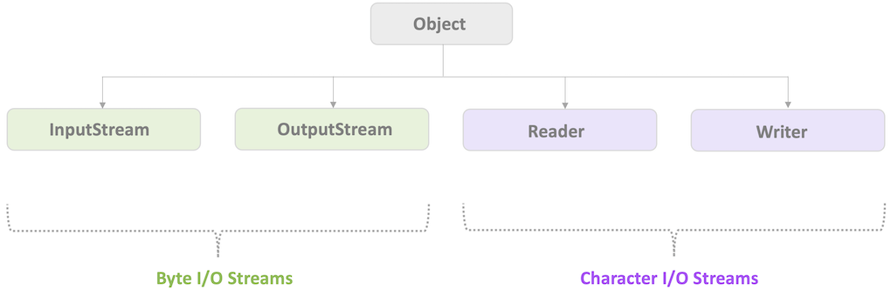
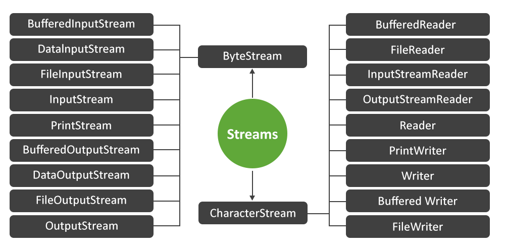
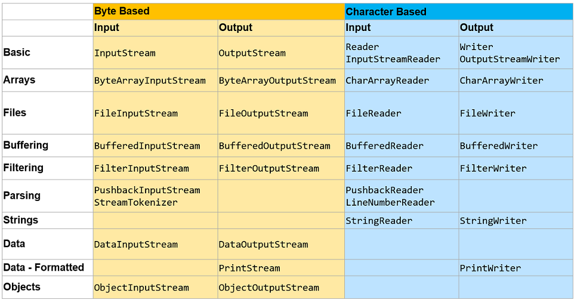
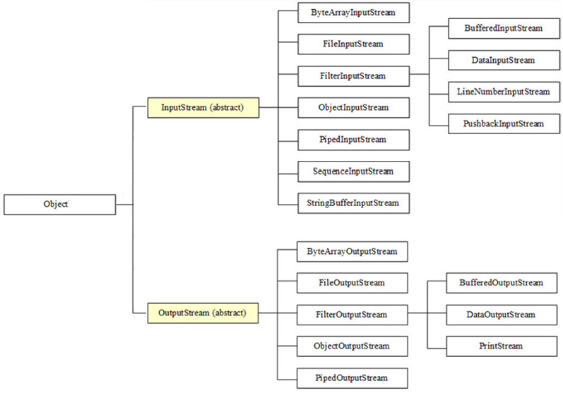
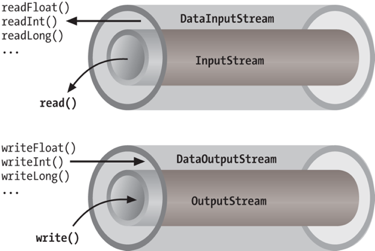
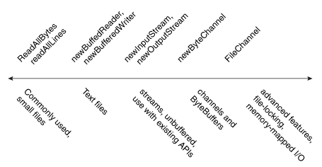
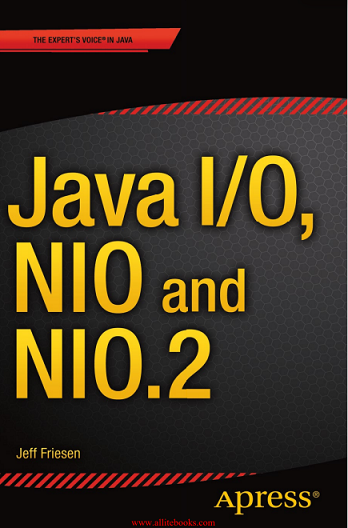

class: center, middle

# Входно-изходни потоци и файлова система

19.11.2025

.center[]

---

### Предната лекция говорихме за:

- Как се тества софтуер, и кому е нужно
- Какво е unit testing
- JUnit
- Stubbing и mocking
- Mockito

---

### Днес ще разгледаме:

- Входно-изходните потоци в Java
- Работа с файловата система

---

### Какво е поточна линия?

.center[]

---

### Входно-изходни потоци

- Концепцията за вход-изход в Java се основава на *потоци* (*streams*)
- *Потокът* е абстракция за безкраен поток от данни
- Може да се четат данни от поток или да се пишат данни в поток
- В Java потоците може да се основават на байтове или на символи

---

### Източник на данни и дестинация за данни

<br>

.center[]

---

### Две основни йерархии:

- **Byte Streams** - за binary данни. Използваме за неща като:
    - Снимки, видео, аудио
    - ZIP/JAR файлове
    - Мрежова комуникация

- **Character Streams** - за текст. Използваме за неща като:
    - Текстови файлове
      - CSV, JSON, XML
      - Конфигурационни файлове
      - Лог файлове

---

### Абстрактните класове в корена на I/O йерархията

<br>

.center[]

<br>

Намират се в пакета `java.io`

---

### Входно-изходни потоци: според източника / дестинацията на данните

Абстрактните класове `InputStream`, `OutputStream`, `Reader` и `Writer` имат много наследници, създадени за различни цели:

- Достъп до файлове
- Достъп до мрежи
- Достъп до буфери в паметта
- Междунишкова комуникация (Pipes)

---

### Входно-изходни потоци: според допълнителните си качества

- Четене и писане на текст
- Четене и писане на примитивни типове данни
- Четене и писане на обекти
- Парсване
- Буфериране
- Компресиране
- Криптиране

---

### Видове потоци

.center[]

---

### Видове потоци според нуждата

.center[]

---

### Видове Byte потоци

.center[]

---

### Видове Character потоци

.center[]

---

### Входно-изходни потоци: жизнен цикъл

Потоците се

- Създават
- Използват
- Затварят

---

### "Обвиване" на потоци

По-специализираните типове входно-изходни потоци

- често се създават като wrapper около по-базови типове потоци
- и добавят свойства като буфериране или работа на по-високо ниво на абстракция.
- За целта, повечето потоци имат overloaded конструктори, които приемат поток като аргумент

```java
// Базов поток
FileInputStream fileInput = new FileInputStream("data.bin");

// Добавяме буфериране за скорост
BufferedInputStream bufferedInput = new BufferedInputStream(fileInput);

// Добавяме четене на примитивни типове
DataInputStream dataInput = new DataInputStream(bufferedInput);

// Сега можем да четем int, double, и т.н.
int number = dataInput.readInt();
double value = dataInput.readDouble();
```

---

### "Обвиване" на потоци

.center[]

  `.close()`-ването на wrapper потока автоматично `.close()`-ва и тези, които той wrap-ва


> "Обвиването" на потоци е пример за Decorator Pattern 

---

### Пример с `InputStream`

```java
InputStream inputStream = new FileInputStream("c:\\data\\input-text.txt");

int data;
while ((data = inputStream.read()) != -1) {
    // doSomethingWithData(data);
}

inputStream.close();

```

<br/>

`read()` чете един байт и го връща като int в интервала [0, 255].

Няма валидна стойност -1, затова -1 може да се върне като маркер за край на потока.

---

### `java.io.InputStream`

```java
int          available();
void         close();
void         mark(int readlimit);
boolean      markSupported();
abstract int read();
int          read(byte[] b);
int          read(byte[] b, int off, int len);
byte[]       readAllBytes();
int          readNBytes(byte[] b, int off, int len);
void         reset();
long         skip(long n);
long         transferTo(OutputStream out);
```

---

### `java.io.OutputStream`

```java
void          close();
void          flush();
void          write(byte[] b);
void          write(byte[] b, int off, int len);
abstract void write(int b);
```

---

### Пример с `OutputStream`

```java
OutputStream os = new FileOutputStream("test.txt"));

os.write("Hello FMI!".getBytes());
os.flush();
os.close();
```

<br>

При конструирането на `FileOutputStream`, ако файлът не съществува, ще се направи опит да се създаде.

---

### `FileOutputStream`: append vs. overwrite

```java
// appends to a file
OutputStream output = new FileOutputStream("c:\\data\\output-text.txt", true); 

// overwrites a file
OutputStream output = new FileOutputStream("c:\\data\\output-text.txt", false);
```

</br>

Ако не подадем булев аргумент, поведението е overwrite (презаписване на файла).

---

### Пример с `DataInputStream`

```java
DataInputStream input = new DataInputStream(new FileInputStream("binary.data"));

int    aByte   = input.read();
int    anInt   = input.readInt();
float  aFloat  = input.readFloat();
double aDouble = input.readDouble();
// etc.

input.close();
```

---

### Пример с `ObjectOutputStream`

```java
var objectOutputStream = new ObjectOutputStream(new FileOutputStream("persons.dat"));

Person object = new Person();
objectOutputStream.writeObject(object);
objectOutputStream.close();
```

---

### `java.io.Serializable`

`Serializable` е маркерен интерфейс, който указва, че обектите на класа могат да се *сериализират* (т.е. конвертират в последователност от битове) и *десериализират* (т.е. (пре)създават от последователност от битове). Класове, обекти на които ще записваме или четем във файл или ще пращаме или получаваме по мрежата, трябва да са `Serializable`.

---

### `java.io.Serializable`

```java
import java.io.Serializable;

public class Person implements Serializable {
    // the particular version of the class definition is denoted by
    // the serial version unique identifier: IDEs can generate these
    private static final long serialVersionUID = 1234L;

    private String name;
    private int age;

    public Person(String name, int age) {
        this.name = name;
        this.age = age;
    }
}
```

---

### Try-with-resources

- `try` блок, който декларира един или повече ресурси и автоматично затваря всеки ресурс в края на блока
- Ресурс може да е обект от произволен клас, който имплементира интерфейса `java.lang.AutoCloseable` (което включва всички класове, които имплементират `java.io.Closeable`)

---

### Пример за try-with-resources

```java
static String readFirstLineFromFile(String path) throws IOException {

    try (BufferedReader br = new BufferedReader(new FileReader(path))) {
        return br.readLine();
    }

}
```

<br>

Каквото е декларирано в кръглите скоби след `try`, се `.close()`-ва автоматично при излизане от `try` блока.

---

### `java.io.Reader`

```java
abstract void close();
void          mark(int readAheadLimit);
boolean       markSupported();
int           read();
int           read(char[] cbuf);
abstract int  read(char[] cbuf, int off, int len);
int           read(CharBuffer target);
boolean       ready();
void          reset();
long          skip(long n);
```

---

### `java.io.Writer`

```java
Writer        append(char c);
Writer        append(CharSequence csq);
Writer        append(CharSequence csq, int start, int end);
abstract void close();
abstract void flush();
void          write(char[] cbuf);
abstract void write(char[] cbuf, int off, int len);
void          write(int c);
void          write(String str);
void          write(String str, int off, int len);
```

---

### Пример с `BufferedReader`

```java
Reader reader = new FileReader("data/data.txt");
BufferedReader bufferedReader = new BufferedReader(reader);

String line;
while ((line = bufferedReader.readLine()) != null) {
    // process line
}
```

---

### Разделител на редовете в текстов файл

Различните операционни системи използват различен символ или последователност от символи, за да обозначат край на ред в текстов файл:

  - Windows: `\r\n`
  - UNIX, Linux и MacOS: `\n`

За да си гарантирате, че Java кодът ви ще работи коректно на всяка OS, вместо тези символи, трябва да ползвате

  - `System.lineSeparator()`, или
  - `PrintWriter.println()`, или
  - `BufferedWriter.newLine()`

---

### Трите стандартни потока

<br>

.center[]

---

### `java.util.Scanner`

```java
Scanner scanner = new Scanner(System.in);
int i = scanner.nextInt();
String str = scanner.nextLine();
// [...]
```

---

### `java.util.Formatter`

```java
StringBuilder sb = new StringBuilder();
// Send all output to the Appendable object sb
Formatter formatter = new Formatter(sb, Locale.US);

// Explicit argument indices may be used to re-order output.
formatter.format("%4$2s %3$2s %2$2s %1$2s", "a", "b", "c", "d")
// -> " d  c  b  a"

// Optional locale as the first argument can be used to get
// locale-specific formatting of numbers. The precision and width
// can be given to round and align the value.
formatter.format(Locale.FRANCE, "e = %+10.4f", Math.E);
// -> "e =    +2,7183"
```

---

### `java.util.Formatter`

```java
// The '(' numeric flag may be used to format negative numbers
// with parentheses rather than a minus sign. Group separators
// are automatically inserted.
formatter.format("Amount diff since last statement: $ %(,.2f", balanceDelta);
// -> "Amount diff since last statement: $ (6,217.58)"

// Writes a formatted string to System.out
System.out.format("Local time: %tT", Calendar.getInstance());
// -> "Local time: 13:34:18"

// Writes formatted output to System.err
System.err.printf("Unable to open file '%1$s': %2$s", fileName, exception.getMessage());
// -> "Unable to open file 'food': No such file or directory"
```

---

## Въпроси?

---

### Файловата система

- Йерархична структура
- Състои се от директории и файлове
- Главна директория (корен)
- Текуща (работна) директория
- Пътища
    - Относителни
    - Абсолютни
- Symbolic links

---

### Java API-то за работа с файловата система

NIO.2 (NIO == Non-blocking I/O)

- Пакетът [`java.nio.file`](https://docs.oracle.com/en/java/javase/23/docs/api/java.base/java/nio/file/package-summary.html)
    - [`java.nio.file.Path`](https://docs.oracle.com/en/java/javase/23/docs/api/java.base/java/nio/file/Path.html)
    - [`java.nio.file.Files`](https://docs.oracle.com/en/java/javase/23/docs/api/java.base/java/nio/file/Files.html)

---

### `java.nio.file.Path`

```java
// Класът Path служи за представяне на път
// Обозначава файл или директория
// Файлът или директорията може физически да съществуват или не
// Инстанции се създават чрез статични методи на java.nio.file.Paths,
// а от Java 11 - и на java.nio.file.Path

Path pathToUserHomeDir = Path.of("C:\\Users\\joe"); // C:\Users\joe
Path pathToAFile       = Path.of("C:\\Users\\joe\\orders.txt"); // C:\Users\joe\orders.txt
Path relPathToAFile    = Path.of("Users", "joe", "orders.txt"); // \Users\joe\orders.txt

Path linuxPathToAFile  = Paths.get("/home", "joe", "file.txt"); // /home/joe/file.txt
Path linuxRelativePath = Paths.get("documents", "FileIO.odp"); // documents/FileIO.odp
```

---

### `java.nio.file.Path` - разделители

- Разделителят по подразбиране на имената в пътищата е OS-dependent
    - В Windows е back slash: \\
    - В UNIX, Linux и MacOS е forward slash: /
- Може да се вземе в Java код чрез `File.separator` или `FileSystem.getSeparator()`

---

### `java.nio.file.Path`

| Метод          | Връща под UNIX/Linux | Връща под Windows |
|:---------------|:---------------------|:------------------|
| toString()     | /home/joe/foo        | C:\home\joe\foo   |
| getFileName()  | foo                  | foo               |
| getName(0)     | home                 | home              |
| getNameCount() | 3                    | 3                 |
| subpath(0, 2)  | home/joe             | home\joe          |
| getParent()    | /home/joe            | \home\joe         |
| getRoot()      | /                    | C:\               |

---

### `java.nio.file.Path`: Преобразувания

```java
Path toAbsolutePath() // преобразува пътя до абсолютен, т.е.
                      // започващ от главната директория

Path toRealPath()     // преобразува пътя до реален, т.е.
                      //     - абсолютен
                      //     - с премахнати символни връзки
                      //     - с премахнати . и ..

Path resolve(Path anotherPath) // добавя относителен път по следния начин:
Path p1 = Paths.get("/home/joe/foo");
Path p2 = p1.resolve("bar"); // резултатът е /home/joe/foo/bar

```

---

### `java.nio.file.Path`: Сравняване

```java
boolean equals(Path anotherPath)
boolean startsWith(Path anotherPath)
boolean endsWith(Path anotherPath)
```

---

### Some legacy: `java.io.File`

Дескриптор за файлове, аналог на `java.nio.file.Path` във версиите преди Java 7.<p>
Присъства все още в много API-та.

<br>

```java
// creation
File absoluteFile = new File("c:\\Users\\joe\\file.txt");
File absoluteFile = new File("c:\\Users\\joe", "file.txt");
File parentFile = new File("c:\\Users\\joe");
File absoluteFile = new File(parentFile, "file.txt");
URI fileUri = URI.create("file:///home/joe/file.txt");
File absoluteFile = new File(fileUri);

// conversion to and from java.nio.file.Path
Path absolutePath = absoluteFile.toPath();
File absoluteFile = absolutePath.toFile();
```

---

### `java.nio.file.Files`: Метаданни

```java
long size(Path path)

boolean isRegularFile(Path path)
boolean isDirectory(Path path)
boolean isSymbolicLink(Path path)
boolean isHidden(Path path)


FileTime getLastModifiedTime(Path path)
FileTime setLastModifiedTime(Path path, FileTime time)

UserPrincipal getOwner(Path path)

Object getAttribute(Path path, String attribute)
Path setAttribute(Path path, String attribute, Object value)
```

---

### `java.nio.file.Files`: Други проверки

```java
boolean exists(Path path)
boolean notExists(Path path)
boolean isReadable(Path path)
boolean isWritable(Path path)
boolean isExecutable(Path path)
boolean isSameFile(Path path1, Path path2)

```

---

### `java.nio.file.Files`: Изтриване на файлове и директории

```java
void delete(Path path)
// ако path не съществува, хвърля NoSuchFileException
// ако path е непразна директория, хвърля DirectoryNotEmptyException

boolean deleteIfExists(Path path)
// ако path не съществува, връща false
// ако path е непразна директория, хвърля DirectoryNotEmptyException
```

---

### `java.nio.file.Files`: Копиране на файлове и директории

```java
Path copy(Path source, Path target, CopyOption... options)

// съдържанието на директория не се копира
// options може да бъде една или повече от:
//    StandardCopyOption.COPY_ATTRIBUTES
//        копират се и атрибутите на файла/директорията,
//        например време на последна промянa
// StandardCopyOption.REPLACE_EXISTING
//        ако target е съществуващ файл, то той се презаписва
//        вместо да се хвърля FileAlreadyExistsException
```

---

### `java.nio.file.Files`: Преместване/преименуване на файлове и директории

```java
Path move(Path source, Path target, CopyOption... options)

// директория може да се премести само на същата файлова система
// options може да бъде една или повече от:
//    StandardCopyOption.ATOMIC_MOVE
//        преместването е атомарно, а ако това не е възможно,
//        се хвърля `AtomicMoveNotSupportedException
//    StandardCopyOption.REPLACE_EXISTING`: ако target е
//    съществуващ файл, то той се презаписва вместо да се хвърля изключение
```

---

### `java.nio.file.Files`: Създаване на директория

```java
Path createDirectory(Path dir)
// създава директория с път dir,
// ако родителската директория на този път вече съществува

Path createDirectories(Path dir)
// създава директория с път dir, създавайки
// и родителските директории, ако има нужда
```

---

### `java.nio.file.Files`: Обхождане на директория

```java
DirectoryStream<Path> newDirectoryStream(Path dir)
// създава поток, от който могат да бъдат прочетени файловете
// и поддиректориите на директорията с път dir като инстанции на Path
// DirectoryStream прилича повече на колекция
// (защото е наследник на Iterable), отколкото на входно-изходен поток.

Path dir = Path.of("/somedir");
try (DirectoryStream<Path> stream = Files.newDirectoryStream(dir)) {

    for (Path fileOrSubDir : stream) {
        // употреба на fileOrSubDir
    }

} catch (IOException | DirectoryIteratorException e) {
    // обработка на изключенията
}
```

---

### Обхождане на директория с шаблони за търсене (globs, wildcards)

```java
DirectoryStream<Path> newDirectoryStream(Path dir, String glob)
// създава поток, който съдържа само файловете и поддиректориите,
// които отговарят на шаблона за търсене glob
// например, итерираме всички файлове с разширение .java

Path dir = Path.of("/somedir");

try (DirectoryStream<Path> stream = Files.newDirectoryStream(dir, "*.java")) {
    // [...]
}
```

---

### Шаблони за търсене (globs, wildcards)

| Шаблон                  | Семантика                                                                        |
|:------------------------|:---------------------------------------------------------------------------------|
| \*                      | замества произволен брой символи (вкл. николко) в рамките на едно име от пътя    |
| \*\*                    | като \*, но пресича границите на имената в пътя, (т.е. може да замести / или \\) |
| ?                       | замества точно един символ                                                       |
| {s1, …, sN}             | замества някой от под-шаблоните                                                  |
| [c1...cN]               | замества някой от символите                                                      |
| [c1-c2]                 | замества някой от символите в диапазона от c1 до с2                              |
| [!c]                    | замества всеки един символ, различен от c                                        |
| \                       | използва се за escape на специалните символи, вкл. \\                            |
| всеки друг символ       | замества себе си                                                                 |

---

### Примерни шаблони за търсене

| Шаблон          | Семантика                                                      |
|:----------------|:---------------------------------------------------------------|
| /home/\*/file   | замества /home/joe/file (и други), но не и /home/joe/work/file |
| /home/\*\*/file | замества /home/joe/work/file (и други)                         |
| {temp\*, tmp\*} | замества всички имена, започващи с temp или tmp                |
| [fmi]           | замества една от буквите f, m, или i                           |
| [fF]            | замества f или F                                               |
| [!a].txt        | замества един символ, различен от ‘a’, следван от .text        |
| \\              | замества обратно наклонена черта                               |
| alabala         | замества alabala                                               |

---

### Прочитане или записване на цял файл с `java.nio.file.Files`

```java
// These are suitable for small files.
// For larger ones, use buffered streams
byte[] readAllBytes(Path file);
List<String> readAllLines(Path file, Charset cs);

Path write(Path file, byte[] bytes, OpenOption... options);
Path write(Path path, Iterable<? extends CharSequence> lines, Charset cs, OpenOption... options);

// Read/write entire file into a String: since Java 11
String readString(Path file); // UTF-8
String readString(Path file, Charset cs);

Path writeString(Path file, CharSequence lines, OpenOption[] options); // UTF-8
Path writeString(Path file, CharSequence lines, Charset cs, OpenOption[] options);
```

---

### ⚡ Бенчмарк: Методи за четене на файлове

| Метод | Малък файл (1MB) | Среден (100MB) | Голям (1GB) | Кога да използваме |
|---------|--------------|---------------|-------------|----------------------|
| `Files.readString()` | ⚡ 4ms | ⚡ 15ms | ❌ OutOfMemory | Малки текстови файлове |
| `Files.readAllLines()` | ⚡ 4ms | ⚡ 120ms | ⚠️ 3.5s | Средни файлове, нужни са всички редове |
| `Files.lines()` + Stream | ⚡ 5ms | ⚡ 112ms | ⚡ 3.5s | Големи файлове, обработка ред по ред |
| `BufferedReader` | ⚡ 24ms | ⚡ 122ms | ⚡ 1.1s | Максимален контрол |
| `FileChannel` (NIO.2) | ⚡ 3ms | ⚡ 102ms | ⚡ 969ms | Екстремна производителност |

---

class: center, middle

## 🏆 Топ 5 често срещани грешки
## от 10,000+ Stack Overflow въпроса

---

### 🐞 Грешка #1: Пропускане на .close()

```java
// ❌ Грешно - file handle leak!
FileInputStream input = new FileInputStream("data.bin");
int data = input.read();
// Забравихме да затворим потока!
```
</br/>

```java
// ⚠️ По-добре - но все още рисковано
FileInputStream input = null;
try {
    input = new FileInputStream("data.bin");
    int data = input.read();
} finally {
    if (input != null) {
        input.close(); // Ами ако close() хвърли изключение?
    }
}
```

---

### 🐞 Грешка #1: Пропускане на .close()

```java
// ✅ Правилно - try-with-resources
try (FileInputStream input = new FileInputStream("data.bin")) {
    int data = input.read();
} // Автоматично се затваря
```

---

### 🐞 Грешка #2: Грешен encoding

```java
// ❌ Грешно - използва platform default encoding
FileWriter writer = new FileWriter("users.txt");
writer.write("Иван Петров");
writer.close();

// На Windows често е Windows-1252
// На Linux е UTF-8
// На Mac може да е MacRoman
// → Различен резултат на различни машини!
```
<br/>

- Ако запишете в един encoding и прочетете в друг, байтовете се интерпретират грешно → „маймуница“.
- Ето как изглежда „маймуница“ при грешен encoding, ако текстът „Иван Петров“ се запише с Windows-1252, а после се прочете като UTF-8:

  `Иван Петров`

---

### 🐞 Грешка #2: Грешен encoding

```java
// ✅ Правилно - изрично указан UTF-8
try (BufferedWriter writer = Files.newBufferedWriter(
        Path.of("users.txt"), UTF_8)) {
    writer.write("Иван Петров");
}
```
<br/>
```java
// ✅ Най-просто
Files.writeString(Path.of("users.txt"), "Иван Петров"); // UTF_8 by default
```

---

### 🐞 Грешка #3: Четене byte-by-byte

```java
// ❌ Грешно - 1000x по-бавно!
try (FileInputStream input = new FileInputStream("large.dat")) {
    int data;
    while ((data = input.read()) != -1) {
        process(data); // Системно извикване за ВСЕКИ байт!
    }
}
```

---

### 🐞 Грешка #3: Четене byte-by-byte

```java
// ✅ Правилно - с буфериране
try (BufferedInputStream input = 
        new BufferedInputStream(new FileInputStream("large.dat"))) {
    int data;
    while ((data = input.read()) != -1) {
        process(data); // Чете се на блокове от 8192 байта
    }
}
```
<br/>

```java
// ✅ Отлично - четене на масив
try (FileInputStream input = new FileInputStream("large.dat")) {
    byte[] buffer = new byte[8192];
    int bytesRead;
    while ((bytesRead = input.read(buffer)) != -1) {
        processBuffer(buffer, bytesRead);
    }
}
```

---

### 🐞 Грешка #4: Игнориране на IOException

```java
// ❌ Грешно - поглъщане на грешки
try {
    String content = Files.readString(Path.of("config.json"), UTF_8);
} catch (IOException e) {
    // Нищо... файлът липсва? Нямаме права? Кой знае...
}
```

---

### 🐞 Грешка #4: Игнориране на IOException

```java
// ✅ Правилно - смислена обработка
try {
    String content = Files.readString(Path.of("config.json"), UTF_8);
    return parseConfig(content);
} catch (NoSuchFileException e) {
    logger.error("Configuration file not found: " + e.getMessage());
    return getDefaultConfig();
} catch (AccessDeniedException e) {
    logger.error("No permission to read config file");
    throw new SecurityException("Cannot access configuration", e);
} catch (IOException e) {
    logger.error("Failed to read configuration", e);
    throw new RuntimeException("Configuration error", e);
}
```

---

### 🐞 Грешка #5: Ползване на абсолютни пътища

```java
// ❌ Грешно - работи само на вашата машина
Path file = Path.of("C:\\Users\\Ivan\\Documents\\data.txt");

// На Mac/Linux ще гръмне
// На друг Windows компютър ще гръмне
// В Docker контейнер ще гръмне
```

---

### 🐞 Грешка #5: Ползване на абсолютни пътища

```java
// ✅ Правилно - относителни пътища
Path file = Path.of("data", "input.txt");
// → data/input.txt на всички платформи
```
<br/>

```java
// ✅ Добро - home directory
Path home = Paths.get(System.getProperty("user.home"));
Path file = home.resolve("myapp").resolve("data.txt");
// → /home/ivan/myapp/data.txt на Linux
// → C:\Users\Ivan\myapp\data.txt на Windows
```

---

### Други интересни Java I/O APIs

- Информация за свободното пространство
- Временни файлове и директории
- Advanced видове филтриращи потоци
    - Inflater/Deflater потоци
        - Работа със ZIP файлове
    - Криптиращи/декриптиращи потоци

---

### Информация за свободното пространство

-  *Дял* (*partition*) e ОС-специфична част от пространството за съхранение с файлова система
- Определянето на размера на свободното пространство е важно за някои приложения, например инсталатори
- Java предоставя ОС-независимо API за това чрез класовете `FileSystems` и `FileStore` в пакета `java.nio.file`

  ```java
  // обхождаме всички дялове на файловата система по подразбиране
  Iterable<FileStore> partitions = FileSystems.getDefault().getFileStores();
  for (FileStore fs : partitions) {
      System.out.println("Partition: " + fs.name());
      System.out.println("Total space: " + fs.getTotalSpace());
      System.out.println("Unallocated space: " + fs.getUnallocatedSpace());
      System.out.println("Usable space: " + fs.getUsableSpace());
  }
  ```

---

### Временни файлове и директории

`java.nio.file.Files` съдържа статични utility методи за работа с временни файлове и директории

<br>

```java
Path createTempFile(Path dir, String prefix, String suffix, FileAttribute<?>... attrs)
    // създава нов празен файл в директорията dir и с име,
    // започващо с prefix и завършващо със suffix

Path createTempFile(String prefix, String suffix, FileAttribute<?>... attrs)
    // създава нов празен файл в системната временна директория и с име,
    // започващо с prefix и завършващо със suffix

Path createTempDirectory(Path dir, String prefix, FileAttribute<?>... attrs)
    // създава нова поддиректория в директорията dir и с име,
    // започващо с prefix

Path createTempDirectory(String prefix, FileAttribute<?>... attrs)
    // създава нова поддиректория в системната временна директория и с име,
    // започващо с prefix
```

---

### Inflater/Deflater потоци. Работа със ZIP файлове

Класовете за работа със ZIP файлове се намират в пакета `java.util.zip`.

- `ZipFile` се използва за четене и взаимодействие със `ZipEntry` инстанции в ZIP архив
- `ZipEntry` е абстракция за елемент (файл или директория) в ZIP архив (например, `ZipFile` инстанция)
- `ZipInputStream` е наследник на `InflaterInputStream`, наследник на `FilterInputStream`, наследник на абстрактния `InputStream` клас и се използва за четене на елементи в ZIP файл
- `ZipOutputStream` е наследник на `DeflaterOutputStream`, наследник на `FilterOutputStream`, наследник на абстрактния `OutputStream` клас и се използва за записване на елементи в ZIP файл

---

### Криптиращи и декриптиращи потоци

- Класовете за работа с криптиращи и декриптиращи потоци се намират в пакета `javax.crypto` и формират т.нар. *Java Cryptographic Extension (JCE) framework*
- Основните са
    - `Cipher`: представлява криптографски шифър. Поддържат се алгоритми за криптиране като AES, DES, RSA
    - `CipherInputStream`, наследник на `FilterInputStream`, наследник на абстрактния `InputStream`
    - `CipherOutputStream`, наследник на `FilterOutputStream`, наследник на абстрактния `OutputStream`

---

### Как се unit-тества код, работещ с файлове?

- Пакетираме (статични) тестови файлове в (проекта на) тестовете
- Създаваме динамично тестови файлове преди изпълнението на тестовете и ги изтриваме след края на тестовете
- Заменяме прякото тестване с файлове (файлови потоци) с други I/О потоци (например `ByteArrayInputStream` или `StringReader`)
    - това обикновено изисква refactoring, но е най-сигурният и прост начин

---

### Clean Code принципи за код, работещ с потоци и файлове

- винаги и гарантирано затваряй ресурсите (потоци, файлове), които създаваш
- за целта, ползвай try-with-resources винаги, когато е възможно
- ползвай `var` (с удоволствие и мярка)

  ```java
  var input = new ByteArrayInputStream("Shorter is better".getBytes());
  ```

---

### Обобщение

В Java има голямо разнообразие от API-та за работа с файловата система.<br>
Те се различават по сценариите, за които са подходящи, имат различни предимства и недостатъци и правят различен компромис между гъвкавост, бързодействие и сложност за употреба.

<br>

.center[]

.center[<small>API-тата, подредени от по-прости към по-сложни</small>]

---

### Полезни четива

.center[]

---

## Въпроси?

.font-xl[.ri-github-fill.icon-inline[[fmi/java-course](https://github.com/fmi/java-course)]]

.font-xl[.ri-youtube-fill.icon-inline[[MJT2026](https://www.youtube.com/playlist?list=PLew34f6r0Pxx6LmzYcc9-8-_-T3ZPZTXg)]]
