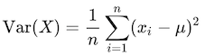
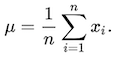
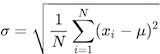
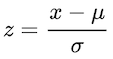

# Fraud Detector :credit_card: :male_detective:

В наши дни, електронните разплащания са гръбнакът на световната финансова система. Все по-често предпочитаме да пазаруваме онлайн, да плащаме с карта и да превеждаме пари по електронен път. Електронните парични потоци за съжаление все по-често стават и обект на посегателство от злонамерени агенти, които извършват различни видове измами, възползвайки се от пробиви в сигурността, кражба на лични данни, социално инженерство и други. Това е актуален и значим проблем, както за финансовите институции, така и за индивидуалните потребители като нас. По различни оценки, загубите от измами възлизат на около 5% от световния финансов оборот: повече от 6 трилиона долара годишно!

Това поражда необходимостта от разработването на сложни системи и алгоритми за откриване на измами, които надеждно да гарантират сигурността и доверието в електронните финансовите операции.

Откриването на измами (*fraud detection*) е свързано с анализ на риска и идентифицирането на *подозрителни* финансови транзакции: това са транзакции, чиито характеристики ги определят като "отклонения" (*outliers*), т.е. като значително различаващи се от останалите транзакции в един поток или набор от данни. Тези отклонения (*аномалии*) се откриват автоматично и задействат детайлното им разглеждане от човек.

Тази седмица ще приложим знанията си за работа с файлове, входно-изходни потоци, ламбда изрази и Java Stream API-то, за да създадем **Fraud Detector**, който ще изчислява риска, анализирайки финансови транзакции на потребители (акаунти). Анализът ще се базира на реален *dataset*, съдържащ данни за над 2,500 финансови транзакции, който е взет от [kaggle](https://www.kaggle.com/datasets/valakhorasani/bank-transaction-dataset-for-fraud-detection), онлайн платформата за machine learning и data science на Google. Понеже оригиналният dataset съдържа някои колони, които няма да ни трябват за задачата, сме ги премахнали, като може да свалите обработения файл от [тук](./resources/dataset.csv).

Всеки ред от файла съдържа информация за една транзакция, като полетата са разделени със запетая (CSV формат):

`TransactionID,AccountID,TransactionAmount,TransactionDate,Location,Channel`

## Transaction Analyzer

В пакета `bg.sofia.uni.fmi.mjt.frauddetector.analyzer` създайте клас `TransactionAnalyzerImpl`, който има публичен конструктор `TransactionAnalyzerImpl(Reader reader, List<Rule> rules)` и имплементира интерфейса `TransactionAnalyzer`:

```java
package bg.sofia.uni.fmi.mjt.frauddetector.analyzer;

import bg.sofia.uni.fmi.mjt.frauddetector.transaction.Channel;
import bg.sofia.uni.fmi.mjt.frauddetector.transaction.Transaction;

import java.util.List;
import java.util.Map;
import java.util.SortedMap;

public interface TransactionAnalyzer {

    /**
     * Retrieves all transactions loaded into the analyzer.
     *
     * @return a list of all transactions.
     */
    List<Transaction> allTransactions();

    /**
     * Retrieves all unique account IDs from the loaded transactions.
     *
     * @return a list of unique account IDs as strings.
     */
    List<String> allAccountIDs();

    /**
     * Retrieves a map of transaction counts grouped by the channel of the transaction.
     *
     * @return a map where keys are Channel values and values are the count of transactions for each channel.
     */
    Map<Channel, Integer> transactionCountByChannel();

    /**
     * Calculates the total amount spent by a specific user, identified by their account ID.
     *
     * @param accountID the account ID for which the total amount spent is calculated.
     * @return the total amount spent by the user as a double.
     * @throws IllegalArgumentException if the accountID is null or empty.
     */
    double amountSpentByUser(String accountID);

    /**
     * Retrieves all transactions associated with a specific account ID.
     *
     * @param accountId the account ID for which transactions are retrieved.
     * @return a list of Transaction objects associated with the specified account.
     * @throws IllegalArgumentException if the account ID is null or empty.
     */
    List<Transaction> allTransactionsByUser(String accountId);

    /**
     * Returns the risk rating of an account with the specified ID.
     *
     * @return the risk rating as a double-precision floating-point number in the interval [0.0, 1.0].
     * @throws IllegalArgumentException if the account ID is null or empty.
     */
    double accountRating(String accountId);

    /**
     * Calculates the risk score for each account based on the loaded rules.
     * The score for each account is a double-precision floating-point number in the interval [0, 1] and is
     * formed by summing up the weights of all applicable rules to the account transactions.
     * The result is sorted in descending order, with the highest-risk accounts listed first.
     *
     * @return a map where keys are account IDs (strings) and values are risk scores (doubles).
     */
    SortedMap<String, Double> accountsRisk();

}
```

На конструктора се подава коректно създаден входен поток, от който може да се изчете dataset-a.
При извикване на конструктора с множество правила със сумарна тежест, различна от 1.0, хвърляйте `IllegalArgumentException`.

:point_right: Обърнете внимание, че dataset-ът съдържа заглавен ред, който трябва да пропуснете при изчитането му.

:point_right: Напомняне: когато сравнявате числа с плаваща запетая, не разчитайте на точно равенство, а работете с равенство с определена точност (делта). 

### Транзакции

Транзакциите се моделират от record-a `Transaction`, който има следните компоненти: `(String transactionID, String accountID, double transactionAmount, LocalDateTime transactionDate, String location, Channel channel)` и има публичен статичен factory метод със сигнатура

`public static Transaction of(String line)`,

който по даден низ, представляващ ред от dataset-a, връща `Transaction` обект.

:point_right: Подсказка: за парсването на датата, ще ви влезе в употреба [`java.time.format.DateTimeFormatter.ofPattern(...)`](https://docs.oracle.com/en/java/javase/23/docs/api/java.base/java/time/format/DateTimeFormatter.html).

### Канали

Транзакциите могат да се извършват по един от три вида канали: банкомат, онлайн и банков клон, описвани от следния enum:

```java
package bg.sofia.uni.fmi.mjt.frauddetector.transaction;

public enum Channel {
    ATM, ONLINE, BRANCH
}
```

## Правила за изчисляване на риска

Ще създадем множество правила, чрез които ще оценяваме риска на базата на аномалии в транзакциите на дадения акаунт. Всяко правило се характеризира с *праг*, който го задейства (прави приложимо) и относително *тегло*, с което участва в изчислението на риска. Теглото е число в интервала [0.0, 1.0], а сумата от теглата на всички правила трябва да е 1.0.

1. **FrequencyRule**: Оценява риска на базата на *честота на транзакциите*, т.е. броят им в определен времеви прозорец.
   - Праг: брой транзакции в рамките на времевия прозорец.

   Класът трябва да има публичен конструктор със сигнатура `FrequencyRule(int transactionCountThreshold, TemporalAmount timeWindow, double weight)`.

2. **LocationsRule**: Оценява риска на базата на броя различни *локации на транзакциите*.
   - Праг: брой различни локации, от които са осъществени транзакции.

   Класът трябва да има публичен конструктор със сигнатура `LocationsRule(int threshold, double weight)`.

3. **SmallTransactionsRule**: Оценява риска на базата на твърде голям брой транзакции на дребна сума.
   - Праг: брой транзакции на сума под определен размер.

   Класът трябва да има публичен конструктор със сигнатура `SmallTransactionsRule(int countThreshold, double amountThreshold, double weight)`.

4. **ZScoreRule**: Оценява риска въз основа на т.нар. *Z-score* на сумата на транзакциите, което е метрика за това, колко се различава сумата на транзакцията от средната стойност за дадения акаунт.
   - Праг: Z-score над определено число.

   Класът трябва да има публичен конструктор със сигнатура `ZScoreRule(double zScoreThreshold, double weight)`.

За да разберем z-score метриката, трябва да се запознаем с някои понятия от статистиката:

- *Нормално разпределение* (*Normal distribution*) на данните в един dataset означава, че повечето данни са концентрирани около средната стойност и са симетрични спрямо нея.

- *Дисперсия* (*Variance*) е мярка за "разпръснатостта" на стойностите в даден набор от данни, т.е. колко далеч от средната стойност стигат.

Дисперсията се изчислява по следната формула:



където *μ* е средната стойност, т.е.


  
- *Стандартно отклонение* (*Standard deviation*) е една от основните мерки за оценка на разсейването или разпространението на стойностите в един набор от данни. То показва, колко далеч са отделните стойности от средната стойност на тези данни. Стандартното отклонение се пресмята като квадратния корен на дисперсията:



- *Z-score* е метрика за това, колко далеч е дадена стойност от средната стойност, но измерено в брой стандартни отклонения.

Формулата за изчисляване на z-score е следната:



където:
- *x* е стойността на данната,
- *μ* е средната стойност,
- *σ* е стандартното отклонение.

Ако ви е любопитно, може да научите повече за [нормалното разпределение](https://www.mathsisfun.com/data/standard-normal-distribution.html), [стандартното отклонение и дисперсията](https://www.mathsisfun.com/data/standard-deviation.html) и [z-score-а](https://www.mathsisfun.com/definitions/z-score.html) - ще ви е полезно за курса по статистика.

Всички правила се намират в пакета `bg.sofia.uni.fmi.frauddetector.rule` и имплементират интерфейса `Rule`:

```java
package bg.sofia.uni.fmi.mjt.frauddetector.rule;

import bg.sofia.uni.fmi.mjt.frauddetector.transaction.Transaction;

import java.util.List;

/**
 * Represents a generic rule that can be applied to a list of transactions.
 * This interface defines the structure for determining the applicability of
 * a rule and its associated weight. If you want to dig deeper,
 * you can check <a href="https://medium.com/swlh/rules-pattern-1c59854547b">this article</a>
 * on the Rules pattern.
 */
public interface Rule {

    /**
     * Determines whether the rule is applicable based on the given list of transactions.
     *
     * @param transactions the list of objects to evaluate.
     *                     These transactions are used to determine if the rule
     *                     conditions are satisfied.
     * @return true, if the rule is applicable based on the transactions.
     */
    boolean applicable(List<Transaction> transactions);

    /**
     * Retrieves the weight of the rule.
     * The weight represents the importance or priority of the rule
     * and is a double-precision floating-point number in the interval [0, 1].
     *
     * @return the weight of the rule.
     */
    double weight();

}
```  

### Примерна употреба

Ето един прост пример, как може да се използва Fraud Detector-a:

```java
import bg.sofia.uni.fmi.mjt.frauddetector.analyzer.TransactionAnalyzer;
import bg.sofia.uni.fmi.mjt.frauddetector.analyzer.TransactionAnalyzerImpl;
import bg.sofia.uni.fmi.mjt.frauddetector.rule.FrequencyRule;
import bg.sofia.uni.fmi.mjt.frauddetector.rule.LocationsRule;
import bg.sofia.uni.fmi.mjt.frauddetector.rule.Rule;
import bg.sofia.uni.fmi.mjt.frauddetector.rule.SmallTransactionsRule;
import bg.sofia.uni.fmi.mjt.frauddetector.rule.ZScoreRule;

import java.io.FileNotFoundException;
import java.io.FileReader;
import java.io.Reader;
import java.time.Period;
import java.util.List;

public class Main {

    public static void main(String... args) throws FileNotFoundException {
        String filePath = "dataset.csv";

        Reader reader = new FileReader(filePath);
        List<Rule> rules = List.of(
            new ZScoreRule(1.5, 0.3),
            new LocationsRule(3, 0.4),
            new FrequencyRule(4, Period.ofWeeks(4), 0.25),
            new SmallTransactionsRule(1, 10.20, 0.05)
        );

        TransactionAnalyzer analyzer = new TransactionAnalyzerImpl(reader, rules);

        System.out.println(analyzer.allAccountIDs());
        System.out.println(analyzer.allTransactionsByUser(analyzer.allTransactions().getFirst().accountID()));
        System.out.println(analyzer.accountsRisk());
    }

}
```

### Тестване

Най-добре първо тествайте реализацията си локално с пример като горния. После създайте и unit тестове.

## Пакети

Спазвайте имената на пакетите на всички по-горе описани класове, тъй като в противен случай решението ви няма да може да бъде тествано от грейдъра.

```
src
└── bg.sofia.uni.fmi.mjt.frauddetector
    ├── analyzer
    │     ├── TransactionAnalyzer.java
    │     ├── TransactionAnalyzerImpl.java  
    │     └── (...)
    ├── rule
    │     ├── FrequencyRule.java
    │     ├── LocationsRule.java
    │     ├── Rule.java
    │     ├── SmallTransactionsRule.java
    │     ├── ZScoreRule.java
    │     └── (...)
    ├── transaction
    │     ├── Channel.java
    │     ├── Transaction.java
    │     └── (...)
    └── (...)

test
└── bg.sofia.uni.fmi.mjt.frauddetector
     └── (...)
```

## Забележки

- В грейдъра качете директориите src и test като ги селектирате и двете. Друг вариант е да ги сложите в общ .zip архив и да качите него
- Не качвайте jar-ките на JUnit и Mockito библиотеките. На грейдъра ги има, няма смисъл решението ви да набъбва излишно.

Успех!
