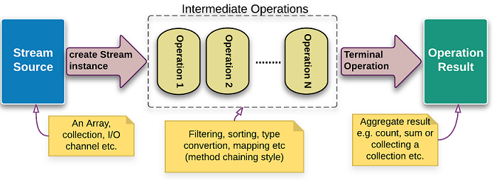

class: center, middle

# Ламбда изрази и Stream API

01.12.2021

.center[]

---

### Предната лекция говорихме за:

- Входно-изходни потоци
- Работа с файловата система

---

### Днес ще разгледаме:

- Lambda изрази
- Stream API

---

### Функционални интерфейси

- *Функционалните интерфейси* са интерфейси с точно един абстрактен метод
- Понякога се наричат още *SAM интерфейси* (Single Abstract Method)
- Няма проблем, освен абстрактния си метод, да имат произволен брой статични или `default` методи
- Могат да се анотират с незадължителната анотация `@FunctionalInterface`

---

### Един пример

```java
public class NamesSorter {
    public static void main(String[] args) {
        List<String> names = Arrays.asList("Peter", "Anna", "Mike", "Xenia");
        Collections.sort(names, new NamesComparator());
        System.out.println(names);
    }
}

class NamesComparator implements Comparator<String> {
    @Override
    public int compare(String o1, String o2) {
        return o1.compareTo(o2);
    }
}

// Налага се да създадем отделен клас, имплементиращ SAM интерфейс
```

---

### Един пример

```java
// Може да го направим и с анонимен вътрешен клас,
// но пак има доста boilerplate код
public class NamesSorter {
    public static void main(String[] args) {
        List<String> names = Arrays.asList("Peter", "Anna", "Mike", "Xenia");
        Collections.sort(names, new Comparator<String>() {
            @Override
            public int compare(String a, String b) {
                return a.compareTo(b);
            }
        });
        System.out.println(names);
    }
}
// Има ли начин да подадем само дефиниция на функция като аргумент?
```

---

### Един пример

```java
Collections.sort(names, new Comparator<String>() {
    @Override
    public int compare(String a, String b) {
        return a.compareTo(b);
    }
});

// define just the function
Collections.sort(names, (String a, String b) -> {
    return a.compareTo(b);
});

// omit {} and return
Collections.sort(names, (String a, String b) -> a.compareTo(b));

// infer argument types
Collections.sort(names, (a, b) -> a.compareTo(b));
```

---

### Ламбда израз

- Функция, която няма име и не е метод на клас, се нарича *ламбда функция* или *ламбда израз*.
- Терминът идва от ламбда смятането - универсален модел за описание на изчисления (алгоритъм), който може да се използва за описание на произволна машина на Тюринг. Въведено е от Алонзо Чърч през 30-те години на 20-ти век.

---

### Ламбда изрази - синтаксис

`параметри -> тяло`

- Списъкът с параметри се огражда с кръгли скоби, а параметрите се разделят със запетаи. Може да е празен ()
- Типът на параметрите може да бъде
    - експлицитно зададен
    - inferred: с `var` или въобще пропуснат
- Когато има един-единствен параметър и неговият тип може да бъде пропуснат, може да се пропуснат и скобите
- Тялото на ламбда израз се огражда с фигурни скоби {} и може да съдържа нула, един или повече изрази, разделени с ;
    - Когато има единствен израз в тялото, return клаузата може да се изпусне
    - Когато имаме повече от един израз, трябва експлицитно да предоставим return клауза

---

### Ламбда изрази - примери

```java
// one parameter
(String name) -> System.out.println("Hello " + name);

// type inference
(name) -> System.out.println("Hello " + name);

// omit ()
name -> System.out.println("Hello " + name);

// three parameters
(int a, int b, double c) -> a + b + c;

// type inference
(a, b, c) -> a + b + c;

// empty body
() -> {};
```

---

### Ламбда изрази - примери

```java
// omit {} and the return as there is single expression in the body
(a, b) -> a + b;

// multiple expressions in the body
(a, b) -> {a = 5; b = 2; return a + b;}; 

// body on multiple lines
(a, b) -> {
    a = 5;
    b = 2;
    return a + b;
};
```

---

### Функции със странични ефекти

- Страничен ефект е всяко действие във функция, което променя външно за нея състояние:
    - промяна на данни (външни за функцията)
    - I/O операция
    - хвърляне на изключение
    - извикване на друга функция, която предизвиква страничен ефект
- Всеки метод в Java, който е от тип `void`, извършва страничен ефект.

---

### Функции със странични ефекти - пример

```java
public class BankAccount {

    private int balance = 100;

    public int transfer(int amount) {
        balance += amount;
        return balance;
    }

}
```

<br>

```java
BankAccount account = new BankAccount();
account.transfer(10); // 110
account.transfer(10); // 120
```

---

### Чисти функции

- Чистите функции не извършват странични ефекти
- Винаги когато извикаме функцията с дадени параметри, е гарантиран един и същ резултат

---

### Чисти функции

- Резултатът им може да се запази и преизползва
- Извикването на функцията може да бъде заменено с резултата (referential transparency)
- Чистите функции са лесно композируеми
- Чистите функции са лесни за анализ на проблеми
- Позволяват изчислението да се паралелизира

---

### Чисти функции - пример

```java
public static int add(int a, int b) {
    return a + b;
}
```

<br>

```java
add(3, 5) // 8
add(3, 5) // 8
```

---

### Функции от по-висок ред

- Функции, които приемат като аргумент функция или връщат функция като резултат, се наричат *функции от по-висок ред*
- Функциите от по-висок ред ни предоставят средство, с което да композираме логика, комбинирайки функции

---

### Ламбда изразите като тип

- Java e статично типизиран език ⇨ ламбда изразите също си имат тип
- Типът на ламбда израз е някакъв функционален интерфейс
- По време на компилация, ламбда изразът трябва да съответства на абстрактния метод на функционалния интерфейс
    - следователно, се знае типът и на параметрите на функцията, и на връщания резултат
- Може да декларираме променливи от тип функционален интерфейс и да им присвояваме ламбда изрази, или да декларираме методи с формални параметри - функционален интерфейс и да подаваме ламбда израз като аргумент

---

### Стандартни функционални интерфейси

JDK-то съдържа множество стандартни функционални интерфейси. Намират се в пакета `java.util.function`.
Четирите най-използвани от тях са

<br>

| Интерфейс               | Ламбда нотация |
| ----------------------- |--------------- |
| Supplier<T>             | () -> T        |
| Consumer<T>             | (T) -> void    |
| Predicate<T>            | (T) -> boolean |
| Function<T, R>          | (T) -> R       |

---

### `Supplier<T>: () -> T`

Представлява операция без аргументи, която връща резултат.
Съдържа един абстрактен метод, `T get()`.

<br>

```java
Supplier<Integer> supplyYear = () -> 2021;
System.out.println(supplyYear.get()); // 2021
```

---

### `Consumer<T>: (T) -> void`

```java
// Представлява операция, която приема единствен аргумент като вход
// и не връща резултат. За разлика от повечето функционални интерфейси,
// Consumer<T> работи чрез странични ефекти.
// Съдържа един абстрактен метод, `void accept(T t)`.
// Съдържа и метод `default Consumer<T> andThen(Consumer<T> after)`,
// чрез който може да се chain-ва с други `Consumer<T>` операции.

Consumer<Double> inEUR = s -> System.out.println("EUR: " + s);
Consumer<Double> inUSD = s -> System.out.println("USD: " + s);

inEUR.accept(10.0); // EUR: 10.0
inEUR.andThen(inUSD).accept(10.0); // EUR: 10.0
                                   // USD: 10.0
```

---

### `Predicate<T>: (T) -> boolean`

```java
// Представлява предикат: булева функция с един аргумент.

// abstract method: evaluates this predicate on the given argument
boolean test(T t);

// Returns a predicate that represents the logical negation
// of this predicate
default Predicate<T> negate();

// Returns a composed predicate that represents a short-circuiting
// logical AND of this predicate and another
default Predicate<T> and(Predicate<? super T> other); 

// Returns a composed predicate that represents a short-circuiting
// logical OR of this predicate and another
default Predicate<T> or(Predicate<? super T> other);

// Returns a predicate that tests if two arguments are equal
// according to Objects.equals(Object, Object)
static <T> Predicate<T> isEqual(Object targetRef);
```

---

### `Predicate<T>: (T) -> boolean`

```java
Predicate<Integer> isLessThan10 = i -> i < 10;
Predicate<Integer> isGreaterThan0 = i -> i > 0;
System.out.println(isLessThan10.and(isGreaterThan0).test(5)); // true
System.out.println(isLessThan10.and(isGreaterThan0).test(10)); // false
```

---

### `Function<T, R>: (T) -> R`

```java
// Представлява функция, която приема един аргумент и връща резултат

// abstract method: applies this function to the given argument
R apply(T t);

// Returns a composed function that first applies this function to its
// input, and then applies the after function to the result
default <V> Function<T,V> andThen(Function<? super R,? extends V> after);

// Returns a composed function that first applies the before function
// to its input, and then applies this function to the result
default <V> Function<V,R> compose(Function<? super V,? extends T> before);

// Returns a function that always returns its input argument
static <T> Function<T,T> identity();
```

---

### `Function<T, R>: (T) -> R`

```java
Function<Integer, Integer> square = i -> i * i;
Function<Integer, Integer> subtractOne = i -> i - 1;
System.out.println(square.andThen(subtractOne).apply(3)); // 8
System.out.println(square.compose(subtractOne).apply(3)); // 4

// z1(x) = f(g(x))
Function<Integer, Integer> z1 = f.compose(g);

// z2(x) = g(f(x))
Function<Integer, Integer> z2 = f.andThen(g);
```

---

### Други стандартни функционални интерфейси

Останалите 39 функционални интерфейси в `java.util.function` са вариации на четирите разгледани.
Създадени са, за да се постигне едно или няколко от следните:
- по-добро бързодействие чрез избягване на autoboxing чрез използване на примитивните типове `int`, `long` и `double`
- позволяване на два аргумента и/или по-кратка нотация

  ```java
  // shorter notation without generics and avoiding autoboxing
  IntFunction<R>

  // function of two arguments
  BiFunction<T, U, R>

  // allows two input parameters of type T and returns a value of type T
  BinaryOperator<T>
  ```

---

### Контекст на ламбда израз

- Компилаторът определя типа на ламбда израз в зависимост от контекста на употребата му:
    - инициализация или присвояване на променлива
    - параметър на метод или конструктор
    - връщане на резултат от метод
    - сast операция
- Един и същ ламбда израз може да има различен тип в зависимост от контекста:

  ```java
  Function<String, Integer> func = x -> 1;
  Comparable<Double>        comp = x -> 1;
  ```

---

### Variable capture

- Ламбда изразите могат да достъпват променливи, декларирани извън самия ламбда израз. Това може да са
    - локални променливи
    - член-променливи на обхващащия клас
    - статични член-променливи на обхващащия клас

---

### Variable capture

- Ако ламбда израз използва локална променлива, декларирана извън него, тази променлива трябва да е `final` или *ефективно final* (т.е. да не си променя стойността в този контекст)
- Причината за това ограничение е, че ламбда функцията може да се предава като аргумент и изпълнява в различни контексти (например, различни нишки) и резултатът от изпълнението ѝ не трябва да зависи от контекста
    - Също, възможно е ламбда изразът да се изпълни след като локалната променлива е унищожена (например, ако метод връща такъв ламбда израз като резултат)

---

### Variable capture

```java
int x = 7;
Function<Integer, Integer> multiply = i -> i * x;
// x++; would cause compilation error on the line above
```

---

### Ключовата дума `this`

- Ключовата дума `this` в ламбда израз реферира инстанцията на обхващащия клас, която се нарича още *обхващаща инстанция (enclosing instance)*, *обхващащ контекст* или *обхващащ scope*.

---

### Ламбда изрази: добри практики

- Препоръчва се ламбда изразите да не модифицират:
    - данните на източника (*non-interference*)
    - външни променливи (*stateless*)
- Препоръчва се ламбда изразите да са one-liners

---

### Референции към методи

Много често в ламбда изразите просто делегираме параметрите на някой съществуващ метод:

```java
Comparator<String> comp1 = (s1, s2) -> s1.compareTo(s2);
```

<br>

Референциите към методи са удобен синтаксис, с който може да се реферира съществуващ метод на клас:

```java
Comparator<String> comp2 = String::compareTo;
Predicate<String> filter = "Ivan"::equalsIgnoreCase;
```

---

### Референции към методи - видове

Референция към статичен метод (ClassName::methName)

```java
String::valueOf
```

<br>

Референция към метод на конкретна инстанция от даден клас (instanceRef::methName)

```java
"FPRocks!"::equals
```

<br>

Референция към метод на произволна инстанция на даден клас (ClassName::methName)

```java
String::toLowerCase
```

---

### Референции към методи - видове

Конструктор (ClassName::new)

```java
String::new, String[]::new
```

<br>

Метод на суперкласа (super::methName)

```java
super::equals
```

---

## Въпроси?

---

### Java Stream API

- Ламбда изразите, заедно с функционалните интерфейси, разширяват възможностите на Java с елементи на функционалното програмиране
- Те позволяват предаването на поведение (функции) като параметри на библиотеки, оптимизирани за бързодействие при обработката на данни
    - По този начин, един app developer може да се фокусира върху бизнес логиката на приложението си, оставяйки аспекти като бързодействието на авторите на въпросните библиотеки.
- Една такава основна библиотека е `java.util.stream`

---

### `java.util.stream`

- Интерфейсите и класовете от пакета `java.util.stream`, които съвкупно наричаме Java Stream API, са предназначени за ефективната последователна или паралелна обработка на крайни или безкрайни потоци от данни
- Алгоритмите, работещи с данни във вид на потоци, се реализират като последователност (pipeline) от операции върху елементите на потока

---

### Инициализация на поток от колекции, масиви и низове

Има множество начини да се инициализира поток:

```java
Stream.empty() // създава празен поток (без елементи)
Stream.of(T... values) // създава поток от елементи от тип T

// връща поток от елементите на дадената колекция
Collection.stream()

// връща паралелен поток от елементите на дадената колекция
Collection.parallelStream() 

Arrays.stream((T[] array)) // връща поток от елементите на масив

IntStream streamOfChars = "abc".chars(); // поток от символите на низ

Stream<String> streamOfString = // split-ва низ като поток по шаблон
        Pattern.compile(", ").splitAsStream("a, b, c");
```

---

### Потоци от елементи от примитивен тип

`Stream<T>` е generic интерфейс и няма как да се използва за примитивни типове като параметър.
Затова съществуват три специализирани интерфейса за `int`, `long` и `double` потоци:

  - `IntStream`
  - `LongStream`
  - `DoubleStream`

Инстанции на примитивните потоци се създават със статичните `of`, `range()` и `rangeClosed()` методи на интерфейсите или индиректно, от API-та, които връщат примитивен поток.

```java
IntStream intStream = IntStream.of(1, 2, 3);
int[] intArray = {1, 2, 3};
IntStream intStreamFromArray = IntStream.of(intArray);
LongStream longsRange = LongStream.range(1, 3); // [1, 3)
LongStream longsRangeClosed = LongStream.rangeClosed(1, 3); // [1, 3]
```

---

### Потоци от елементи от примитивен тип

`IntStream`, `LongStream` и `DoubleStream` имат допълнителни статистически методи:

- `average()`
- `max()`
- `min()`
- `sum()`

---

### Инициализация на поток от съдържание на файл или директория

```java
// java.nio.file.Files

// създава поток от низове, представляващи редовете на даден текстов файл
Stream<String> lines(Path path)

// връща съдържанието на директория като поток от файлове и директории
Stream<Path> list(Path dir)

// връща съдържанието на директорно поддърво
Stream<Path> walk(Path start, FileVisitOption... options)

// връща съдържанието на директорно поддърво, което отговаря на зададения
// предикат, обхождайки до зададена дълбочина
find(Path start, int maxDepth,
        BiPredicate<Path, BasicFileAttributes> matcher,
        FileVisitOption... options)
```

---

### Инициализация на поток от съдържание на файл или директория

```java
// java.io.BufferredReader

// създава поток от низове, представляващи редовете, прочитани от даден
// BufferredReader (най-често, от файл)
Stream<String> lines()
```

---

### Инициализация на поток от псевдослучайни числа

```java
// java.util.Random

// създава безкраен поток от псевдослучайни double числа в интервала [0, 1)
DoubleStream doubles()

// създава безкраен поток от псевдослучайни int числа
IntStream ints()

// създава безкраен поток от псевдослучайни long числа
LongStream longs()
```

---

### Инициализация на поток чрез итерация

```java
// java.util.Stream

// Създава безкраен последователен поток чрез итеративното прилагане
// на втория аргумент към първия аргумент.
// Елементите на потока са seed, f(seed), f(f(seed)), ...
Stream<T> iterate(T seed, UnaryOperator<T> f)

// Създава краен последователен поток чрез итеративното прилагане
// на третия аргумент към първия: // seed, f(seed), f(f(seed))
// докато вторият параметър връща true
Stream<T> iterate(T seed, Predicate<T> hasNext, UnaryOperator<T> f) 

Stream.iterate(1, i -> ++i) // 1, 2, 3, 4, 5, ...
Stream.iterate(1, i -> i < 4, i -> ++i) // 1, 2, 3
```

---

### Инициализация на поток чрез `Supplier`

```java
// java.util.Stream

// създава безкраен поток, всеки елемент на който се генерира
// от подадената Supplier функция
Stream<T> generate(Supplier<T> supplier)

Stream.generate(() -> 1) // безкраен поток 1, 1, 1, 1, ...
```

---

### Конкатенация на потоци

```java
// java.util.Stream

// създава поток, който представлява конкатенацията
// на подадените два потока
static <T> Stream<T> concat(Stream<? extends T> a, Stream<? extends T> b)

Stream<Integer> stream1 = List.of(1, 2).stream();
Stream<Integer> stream2 = List.of(2, 3, 4).stream();
Stream.concat(stream1, stream2) // 1, 2, 2, 3, 4
```

---

### Операции върху потоци

- Много от методите на `Stream` интерфейса, онези, които имат параметър функционален интерфейсен тип, се наричат *операции*
- Stream API-то предоставя набор от функции от по-висок ред, чрез които декларативно можем да обработим данните

---

### Операции върху потоци

- Операциите с потоци биват два вида:
    - *Междинни* – връщат `Stream` обект като резултат
    - *Терминални* – връщат обект, различен от `Stream`, или не връщат резултат

- Обработката на потоци типично се организира като pipeline
    - потокът се създава с инициализираща операция,
    - поредица от междинни операции обработват потока, като резултатът от всяка става вход за следващата във веригата
    - накрая терминална операция продуцира резултат или страничен ефект и приключва потока

---

### Операции върху потоци

.center[]

```java
// Stream API pipeline
List<Person> people;
// [...]
List<Person> result = people.stream()
        .filter(p -> p.getFirstName().equals("Nikolay"))
        .filter(p -> p.getAge() < 25)
        .sorted(Comparator.comparing(Person::getLastName))
        .toList();
```

---

### Междинни операции върху потоци

- Междинните операции връщат `Stream` обект
- който съдържа същите или модифицирани елементи,
- като типът на елементите може да е същият или различен от типа на елементите във входния поток.
- Според функционалността си, се разделят на *филтриращи*, *map-ващи* и *сортиращи*

---

### Филтриращи междинни операции: `filter`

```java
// Междинна операция, приема функция (T -> boolean), т.е. предикат
// и връща поток само с елементите, за които предикатът е true.

employees.filter(e -> e.getAge() < 25);
```

---

### Филтриращи междинни операции: `limit`

```java
// Междинна операция, приема цяло число N и връща краен поток
// само с първите N елементa на входния поток. Особено често се използва,
// за да се обработи крайна част от безкраен поток.

employees.limit(100);
```

---

### Филтриращи междинни операции: `distinct`

```java
// Междинна операция без аргументи, връща елементите на входния поток
// като премахва повтарящите се. Критерият за еднаквост е equals().

employees.distinct();
```

---

### Филтриращи междинни операции: `skip`, `dropWhile`, `takeWhile`

```java
// Междинна операция, приема цяло число N и връща краен поток,
// игнорирайки (пропускайки) първите N елементa на входния поток.

employees.skip(10);

// пропуска първите елементи на потока, докато предикатът връща true

employees.dropWhile(e -> e.getAge < 18);

// допуска само първите елементи на потока, докато предикатът връща true

employees.takeWhile(e -> e.getName().startsWith("A"));
```

---

### Map-ващи междинни операции: `map`

- Map-ващите операции за единствени междинни операции, които променят елементите на входния поток
- Те map-ват, (трансформират) всеки елемент на входния поток към нов елемент
- Map е междинна операция, приема функция (T -> V) и връща поток със същия брой елементи, но oт новия тип (V)

  ```java
  employees.map(e -> e.getName());

  // map операции, специализирани за примитивни потоци -
  // mapToInt, mapToLong, mapToDouble

  employees.mapToInt(e -> e.getAge());
  employees.mapToDouble(e -> e.getSalary());

  // the same as the above but with method reference
  employees.mapToDouble(Employee::getSalary());
  ```

---

### Map-ващи междинни операции: `flatMap`

Междинна операция, приема функция (T -> Stream[V]) и връща поток с линейна структура (flat), вместо поток от потоци.

```java
// Returns 1-dimensional stream with all employee bonuses
// Stream<T> -> flatMap -> Stream<V>
employees.flatMap(e -> Stream.of(e.getSalary(), e.getBonus()));
```

<br>

Има и `flatMap` операции, специализирани за примитивни потоци - `flatMapToInt`, `flatMapToLong`, `flatMapToDouble`

---

### Сортиращи междинни операции: `sorted`

```java
// according to their natural order
employees.sorted();

// according to the specified Comparator
employees.sorted((e1, e2) -> e1.getSalary() < e2.getSalary());
```

<br>

Обърнете внимание, че тези операции не могат да приключат докато не се обработят всички елементи на потока.
Te са скъпи откъм ресурси и бавни откъм performance, така че трябва да се ползват само за малки потоци.

---

### Терминални операции: обработка елемент по елемент с `forEach`

Терминална операция, приема функция (T -> void) и не връща резултат (т.е. няма функционална природа)

<br>

```java
// Prints the name and age of each employee
// Stream<T> -> forЕach -> void

employees.forEach(e -> System.out.println(e.getName() + " " + e.getAge()));
```

---

### Терминални операции: `reduce`

Терминална операция, приема функция ((T, T) -> T) и връща единичен резултат

<br>

```java
// Returns the sum of employee salaries
// Stream<T> -> reduce -> T
employees.mapToDouble(Employee::getSalary)
     .reduce((res, el) -> res + el);
```

<br>

- Специализирани reduce операции: `min()`, `max()`
- Допълнителни reduce операции за `Int`/`Long`/`DoubleStream`: `sum()`, `average()`

---

### `reduce` - обща форма

Reduce има и по-обща форма, която дава възможност да се върне резултат, различен от типа на потока ((V, T) -> V)

<br>

```java
// Stream<T> -> reduce -> V
double result = employees.reduce(
    0.0,                               // initial value
    (res, el) -> res + el.getSalary(), // accumulator
    (left, right) -> left + right);    // combiner
```

---

### `collect`

- Възможно е reduce операция да върне резултат, който не е единичен обект, а колекция
- collect предоставя възможност за акумулиране на резултата в колекция

  ```java
  List<Integer> list = Stream.of(1, 2, 3, 4, 5)
                             .collect(ArrayList::new, // supplier
                                      ArrayList::add, // accumulator
                                      ArrayList::addAll); // combiner
  System.out.println(list); // [1, 2, 3, 4, 5]
  ```

---

### `collect` с колектори

Тъй като `collect` в общия си вид изисква три функции, за улеснение в Stream API-то има клас `Collectors` със статични методи, създаващи "готови" специализирани `Collector` обекти за най-често срещаните случаи: `Collectors.toCollection()`, `Collectors.toList()`, `Collectors.toSet()`, `Collectors.toMap()`

<br>

```java
List<Integer> list = Stream.of(1, 2, 3, 4, 5)
                           .collect(Collectors.toList()); // [1, 2, 3, 4, 5]

// since Java 16
List<Integer> list = Stream.of(1, 2, 3, 4, 5)
                           .toList();

```

---

### Още колектори

Класът `Collectors` също така предоставя полезни помощни функции за `reduce` oперации. Най-използваните са:
  - `groupingBy` – групира (агрегира) елементите по дадена класифицираща функция
  - `joining` – конкатенира елементите на потока в низ

<br>

```java
// The result is from type Map<Department, List<Employee>>
employees.collect(Collectors.groupingBy(Employee::getDepartment));

// The result is a String containing all employee names
// separated by the specified separator string
employees.map(Employee::getName).collect(Collectors.joining(", "));
```

---

### Short-Circuiting операции

Операции, които прекратяват обхождането на потока преждевременно. Полезни са при безкрайни потоци.

---

### Short-Circuiting операции

- `findFirst()` – връща първия елемент на потока
- `findAny()` – връща произволен елемент от потока
- `allMatch(T -> boolean)` – дали всички елементи отговарят на дадено условие
- `anyMatch(T -> boolean)` – дали някой елемент отговаря на дадено условие
- `noneMatch(T -> boolean)` - дали никой от елементите не отговаря на дадено условие
- `limit(int n)` – връща `n` елементи (междинна операция)

---

### Други терминални операции: `count`

```java
long count = Stream.of(1, 2, 3, 4, 5).count();
System.out.println(count); // 5

// another way
long count = Stream.of(1, 2, 3, 4, 5).collect(Collectors.counting());
System.out.println(count); // 5
```

---

### `java.util.Optional`

- Generic клас, контейнер за обект, който може да съдържа или не дадена стойност
- Някои от методите на Stream API-то връщат като резултат `Optional<Т>`
- Начин за избягване на проверки за `null` или `NullPointerException`

<br>

```java
// Check if value is present
boolean isPresent = optionalEmployee.isPresent();

// Executes the action only if the value is present
optionalEmployee.ifPresent(System.out::println);
```

---

### `java.util.Optional`

```java
// Returns the container value
// or throws NoSuchElementException
Employee e = optionalEmployee.get();

// Returns default value if the value is not present
optionalEmployee.orElse(Employee.UNKNOWN);

// Throws given exception if the value is not present
optionalEmployee.orElseThrow(NoSuchElementException::new);

int result = Stream.of(1, 2, 3, 4, 5)
                .filter(i -> i > 10)
                .findAny()
                .orElse(-1);
System.out.println(result); // -1
```

---

### Изпълнение на stream pipeline

- Изпълнението може да бъде последователно или паралелно
- Може да превръщате
    - последователен поток в паралелен: чрез методa `parallel()`
    - паралелен поток в последователен: чрез методa `sequential()`
- Междинните операции се изпъляват *lazily*
- Терминалните операции се изпъляват *eagerly*

---

### Stream vs. Collection

- Потоците не са алтернатива на колекциите
- Колекциите са отговорни за съхранение и достъп до данни

---

### Особености на Stream

- нямат собствено хранилище, а използват източник на данни (колекция, файл и т.н.)
- функционална същност – не модифицират вътрешните данни
- колекциите винаги имат краен брой елементи, докато Stream може да бъде безкраен
- елементите могат да се "консумират" само веднъж, подобно на итератор
- позволяват lazy операции
- позволяват паралелно изпълнение на операциите

---

### Stateless и stateful операции върху потоци

- Stream операциите могат да се разделят на *stateless* и *stateful*.
- Stateless операциите не съхраняват данни между обработката на отделните елементи на потока
    - `filter()`, `map()`, `flatMap()`
- Stateful операциите могат да предават състояние от вече обработените елементи към обработката на следващия
    - `distinct()`, `limit()`, `sorted()`, `reduce()`, `collect()`

---

### Паралелно изпълнение на stream операциите

- Stateless операциите не представляват проблем при паралелно изпълнение
- Stateful операциите
    - (без `limit()`), приложени към безкраен поток, не завършват никога
    - могат да дадат различен резултат според това дали се изпълняват последователно или паралелно
    - имат performance impact, защото често изискват обработка на всички елементи на няколко паса

---

### Паралелно изпълнение на stream операциите

- Малките потоци обикновено се обработват по-бързо последователно
- Ако stateful операциите не могат да се заменят със stateless, кодът трябва внимателно да се проектира за паралелно изпълнение, или да се избегне паралелизма

---

### Полезни четива

- [The Java 8 Stream API Tutorial](https://www.baeldung.com/java-8-streams)
- [Package java.util.stream](https://docs.oracle.com/en/java/javase/17/docs/api/java.base/java/util/stream/package-summary.html)
- [Package java.util.function](https://docs.oracle.com/en/java/javase/17/docs/api/java.base/java/util/function/package-summary.html)

---

## Въпроси?

.font-xl[.ri-github-fill.icon-inline[[fmi/java-course](https://github.com/fmi/java-course)]]

.font-xl[.ri-youtube-fill.icon-inline[[MJT2022](https://www.youtube.com/playlist?list=PLew34f6r0PxyUcIg370lv9jHDwFeMDa7e)]]
