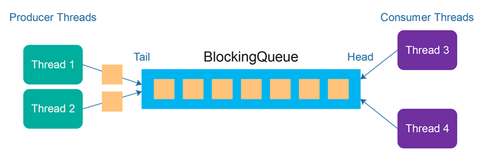

# Sentiment Analyzer :books: 

Sentiment analysis, или анализ на настроения, е техника в областта на обработката на естествен език (NLP), която се използва за автоматично идентифициране и категоризиране на емоционалния тон в текстови данни. Основната цел е да се определи дали даден текст изразява положителна, отрицателна или неутрална емоция. Тази технология намира широко приложение в анализ на потребителски мнения, социални мрежи, маркетингови изследвания и много други области.

За да подобрим производителността на такава задача и за да можем да обработваме големи обеми от данни, използваме многонишково програмиране.

:bulb: Днешната задача, макар и в максимално опростен вид, ни запознава с един често срещан класически concurrency *design pattern*: [Producer-Consumer](https://jenkov.com/tutorials/java-concurrency/producer-consumer.html). Той се ползва за отделяне (*decoupling*) на *producer* и *consumer* логиката в алгоритми, чрез разделяне на *идентифицирането* на задачи/работа от *изпълнението* на тези задачи/работа, така че те да са *слабо свръзани* (*loosely coupled*) и да могат да се изпълняват едновременно и асинхронно.



## Условие

Основната ни задача днес е _многонишково_ да анализираме набор от потоци с текстови данни и да изведем "оценка на настроението" за всеки един от тях.

Например:
"I love java" = 3 (moderately positive)
"I hate bugs" = -2 (slightly negative)

За да има смисъл от паралелна обработка обаче, може да си представим, че се анализират много и големи файлове, с много текст в тях, например цели книги.

Ще работим с няколко текстови потока:
 - поток със "стоп думи" - това са често срещани думи в даден език, които обикновено нямат особена семантична стойност или не допринасят за анализа на текста. Например "the", "is", "at", "which", "on" и т.н.
 - sentiment lexicon - това са наредени двойки <дума, емоционална-оценка>, където "емоционална-оценка" е числова оценка от -5 (негативна) до 5 (позитивна) - тези са описани от enum-a `SentimentScore` даден по-долу.
 - потоци за текстов анализ, който са комбинирани с някакъв идентификатор, за да може да разберем на текста от кой поток, коя оценка съответства.

Producer нишките ни ще имат брой `P`, равен на броя на потоците, които искаме да анализираме (`P=input.length`).
Consumer нишките ни ще имат фиксиран брой `N` и задачата им ще бъде:
- да вземат поток от опашката за обработка;
- да направят семантичен анализ;
- да запазят резултата в колекция, която после ще се върне като резултат;

### Как се прави "семантичен анализ"?
Фокусът на тази задача е многонишковото програмиране, следователно алгоритъмът, който ще ползваме е изключително лесен.

Както казахме, имаме списък със стоп думи и лексикон с "оценки" на думи. Имаме и текст, който трябва да анализираме.
1. toLower() - знаете защо
2. Премахваме стоп думите от текста
3. Премахваме всякаква пунктуация, табулации и т.н., трябва да останат само думи, разделени с whitespace.
4. За всяка дума от текста извличаме "оценка" от лексикона, ако думата липсва - игнорираме.
5. Оценката се смята като сума на всички "оценки на думи".

Ако анализираме текста "I love programming but I hate bugs", използвайки лексикона AFINN:
"love" → +4
"hate" → -4
Останалите думи като "programming" и "bugs" не са в лексикона, така че те не променят резултата.
Резултатът ще бъде: +4 + (-4) = 0, което означава неутрално настроение.

### Лексикон и стоп-думи
Качили сме два файла, които може да ползвате за по-истински анализ. Намират се в директорията `resources`.

### Interface `SentimentAnalyzerAPI`

```java
package bg.sofia.uni.fmi.mjt.sentimentnalyzer;

import bg.sofia.uni.fmi.mjt.sentimentnalyzer.exceptions.SentimentAnalysisException;

import java.io.Reader;
import java.util.Map;

public interface SentimentAnalyzerAPI {

    /**
     * Analyzes the sentiment of multiple input streams concurrently using a producer-consumer pattern.
     *
     * <p>This method processes each {@link AnalyzerInput} by reading its content in parallel, calculating an
     * overall sentiment score for the text based on the sentiment lexicon and stop words. The results are aggregated
     * into a map where each key is the input's unique identifier (from {@code inputID}) and the value is the computed
     * {@link SentimentScore}.</p>
     *
     * @param input one or more {@link AnalyzerInput} instances, each containing an identifier and a {@link Reader}
     *              for the text to analyze.
     * @return a map where each key is the input's unique ID (as specified by {@code inputID}) and the value is the
     *         computed {@link SentimentScore} for the associated text stream.
     *
     * @throws SentimentAnalysisException if an error occurs during input processing or thread execution.
     *
     * <p><b>Example:</b></p>
     * <pre>
     * {@code
     * AnalyzerInput input1 = new AnalyzerInput("doc1", new StringReader("I love java"));
     * AnalyzerInput input2 = new AnalyzerInput("doc2", new StringReader("I hate bugs"));
     *
     * ParallelSentimentAnalyzer analyzer = new ParallelSentimentAnalyzer(4, stopWordsReader, lexiconReader);
     * Map<String, SentimentScore> results = analyzer.analyze(input1, input2);
     *
     * // Example output:
     * // {
     * //   "doc1": MODERATELY_POSITIVE,
     * //   "doc2": SLIGHTLY_NEGATIVE
     * // }
     * }
     * </pre>
     */
    public Map<String, SentimentScore> analyze(AnalyzerInput... input);

}
```

### `AnalyzerInput`

```java
package bg.sofia.uni.fmi.mjt.sentimentnalyzer;

import java.io.Reader;

public record AnalyzerInput(String inputID, Reader inputReader) {
}
```

#### `SentimentScore`

```java
package bg.sofia.uni.fmi.mjt.sentimentnalyzer;

public enum SentimentScore {
    VERY_NEGATIVE(-5, "Very Negative"),
    NEGATIVE(-4, "Negative"),
    MODERATELY_NEGATIVE(-3, "Moderately Negative"),
    SLIGHTLY_NEGATIVE(-2, "Slightly Negative"),
    WEAKLY_NEGATIVE(-1, "Weakly Negative"),
    NEUTRAL(0, "Neutral"),
    WEAKLY_POSITIVE(1, "Weakly Positive"),
    SLIGHTLY_POSITIVE(2, "Slightly Positive"),
    MODERATELY_POSITIVE(3, "Moderately Positive"),
    POSITIVE(4, "Positive"),
    VERY_POSITIVE(5, "Very Positive");

    private final int score;
    private final String description;

    SentimentScore(int score, String description) {
        this.score = score;
        this.description = description;
    }

    public static SentimentScore fromScore(int score) {
        for (SentimentScore sentiment : values()) {
            if (sentiment.getScore() == score) {
                return sentiment;
            }
        }
        throw new IllegalArgumentException("Invalid sentiment score: " + score);
    }

    public int getScore() {
        return score;
    }

    public String getDescription() {
        return description;
    }
}
```

#### Клас `ParallelSentimentAnalyzer`

Класът имплементира `SemanticAnalyzerAPI` и има публичен конструктор, който приема брой на Consumer нишките, които ще обработват текстовите потоци, както и структури, съдържащи стоп-думи и лексикона с оценките на думите:
```java
/**
 * @param workersCount number of consumer workers
 * @param stopWords set containing stop words
 * @param sentimentLexicon map containing the sentiment lexicon, where the key is the word and the value is the sentiment score
 */
public ParallelSentimentAnalyzer(int workersCount, Set<String> stopWords, Map<String, SentimentScore> sentimentLexicon) { }
```

⭐ Бележки:
 - Използвайте подходяща структура от данни, в която да съхранявате текстовете, които са заредени от producer нишките.
 - Producer и Consumer нишките започват работа _сравнително_ едновременно - не карайте Consumer-ите да чакат всички Producer нишки да приключат.
 - В даден момент (например, когато имаме "по-големи" потоци), може да няма заредени текстове за обработка. В такъв случай, Consumer нишките си "почиват" и изчакват да се появят нови текстове.
 - При създаването на `ParallelSentimentAnalyzer`, пробвайте имплементацията с различен брой нишки, които да обработват текстовите потоци - например 2, 5, 7 и т.н.

#### Тествайте локално решението ви

Пуснете няколко пъти решението си с различен брой текстове за обработка. Пробвайте с по-дълги, както и по-къси текстови документи.

Качваме и тестче, което ще ви чака и на грейдъра, заедно с допълнително такова, което обаче работи с малко повече данни, но нивото на assertion ще е горе-долу такова.
Няма особено значение как сте имплементирали алгоритъма и колко е ефективен - важното е да се научите да работите с нишки. :)

**Уверете се, че програмата ви завършва успешно, когато всички текстови потоци са обработени.**

## Структура на проекта

Този път имате пълна свобода в дизайна на задачата, само по-скучните типове са дадени.
Както се казва - "with great power comes great responsibility".

```
src
└─ bg.sofia.uni.fmi.mjt.sentimentanalyzer
    ├── exceptions
    |   └── SentimentAnalysisException.java
    ├── SentimentAnalyzerAPI.java
    ├── ParallelSentimentAnalyzer.java
    ├── SentimentScore.java
    ├── AnalyzerInput.java
    └── (...)
```

В грейдъра качете `zip` архив на папката `src`.
