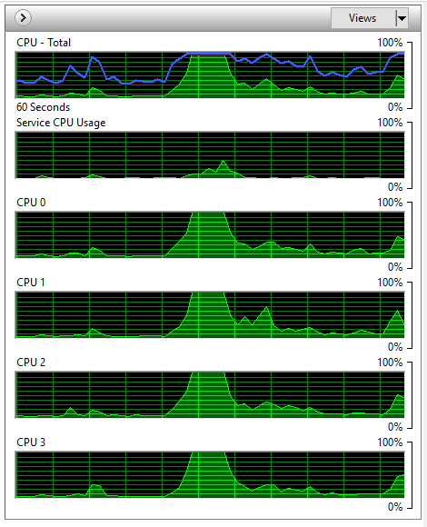

class: center, middle

# Многонишково програмиране с Java

15.12.2021

---

### Предната лекция говорихме за:

- Lambda изрази
- Stream API

---

### Днес ще разгледаме:

- Concurrent и паралелно изпълнение на програми
- Многонишково програмиране (Multithreading)
    - Нишки и техния жизнен цикъл
    - Атомарни типове данни
    - Комуникация и синхронизиране между нишки

---

### Какво значи *concurrent*?

.center[]

---

### Concurrency

- Concurrency е способността да се прави повече от едно нещо в един и същи момент
    - т.е. множество задачи започват, изпълняват се и приключват, в припокриващи се времеви периоди, в непредсказуем ред
    - например, мога да редактирам документ, докато слушам музика от друго приложение и свалям файл от Интернет от трето, *едновременно*
- Concurrency не предполага непременно няколко приложения. Едновременното изпълнение на части от едно приложение, също се нарича concurrency
    - например, текстов редактор форматира текста, прави spell-checking и respond-ва на keyboard events, *едновременно*

---

### Units of Concurrency

Concurrency е много общ термин и може да се използва на различни нива.

- *Multiprocessing* - много процесори, изпълняващи инструкции concurrently. Единицата е процесор (CPU)
- *Multitasking (Многозадачност)* - много задачи/процеси, изпълняващи се едновременно на един процесор. Единицата е процес
- *Multithreading (Многонишковост)* - множество части на една и съща програма се изпъляват concurrently. Единицата е нишка

---

### Процеси и нишки

- *Процес* е програма по време на изпълнение
    - има си собствено адресно пространство, call stack и handles към ресурси (например, отворени файлове)
- *Нишка* е път на изпълнение вътре в процес
    - всеки процес има поне една нишка, наричана *main*
    - всяка нишка може да създава допълнителни нишки
    - нишките в един процес споделят ресурсите му, в частност, памет или отворени файлове. Всяка нишка обаче си има собствен call stack

---

### Процеси и нишки

|               | Процеси     | Нишки             |
|:------------- |:------------|:----------------- |
| Стартиране    | Бавно       | Относително бързо |
| Изолация      | Да          | Не                |
| Комуникация   | Бавна       | Бърза             |

---

### Concurrency: кратка история

- древното минало: преди появата на операционните системи
- еднозадачни операционни системи
- многозадачни операционни системи. Процеси. Комуникация между процеси
    - утилизиране на ресурсите
    - fairness
    - удобство
- едно- и многопроцесорни системи, hyper-threading (2002), многоядрени процесори (2005)

---

### Hyper-threading и многоядрени процесори

.center[]

---

### Concurrent vs. паралелно изпълнение

- Concurrency не предполага непременно паралелно изпълнение
- Когато казваме "множество задачи, изпълняващи се едновременно", всъщност имаме предвид "множество задачи, прогресиращи през един и същи времеви интервал"
    - ОС превключва между задачите толкова често, че за потребителя изглежда, че тe се изпълняват едновременно, в един и същ физически момент
    - Всъщност, паралелно изпълнение е невъзможно на компютър с единствен (single-core, без hyperthreading) процесор

---

### Едно- и многонишкови програми

.center[]

---

### Concurrent vs. паралелно изпълнение

.center[]

---

### Ползи от многонишковостта

- Съществено увеличена производителност на програмите, чрез пълноценна употреба (utilization) на наличните ресурси, като CPU
- Подобрено потребителско изживяване (more responsive UIs)
- По-проста архитектура
    - сложен, асинхронен workflow може да се декомпозира до няколко прости, последователни workflows, изпълнявани в отделни нишки

---

### Проблеми, свързани с concurrency

- Thread interference (Race Conditions)
    - когато множество нишки едновременно четат и пишат споделенни данни и тези операции се припокриват във времето
    - тогава резултатът зависи от реда на четенията и писанията, който е непредвидим

---

### Проблеми, свързани с concurrency

- Memory inconsistency
    - когато различни нишки "виждат" по различен начин едни и същи данни в един и същи момент
        - случва се, когато една нишка промени стойността на някаква споделена данна, но тази промяна не е "стигнала" до другите нишки, които продължават да виждат старата стойност
        - причината е, че компилаторът, JVM-ът и CPU-то правят оптимизации (разместват инструкции, кешират стойности от RAM паметта в регистри или кеш на CPU и т.н.)

---

### Проблеми, свързани с multithreading

- Кодът става по-сложен и неинтуитивен
- Ползваме повече ОС ресурси за многото нишки, например памет
- Нов източник на трудни за репродуциране и дебъгване грешки, поради race conditions и memory inconsistency
- [*Liveness*](https://en.wikipedia.org/wiki/Liveness), [*Starvation*](https://www.baeldung.com/cs/deadlock-livelock-starvation) и Performance рискове
- Многонишкови фреймуърци като "черна кутия"

---

### Управление на нишки в Java

- жизнен цикъл: създаване, стартиране, изпълнение, приключване
    - текущо състояние
- синхронизация
- комуникация между нишки

---

### Създаване на нишка

- Всяка Java програма при стартирането си съдържа една нишка (main)
- За да създадем нова нишка в Java, наследяваме класа `java.lang.Thread` или имплементираме интерфейса `java.lang.Runnable`
- Логиката (инструкциите за изпълнение) е в метода `run()`

---

### Създаване на нишка

```java
// Option 1: extend java.lang.Thread
public class CustomThread extends Thread {
    public void run() {
        System.out.println("Hello world!");
    }
}

Thread customThread = new CustomThread();

// Option 2: implement java.lang.Runnable
public class CustomRunnable implements Runnable {
    public void run() {
        System.out.println("Hello world, from a Runnable!");
    }
}

Thread customThread = new Thread(new CustomRunnable());
```

---

### Създаване на нишка

```java
public class CustomRunnable implements Runnable {
    public void run() {
        System.out.println("Hello world, from a Runnable!");
    }
}

Thread customThread = new Thread(new CustomRunnable());

Thread customThread2 = new Thread() {
    @Override
    public void run() {
        System.out.println("Hello world, from an anonymous class!");
    }
};

Thread customThread3 =
    new Thread(() -> System.out.println("Hello world, from a lambda!"));
```

---

### Стартиране на нишка

- За да стартираме нишка, трябва
    - да извикаме метода `start()`
        - който вътрешно ще извика `run()`

---

### Спиране на нишка

- Нишка не може да бъде спряна експлицитно, веднъж щом е стартирана
- Нишката прекратява изпълнението си автоматично след приключването на метода `run()`
- Нишката не може да бъде стартирана повторно

---

### `Thread` vs. `Runnable`

При употреба на `Runnable` сме по-гъвкави:

- можем да наследим друг клас
- можем да решим да изпълним имплементацията в:
    - нова нишка (като извикаме `start()`)
    - чрез thread pool (ще научим по-късно какво е това)
    - в текущата нишка (като извикаме директно `run()`)

---

### Thread API

Можем да дадем human-readable име на нишка чрез `setName()`. Имената нe са уникални.
Също така, нишките могат да се групират логически чрез `ThreadGroup`. Групата може да се задава само чрез конструктора.

<br>

```java
customThread.setName("Cool thread #1");

// Конструктор, който приема група и име
ThreadGroup coolThreads = new ThreadGroup("Cool thread group");
coolThread1 = new Thread(coolThreads, "Cool thread #1"); 
coolThread2 = new Thread(coolThreads, "Cool thread #2");
```

---

### Thread API

```java
// Паузиране – нишката „заспива“ и не получава процесорно време
// за определен интервал време
Thread.sleep(long milliseconds)

// Референция към текущата нишка
Thread.currentThread()

// Stack trace-ът на нишката
Thread.getStackTrace()

// Можем да проверим, дали дадена нишка не е приключила изпълнението си
boolean isAlive()
```

---

### Приоритет на нишки

```java
// Подсказка към диспечера на нишки, каква част от процесорното
// време да получи дадена нишка. Скалата е от 1 до 10.
// По-малко число означава по-висок приоритет
// Приоритетът по подразбиране е 5
void setPriority(int prio)

// Подсказка към диспечера на нишки, че текущата нишка се отказва
// от своето процесорно време в полза на друга,
// чийто приоритет е минимум колкото този на текущата
void yield()

// NB!
// Добре написано приложение не трябва да разчита на
// приоритетите на нишки или на yield за своята коректност
```

---

### Присъединяване към друга нишка

Дадена нишка може да паузира изпълнението си, докато друга нишка приключи, чрез метода `join()`

<br>

.center[]

---

### Присъединяване към друга нишка

```java
// Извикващата нишка блокира, докато нишката,
// на която е извикала join(), приключи
void join()

// Ако нишката приключи или зададеното време изтече,
// извикващата нишка ще продължи изпълнението си
void join(long millis)
```

---

### Daemon нишки

- Според режима на работа, нишките в Java могат да бъдат два вида:
    - Стандартни (non-daemon) нишки
    - Демон (daemon) нишки

---

### Стандартни нишки

- изпълняват задачи, които са свързани с основната идея на програмата
- всяка JVM работи, докато има поне една работеща стандартна нишка

---

### Daemon нишки

- изпълняват задачи, които не са жизненоважни за програмата 
- JVM ще прекрати работата на нишките от този тип, ако няма поне една работеща стандартна нишка
- Нишките наследяват режима на работа от тази, която ги е създала, или го задават експлицитно

<br>

```java
// Може да сменим режима на нишка чрез:
void setDaemon(boolean flag)
```

---

### Състояние на нишка

- Нишката може да бъде в различно състояние в даден момент от изпълнението си
- Методът `getState()` ни дава възможност да проверим моментното състояние на нишка

---

.center[]

---

### Thread.State

enum, съдържащ всички възможни състояния:

- NEW
- RUNNABLE
- BLOCKED
- WAITING
- TIMED_WAITING
- TERMINATED

---

### Thread Safety

- Основна концепция в многонишковото програмиране
- Клас е *thread-safe*, ако работи коректно при concurrent достъп от множество нишки
- Касае управлението на достъпа до състоянието на обектите
    - по-конкретно, на shared & mutable състоянието

---

### Thread Safety

- thread safety цели защитата на данните от неконтролиран concurrent достъп
- thread-safe класовете енкапсулират евентуалната необходима синхронизация, така че ползвателите им да не се грижат за нея

---

### Thread Safety

- Когато повече от една нишка достъпва състоянието на обект и поне една нишка може да го промени, всички тези нишки трябва да синхронизират достъпа си до това състояние
- Енкапсулацията и data hiding помагат за thread safety

---

### Атомарност (Atomicity)

- *Атомарни* vs. *съставни* (*compound*) операции
- *race conditions*

---

### Примери за race condition

- race condition тип *check-then-act*
    - lazy инициализация
- race condition тип *read-modify-write*
    - инкрементиране на брояч

<br>

```java
// check-then-act race condition
if (ref == null) {
    ref = new Something();
}
return ref;

// read-modify-write race condition
i++; // this is equivalent to i = i + 1,
     // which in fact consists of three operations
```

---

### Атомарни типове данни

- Класове в `java.util.concurrent.atomic` пакета
- Предоставят атомарни имплементации на примитивните типове, масиви от примитивни типове и абстракция за атомарна референция
- `AtomicBoolean`, `AtomicInteger`, `AtomicLong`, `AtomicIntegerArray`, `AtomicLongArray`, `AtomicReference<ActualType>`

---

### Атомарни типове данни

- Предоставят възможност за атомарни съставни операции
- Използват специални CPU инструкции ("compare-and-swap", [CAS](https://en.wikipedia.org/wiki/Compare-and-swap)), които позволяват избягването на синхронизация чрез ключалки, което ги прави много бързи

---

### Атомарни операции

```java
// Всички имплементации имат методи get() и set() за достъп до
// съхраняваната променлива.
AtomicInteger atomicInt = new AtomicInteger();
atomicInt.set(2021);
System.out.println(atomicInt.get()); // 2021
```

---

### Примери за атомарни операции

```java
// thread-safe вариант на ++i (i=i+1)
System.out.println(atomicInt.incrementAndGet()); // 2022

// thread-safe вариант на i += x (i=i+x)
System.out.println(atomicInt.addAndGet(5)); // 2027

AtomicReference<String> atomicRef = new AtomicReference<>();
// atomicRef не е null, но стойността, която съдържа (wrap-ва), е

// thread-safe вариант на if (ref == expected) { ref = update; }
// NB! Сравняваме референции затова използваме `==`, а не equals
atomicRef.compareAndSet(null, "Happy new year!");
System.out.println(atomicRef); // Happy new year!
```

---

### Concurrent достъп до споделени ресурси

---

### Синхронизирана (Критична) секция

- Когато две или повече нишки достъпват concurrently даден ресурс, който може да бъде променян, е необходима синхронизация
- Постига се чрез ключовата дума `synchronized`. Секцията се cъстои от:
    - монитор – логическа "ключалка"
    - блок код, който ще се изпълни ексклузивно от една нишка за даден монитор

---

### Синхронизирана секция

```java
public void depositMoney(BankAccount acc, double amount) {
    // Критична секция – една-единствена нишка за дадена сметка
    // acc може да изпълнява кода в синхронизираната секция
    synchronized (acc) {
        acc.deposit(amount);
    }

    // Не-критична секция - много нишки могат да бъдат едновременно тук
    System.out.println("Deposit completed");
}
```

---

### Синхронизирана секция

- Всеки обект има вътрешен имплицитен *монитор* (*ключалка*, *lock*) т.е. може да се ползва за монитор
- Само една нишка в даден момент за даден монитор може да изпълнява кода (mutex == mutual exclusion)
- всеки достъп до дадено състояние, което може да бъде променено от друга нишка, трябва винаги да става в синхронизирана секция по един и същ монитор

---

### Синхронизирана секция

Мониторът се управлява имплицитно от JVM:

- при влизане, ако е свободен, се маркира като "зает" от съответната нишка
- при влизане, ако не е свободен, нишката блокира и чака
- при излизане, lock-ът се освобождава и, ако има блокирани нишки, те могат да се опитат да вземат ключалката

---

### Синхронизиран метод

Много често искаме да поставим цялото тяло на даден метод в критична секция. С цел по-четим код, Java ни предлага по-сбит вариант.

<br>

```java
public void doSomeWork() {
    synchronized (this) {
        // Критична секция - само една нишка може да
        // изпълнява кода за конкретната инстанция 'this'
    }
}

public synchronized void doSomeWork() { 
    // Критична секция - само една нишка може да 
    // изпълнява кода за конкретната инстанция 'this' 
}
```

---

### Синхронизирана секция или метод?

- Методът ce препоръчва, само ако е достатъчно кратък (и бърз за изпълнение) и наистина има нужда цялото тяло да бъде „охранявано"
- Синхронизираната секция е за предпочитане, когато:
    - нуждаещото се от синхронизация парче код е малка част от метод
    - искаме да ползваме монитор, различен от `this`

---

### Рекурсивност

Lock-ът е *рекурсивен* (*reentrant*): нишката, която го "притежава", може да извиква други критични секции по същия монитор.

<br>

```java
class Demo {
    public void method1() {
        synchronized (this) {
            // изпълняващата нишка вече притежава lock-а,
            // следователно може да извика method2()
            method2();
        }
    }

    public synchronized void method2() {
    }
}
```

---

### Използване на монитор, различен от `this`

- Може да изберем да синхронизираме достъпа в дадена инстанция на обект чрез член-променлива, създадена с целта, която да се използва като ключалка
- понякога даден клас има нужда от различни монитори за "охраняване" на различно състояние

<br>

```java
private final Object dedicatedMonitor = new Object();
```

---

### Използване на няколко монитора

Една нишка може да "притежава" много на брой монитори, стига те да са свободни:

<br>

```java
// Държането на няколко ключалки е лоша практика и 
// при възможност трябва да се избягва
public void multipleLocks() {
    synchronized (lock1) {
        // нишката притежава lock1
        synchronized (lock2) {
            // нишката притежава lock1 & lock2
            synchronized (lock3) {
                // нишката притежава lock1, lock2 & lock3
            }
            // нишката притежава lock1 & lock2
        }
        // нишката притежава lock1
    }
}
```

---

### Синхронизация между множество инстанции на клас

- Подходящо е да ползваме ключалка, обща за класа
- удобно е да ползваме статична променлива за монитор

---

### Синхронизация между множество инстанции на клас

Всяка инстанция на клас има статична референция към обекта на класа, към който принадлежи. Можем да я достъпим чрез:

<br>

```java
BankAccount.class // статично
this.getClass() // чрез ‘this’
```

---

### Статични синхронизирани методи

```java
static void incrementOpCount() {
    synchronized (BankAccount.class) {
        opCount++;
    }
}

static synchronized void incrementOpCount() {
    opCount++;
}
```

---

### Thread-safe обекти

Някои обекти са thread-safe по подразбиране:

- Локални обекти (локални променливи на метод)
- Stateless обекти
- Immutable обекти
- Обекти, които са ефективно final (read-only)

---

### Съставни операции

Ако комбинираме няколко thread-safe операции в една по-сложна (обща), нямаме никаква гаранция, че те ще се изпълнят атомарно.

<br>

```java
public synchronized void withdraw(double amount) {
    this.balance -= amount;
}

public synchronized double getBalance() {
    return balance;
}

// Бъг - този метод също трябва да е синхронизиран
public void verifyAndWithdraw(double amount) {
    if (getBalance() >= amount) {
        withdraw(amount);
    }
}
```

---

### Мъртва хватка (Deadlock)

Получава се, когато две или повече нишки се блокират една друга, всяка от тях притежаваща ключалка, от която друга нишка има нужда, но чакайки за ключалка, която някоя от другите нишки притежава.

.center[]

---

### Мъртва хватка (Deadlock)

- Нишките не могат да бъдат прекратявани отвън
- Ключалките не могат да бъдат отнемани насилствено
- Единственият изход от мъртва хватка, е рестартиране на JVM

---

### Предотвратяване на deadlock

- мониторите да се вземат винаги в същия ред
- използване на един общ монитор
- избягваме да притежаваме повече от един монитор
- подреждаме мониторите спрямо някакъв признак

---

### Комуникация между нишки

---

### Busy wait

Неефективен (и възможно некоректен) начин за комуникация е т.нар. *busy wait*: в цикъл изчакваме събитието да се случи

<br>

```java
// Всеки месец се пуска нова нишка, която тегли сумата на месечната вноска
// от сметката на кредитополучателя
public void withdrawCreditPayment(double monthFee) {
    while (this.balance < monthFee) {
        // Стоим в цикъла, докато няма достатъчно пари да погасят вноската
        Thread.sleep(1_000);
    }
    balance -= monthFee;
}
```

---

### Изчакване чрез `wait()`

```java
// Нишка може да заяви, че иска да изчака, докато дадено събитие се случи
// в друга нишка, чрез метода wait() на java.lang.Object
public synchronized void withdrawCreditPayment(double monthFee) {
    while (this.balance < monthFee) {
        try {
            // Изчакваме и освобождаваме монитора this
            this.wait();
        } catch (InterruptedException e) {
            // хвърля изключение, ако нишката бъде прекъсната
        }
    }
    balance -= monthFee;
}
```

---

### `java.lang.Object.wait()`

- извикването на `wait()` винаги става в критична секция по обекта, който ползваме за монитор
    - в противен случай, се хвърля `java.lang.IllegalMonitorStateException`
- `wait()` освобождава текущия монитор и нишката преминава в статус `WAITING`

---

### `java.lang.Object.wait()`

- Възможно е да извикаме `wait()` с аргумент за време – по този начин нишката ще се събуди, ако бъде известена или времето изтече
- Винаги след събуждане, трябва да проверяваме в цикъл, дали събитието, за което сме чакали, в действителност е настъпило: шаблон, известен като *guarded wait*

---

### Известяване чрез `notify()`

```java
// Нишка може да извести чакащи нишки, че дадено събитие се е случило
// и те могат да продължат своето изпълнение. Това става чрез метода
// notify() на java.lang.Object

// При депозиране на пари по сметка, уведомяваме чакащите нишки,
// че са постъпили средства по сметката
public synchronized void deposit(double amount) {
    this.notify();
    this.balance += amount;
}
```

---

### `java.lang.Object.notify()`

- Събужда една нишка, чакаща за съответния монитор
- Извикването на `notify()` винаги става в критична секция по обекта, който ползваме за монитор
- не освобождава монитора

---

### `notify()` vs. `notifyAll()`

- `notify()` – събужда една произволна нишка, чакаща за този монитор. Полезно е само когато сме сигурни, че само една нишка може да продължи изпълнението си, и не искаме да "платим" цената да събудим всички
- `notifyAll()` – събужда всички нишки. В много случаи, повече от една нишка може да продължи действието си след известяването си. Нишките се изпълняват последователно в синхронизираната секция по монитора след събуждането си

---

### `notify()` vs. `notifyAll()`

- Ако имаме няколко чакащи нишки за текущия монитор, нямаме възможност да кажем коя/кои нишки да бъдат събудени или да бъдат събудени първи
- В практиката по-често се ползва `notifyAll()`. Правилно имплементирана проверка в `while` може да ни гарантира същото поведение като при `notify()` – макар и събудени повече нишки – те ще заспят отново, след като видят, че не могат да продължат

---

### Прекъсване на нишка

- Eдна нишка може да съобщи на друга да спре изпълнението си
- Какво действие ще се извърши в нишката, зависи изцяло от програмиста, възможно е сигналът да се игнорира
- Нишката може да провери дали е била прекъсната
- Някои методи, например `sleep()` или `join()` хвърлят изключение `java.lang.InterruptedException`, когато нишката e получила сигнал за прекъсване, докато те се изпълняват

<br>

```java
customThread.interrupt()

Thread.interrupted() // изчиства флага след прочитането (статичен)
isInterrupted() // не изчиства флага (не-статичен)
```

---

## Въпроси?

.font-xl[.ri-github-fill.icon-inline[[fmi/java-course](https://github.com/fmi/java-course)]]

.font-xl[.ri-youtube-fill.icon-inline[[MJT2022](https://www.youtube.com/playlist?list=PLew34f6r0PxyUcIg370lv9jHDwFeMDa7e)]]
