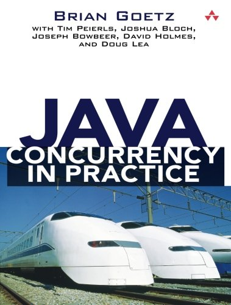
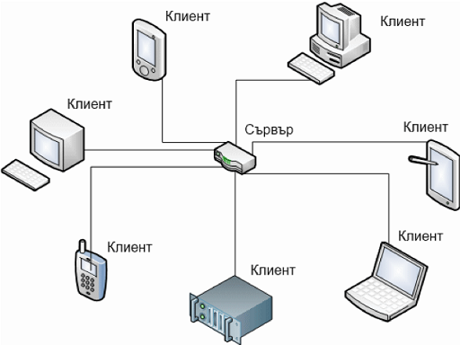
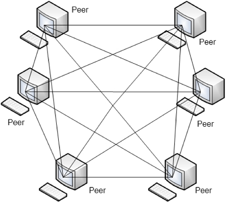
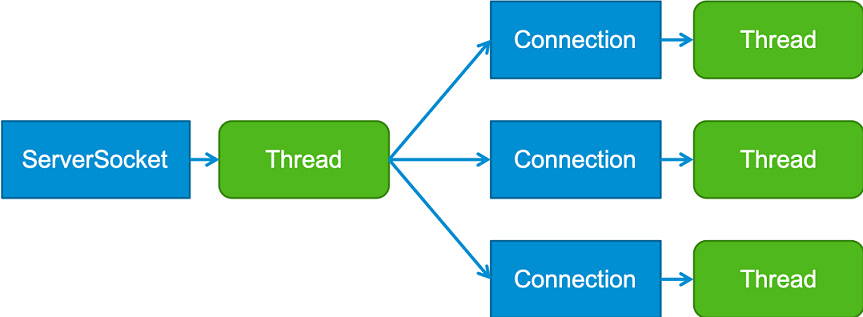
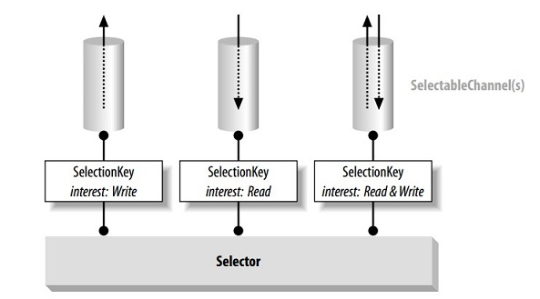
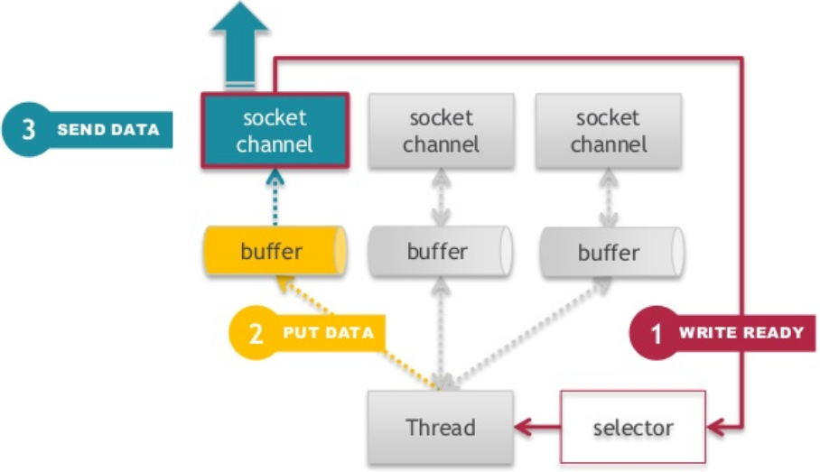
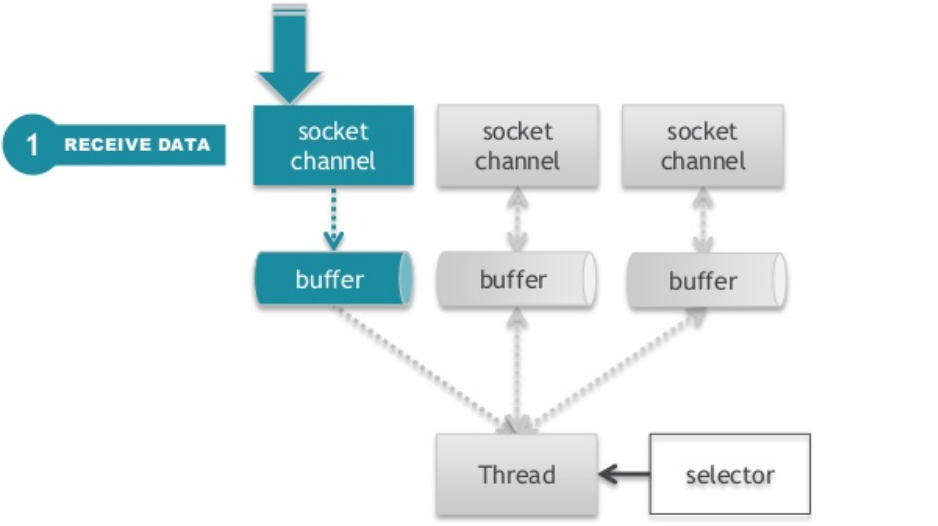
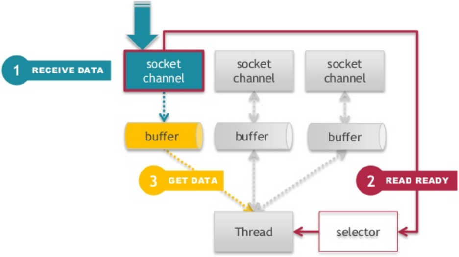

class: center, middle

# Многонишково програмиране с Java (част II)

22.12.2021

---

### Предната лекция говорихме за:

- Concurrent и паралелно изпълнение на програми
- Многонишково програмиране (Multithreading)
    - Нишки и техния жизнен цикъл
    - Атомарни типове данни
    - Комуникация и синхронизиране между нишки

---

### Днес ще разгледаме:

- Thread pools / Executors API
- Concurrent колекции
- Мрежово програмиране

---

### Runnable vs. Callable

```java
// java.lang
@FunctionalInterface
public interface Runnable {

    void run();

}

// java.util.concurrent
@FunctionalInterface
public interface Callable<V> {

    V call() throws Exception;

}
```

---

### Future<V>

```java
// java.util.concurrent
public interface Future<V> {

    boolean cancel(boolean mayInterruptIfRunning);

    boolean isCancelled();

    boolean isDone();

    V get() throws InterruptedException, ExecutionException;

    V get(long timeout, TimeUnit unit)
        throws InterruptedException, ExecutionException,
               TimeoutException;

}
```

---

### Преизползване на нишки

---

### Thread pool (Executor)

- Kонцепция в многонишковото програмиране, при която "рециклираме" нишките след края на тяхното изпълнение, с цел оптимизация.
- Отделните `Runnable` или `Callable` обекти се третират като "задачи" и се трупат в опашка, и когато има свободни нишки в pool-а, те изпълняват задачите, на базата на зададени правила.

.center[]

---

### Executors API

```java
// централен интерфейс
java.util.concurrent.Executor

void execute(Runnable command)

// добавя възможност и за изпълнение на Callable обекти,
// които, за разлика от Runnable, могат да върнат резултат
java.util.concurrent.ExecutorService

<T> Future<T> submit(Callable<T> task)

// задачите могат да се пускат след опредено закъснение
// или периодично на зададен интервал
java.util.concurrent.ScheduledExecutorService

ScheduledFuture<?> schedule(Runnable r, long delay, TimeUnit tu)
ScheduledFuture<?> scheduleAtFixedRate(Runnable r, long initialDelay, long period, TimeUnit tu)
ScheduledFuture<?> scheduleWithFixedDelay(Runnable r, long initialDelay, long delay, TimeUnit tu)
```

---

### Създаване на Executor

```java
// предоставя статични factory методи за създаването на pools от нишки
java.util.concurrent.Executors

// pool-ът ще се състои само от една нишка, следователно
// задачите ще се изпълняват последователно
static ExecutorService newSingleThreadExecutor()

// създава pool, който ще се състои от фиксиран брой нишки.
// Ако в опашката има повече задачи, отколкото налични нишки,
// задачите не се обработват, докато не се освободи нишка
static ExecutorService newFixedThreadPool(int n)

// създава pool от нишки, който ще преизползва нишките,
// ако има налични, в противен случай ще направи нова.
// Нишките, които не се използвани през последната минута,
// ще бъдат премахнати
static ExecutorService newCachedThreadPool()

// pool, който изпълнява задачи периодично или със закъснение
static ScheduledExecutorService newScheduledThreadPool(int size)
```

---

### Спиране на Thread pool

Executor обект винаги трябва да бъде експлицитно спрян с метода `shutdown()`

---

### Thread-safe колекции: Синхронизирани колекции

- Collections API предоставя имплементации на няколко синхронизирани колекции като `
Vector` и `Hashtable`
- `java.util.Collections` предоставя factory метод, с който можем да създадем synchronized колекция от съществуваща обикновена колекция
- Синхронизираните колекции обаче не са достатъчно бързи при много едновременни ползватели и не предоставят възможност за атомарни операции

<br>

```java
static <T> Collection<T> synchronizedCollection(Collection<T> c)
```

---

### Thread-safe колекции: Concurrent колекции

- намират се в пакета `java.util.concurrent`
- създадени са специално за работа в concurrent среда
- добавят възможности за
    - Lock-free паралелен достъп
    - Fail-safe итератори
    - Атомарни операции (например, `putIfAbsent()`)

---

### `CopyOnWriteArrayList`

- Алтернатива на синхронизираните имплементации на `ArrayList`
- Позволява lock-free паралелно четене
- "Fail-safe snapshot" итератор
- Всяка модификация предизвиква копиране на масива
- Атомарни операции: `boolean addIfAbsent(E e);`
- Използването на тази структура е подходящо, само когато броят на четенията от масива значително надвишава броя на модификациите. В противен случай, структурата е изключително неефективна

---

### `ConcurrentHashMap`

- Алтернатива на синхронизираните версии на `java.util.HashMap`
- Паралелен lock-free достъп за четене
- Паралелен (но лимитиран) достъп за писане 
- Fail-safe и "Weakly consistent" итератор
- Атомарни операции: `V putIfAbsent(K key, V value)`
- Най-популярната колекция от `java.util.concurrent` библиотеката, почти винаги е подходяща да се използва за замяната на старите синхронизирани варианти на `HashMap`

---

### `BlockingQueue`

Имплементация на блокираща опашка ("Producer-Consumer" опашка).
Блокира, когато:
- опашката е празна и някой се опитва да чете от нея. При първи запис, бива нотифицирана
- oпашката е пълна и някой се опитва да пише в нея. При първо четене, бива нотифицирана
- `ArrayBlockingQueue` – основна имплементация. Опашката пази елементите си в масив, който не може да променя размера си.

<br>

```java
BlockingQueue<String> queue = new ArrayBlockingQueue<>(4);
```

---

### Multi-threading теми извън обхвата на курса

- Visibility & stale data. Volatile variables. Nonatomic 64-bit operations
- Explicit locks
- Synchronizers: Semaphores, Latches, Barriers, Exchangers

---

### Полезни четива

.center[]

---

### Теория vs. практика

.center[]

---

class: center, middle

# Мрежово програмиране с Java

22.12.2021

.center[]

---

### Теми, които ще разгледаме

- Мрежови модели: клиент-сървър, peer-to-peer
- Мрежови протоколи
    - IP, UDP, TCP
- Мрежова комуникация в Java
    - blocking
    - non-blocking
- Network scalability

---

### Модел Клиент-Сървър

Клиент-сървър е разпределен изчислителен модел, при който част от задачите се разпределят между доставчиците на ресурси или услуги, наречени сървъри и консуматорите на услуги, наречени клиенти.

<br>

.center[]

---

### Модел Peer-to-peer

Peer-to-peer е разпределен архитектурен модел на приложение, при който задачите се разпределят по еднакъв начин между всички участници (peer, node). Всеки участник е едновременно и клиент, и сървър.

.center[]

---

### Видове клиенти

- Според наличната функционалност в клиента:
    - Rich клиенти
    - Thin клиенти
- Според семантиката (протокола):
    - Web клиенти – Браузъри (Chrome, Firefox, IE).
    - Mail клиенти – POP/SMTP клиенти (MS Outlook, Lotus notes).
    - FTP клиенти – Total Commander, Filezilla, WinSCP.
    - ...

---

### Видове сървъри

- Файл сървър (Windows, Samba, UNIX NFS, OpenAFS)
- DB сървър (MySQL, PostgreSQL, Oracle, MS SQL Server, Mongo DB)
- Mail сървър (MS Exchange, GMail)
- Name сървър (DNS)
- FTP сървър (ftpd, IIS)
- Print сървър
- Game сървър
- Web сървър (Apache, GWS, MS IIS, nginx)
- Application сървър (Tomcat, TomEE, GlassFish, JBoss)
- ...

---

### Предимства и недостатъци на Клиент-Сървър

- Висока сигурност: контролът за достъп до данните се осъществява на едно място: сървъра
- Консистентност на данните: всички клиенти в даден момент достъпват едни и същи данни
- Промени в данните се разпространяват много бързо в мрежата: при първото извикване от клиент към сървъра
- Single Point Of Failure (SPOF): ако сървърът е down, никой в мрежата не може да комуникира
- Увеличаването на броя на клиентите води до намаляване на производителността
- 70-95% от времето, през което работи, сървърът е idle

---

### Предимства и недостатъци на Peer-to-Peer

- Няма SPOF
- Няма намаляване на производителността при увеличаване на броя на клиентите
- Проблеми със сигурността: има копия на даните из цялата мрежа
- Риск от умишлена промяна (подмяна) на съдържанието и различни версии на данните в различни възли на мрежата
- Липса на контрол върху съдържанието и възможност за загуба на съдържание
- Труден процес на поддръжка

---

### Open Systems Interconnection (OSI) модел

.center[]

---

### OSI модел: мрежови протоколи

<table style="font-size:0.7em; line-height=0.3em;">
  <tr>
    <th style="font-weight: bold; padding-right: 12px; font-weight: bold;">#</th>
    <th style="font-weight: bold;">Слой</th>
    <th style="font-weight: bold;">Описание</th>
    <th style="font-weight: bold;">Протоколи</th>
  </tr>
  <tr>
    <td>7</td>
    <td>Application</td>
    <td>Позволява на потребителските приложения да заявяват услуги или информация, а на сървър приложенията — да се регистрират и предоставят услуги в мрежата.</td>
    <td>DNS, FTP, HTTP, NFS, NTP, DHCP, SMTP, Telnet</td>
  </tr>
  <tr>
    <td>6</td>
    <td>Presentation</td>
    <td>Конвертиране, компресиране и криптиране на данни.</td>
    <td>TLS/SSL</td>
  </tr>
  <tr>
    <td>5</td>
    <td>Session</td>
    <td>Създаването, поддържането и терминирането на сесии. Сигурност. Логически портове.</td>
    <td>Sockets</td>
  </tr>
  <tr>
    <td>4</td>
    <td>Transport</td>
    <td>Грижи се за целостта на съобщенията, за пристигането им в точна последователност, потвърждаване за пристигане, проверка за загуби и дублиращи се съобщения.</td>
    <td>TCP, UDP</td>
  </tr>
  <tr>
    <td>3</td>
    <td>Network</td>
    <td>Управлява пакетите в мрежата. Рутиране. Фрагментация на данните. Логически адреси.</td>
    <td>IPv4, IPv6, IPX, ICMP</td>
  </tr>
  <tr>
    <td>2</td>
    <td>Data Link</td>
    <td>Предаване на фреймове от един възел на друг. Управление на последователността на фреймовете. Потвърждения. Проверка за грешки. MAC.</td>
    <td>ATM, X.25, DSL, IEEE 802.11</td>
  </tr>
  <tr>
    <td>1</td>
    <td>Physical</td>
    <td>Отговаря за предаването и приемането на неструктурирани потоци от данни по физическия носител. Кодиране/декодиране на данните. Свързване на физическия носител.</td>
    <td>IEEE 802.11, IEEE 1394, Bluetooth</td>
  </tr>
</table>


---

### java.net | Въведение

Пакетът `java.net` предоставя класове, които използват и работят на различни нива от OSI модела.

- Мрежов и data link слой
    - класът `NetworkInterface` предоставя достъп до мрежовите адаптери на компютъра
    - IP адреси - класът `InetAddress`
- Транспортен слой
    - TCP - класове `Socket` и `ServerSocket`
    - UDP - класове `DatagramPacket`, `DatagramSocket` и `MulticastSocket`
- Приложен слой
    - класовете `URL` и `URLConnection` за достъпването на HTTP и FTP ресурси
    - (от Java 11) класовете от пакета `java.net.http` за по-удобна работа с HTTP

---

### java.net | Мрежови адаптери

- Мрежовият адаптер осъществява връзката между компютърна система и мрежа
- Мрежовите адаптери могат да бъдат физически или виртуални (софтуерни). Примери за виртуални са *loopback* интерфейсът и интерфейсите, създадени от виртуалните машини
- Една система може да има повече от един физически и/или виртуален мрежови адаптер
- Java предоставя достъп до всички мрежови адаптери чрез класа `java.net.NetworkInterface`

---

### IP адрес

- Всеки компютър, свързан към мрежа, се идентифицира с логически адрес
- Най-разпространените протоколи за логически адреси в мрежата са IP (Internet Protocol) версия 4 и IP версия 6
- Адресите в IPv4 представляват 32-битови числа, а в IPv6 - 128-битови

<br>

.center[]

---

### Портове

- В общия случай, компютърът има една физическа връзка към мрежата. По тази връзка се изпращат и получават данни от/за всички приложения. Портовете се използват, за да се знае кои данни за кое приложение са
- Предадените данни по мрежата винаги съдържат в себе си информация за компютъра и порта, към които са насочени
- Портовете се идентифицират с 16-битово число, което се използва от UDP и TCP протоколите, за да идентифицират за кое приложение са предназначени данните
- Портовете могат да бъдат от номер 0 до номер 65 535
- Портове с номера от 0 до 1023 са известни като *well-known ports*. За да се използват тези портове от вашето приложение, то трябва да се изпълнява с администраторски права

---

### Адресиране в мрежата | `java.net.InetAddress`

- Инстанции се създават чрез статични методи на класа
- С `NetworkInterface`, може да вземете списък с всички мрежови адаптери или точно определен

```java
// създава инстанция по hostname или по текстово представяне на IP адрес
InetAddress address = InetAddress.getByName​("www.google.com");
System.out.println(address.getHostAddress()); // 172.217.169.164

InetAddress address = InetAddress.getByName("62.44.101.138");
System.out.println(address.getHostName()); // www.fmi.uni-sofia.bg
System.out.println(address.isReachable(5_000)); // true
InetAddress localhost = InetAddress.getLocalHost();

Collections.list(NetworkInterface.getNetworkInterfaces())
           .stream()
           .forEach(n -> {
                System.out.println("Disp. name: " + n.getDisplayName());
                System.out.println("Name: " + n.getName());
           });
```

---

### Сокети (sockets)

- UDP и TCP се имплементират чрез *сокети* (*sockets*)
- Сокетите представляват крайните точки на двупосочна мрежова връзка (connection) между две приложения
- Всеки сокет се идентифицира чрез комбинация от IP адрес и номер на порт

---

### UDP протокол

- позволява на приложенията да пращат съобщения, наречени *datagrams*, чрез прост, connection-less модел на комуникация
- няма *handshake* между двете страни на комуникацията, в следствие на което няма гаранция за доставка на съобщенията и за запазване на реда им

---

### UDP протокол

- Datagram се представя от класа `java.net.DatagramPacket`
- `DatagramSocket` представлява connection-less сокет за пращане и получаване на datagram пакети чрез методите си `send` и `receive`

---

### TCP протокол

- Надгражда IP протокола, затова също се нарича TCP/IP ("TCP over IP")
- Предава данните по надежден начин, т.е. с проверка за грешки, с гаранция за доставка и със запазване на реда на пакетите

---

### TCP протокол

- Имплементира се със сокети - класовете `ServerSocket` и `Socket`, позволяващи пращането и получаването на съобщения между две приложения: сървър и клиент

---

### TCP vs. UDP

| Характеристика               | TCP                  | UDP                       |
|:-----------------------------|:---------------------|:--------------------------|
| Connection                   | connection-based     | connection-less           |
| Надеждност                   | висока               | ниска                     |
| Ред на пакетите              | гарантиран           | не гарантиран             |
| Скорост на доставка          | по-ниска от UDP      | по-висока от TCP          |
| Проверка за грешки           | да, с възстановяване | да, но без възстановяване |
| Потвърджаване при получаване | да                   | не                        |

---

### Клиент-сървър имплементация със сокети

---

### `java.net.ServerSocket`

```java
ServerSocket() // създава server socket, който не е свързан.
               // Изисква извикване на bind(), преди да се използва
ServerSocket(int port) // създава server socket, свързан с дадения порт.
                       // Стойноста на port е от 0 до 65535,
                       // като 0 означава автоматично определен
ServerSocket(int port, int backlog) // задава максимален брой чакащи
                                    // заявки за свързване
ServerSocket(int port, int backlog, InetAddress bindAddr)

void bind(SocketAddress endpoint) // свързва към конкретния IP адрес
void bind(SocketAddress endpoint, int backlog)

Socket accept() // блокира и чака заявка за свързване от клиент
```

---

### `java.net.Socket`

```java
Socket() // създава socket, който не е свързан
Socket(String host, int port) // създава socket и го свързва
                              // със зададения host и порт
Socket(InetAddress address, int port)

void connect​(SocketAddress endpoint) // свързва сокета към сървъра
void connect​(SocketAddress endpoint, int timeout)

InputStream getInputStream() // връща входен поток за четене
OutputStream getOutputStream() // връща изходен поток за писане
```

---

### Сокети (Sockets)

.center[]

---

### java.net | TCP комуникация

.center[]

---

### java.net: blocking мрежова комуникация

.center[]

---

### java.net | Клиент-сървър архитектура

.center[]

---

### java.net | Архитектура

.center[]

---

### java.net | Предимства и недостатъци

- Предимства
    - Сравнително прост код: познатото I/O Stream API
    - Няма нужда от проверки за частично получени съобщения
        - нишката блокира, докато прочете цялото съобщение
- Недостатъци
    - Неефективно използване на нишките
        - Много нишки в waiting/blocked състояние, заради блокиращите операции
        - Допълнителна памет (за нишките)
    - Performance penalty заради context switching между нишките
    - Ограничен брой паралелни конекции, защото нишките на сървъра са краен брой

---

### Мрежово програмиране с Non-blocking I/O (NIO)

- Java NIO API-то реализира алтернативен начин за мрежова комуникация, който позволява неблокиращи (асинхронни) входно-изходни операции
- Чрез него се реализират мрежови приложения, които работят ефективно с огромен брой паралелни клиенти и заявки

---

### java.nio | Основни обекти

- **Буфер** (Buffer) - Блок от паметта, който се използва за временно съхранение на данни за четене или писане
- **Канал** (Channel) - Абстракция за комуникационна връзка (connection)
- **Селектор** (Selector) - Компонент, в който се регистрират множество канали, позволяващ обработката им в една нишка

---

### java.nio | Буфери

- Буферът е контейнер, който съдържа временно данни, които ще бъдат записани или прочетени
- Представлява масив от примитивен тип с фиксиран размер, който пази състояние: докъде е запълнен, колко свободно място има, докъде са прочетени или записани данните
- Класът `Buffer` е абстрактен, но има наследници за всички не-булеви примитивни типове: `ByteBuffer`, `CharBuffer`, `ShortBuffer`, `IntBuffer`, `LongBuffer`, `FloatBuffer`, `DoubleBuffer`
- `java.nio` комуникацията се основава на буфери, за разлика от `java.io` комуникацията, основана на входно-изходни потоци

---

### java.nio.Buffer

- Състоянието на буфера се определя от четири атрибута:
    - *капацитет* (capacity): максималния брой елементи, които може да съдържа буфера. Задава се при създаването му и не може да се променя
    - *лимит* (limit): първият индекс на буфера, който не трябва да се достъпва за четене или писане
    - *позиция* (position): индекса на следващия елемент на буфера за прочитане или за записване
    - *маркер* (mark): индекс, в който може да запомним текущата позиция, за да се върнем към нея по-късно
- Четирите индекса са в следната зависимост:
    0 <= mark <= position <= limit <= capacity

---

### java.nio.Buffer

```java
int capacity()
int position()
Buffer position(int newPosition)
int limit()
Buffer limit(int newLimit)
Buffer mark()
Buffer reset()
```

---

### java.nio.Buffer

```java
// Подготвя буфера за "източване" / прочитане.
// Лимитът става равен на позицията, а позицията на нула
Buffer flip()

// Подготвя буфера за ново запълване.
// Лимитът става равен на капацитета, а позицията на нула
Buffer clear()

// Подготвя буфера за повторно прочитане на данните,
// които вече съдържа. Лимитът остава без промяна,
// позицията се нулира
Buffer rewind()
```

---

### java.nio.ByteBuffer

```java
byte get()
byte get(int index)
ByteBuffer put(byte b)
ByteBuffer put(int index, byte b)
```

---

### java.nio | Как работи буферът

.center[]

---

### java.nio | Директни и индиректни буфери

- Буферите биват *директни* и *индиректни*

<br>

```java
ByteBuffer buffer = ByteBuffer.allocateDirect(1024); // direct buffer
ByteBuffer buffer = ByteBuffer.allocate(1024); // indirect buffer
```

---

### java.nio | Директни и индиректни буфери

- Директните буфери ще използват при възможност native I/O операции за четене и запис директно през операционната система
- Директният буфер представлява непрекъснат регион на постоянно място в паметта, индиректният е Java масив, може да не е непрекъснят регион и може да се мести от garbage collector-a
- Директният буфер е по-скъп за създаване, но ще работи по-ефективно за големи размери и ако живее дълго в паметта
- Индиректният буфер не е толкова ефективен като директният за повечето операции, но управлението на паметта му се осъществява от JVM-a (garbage collector-a) и е по-предсказуемо

---

### Java I/O performance

.center[]

---

### Канали (Channels)

- Каналите са абстракция за връзка ("тръба") за ефективно транспортиране на данни между byte буфери и обект на другия край на канала (най-често файл или сокет)
- Каналите позволяват с минимален overhead да се достъпват native входно-изходните услуги на операционна система, а буферите са вътрешните крайни точки, които каналите използват за изпращане и получаване на данни

---

### java.nio.channels.ServerSocketChannel

```java
// Opens a server-socket channel
static ServerSocketChannel open()

// Accepts a connection made to this channel's socket
SocketChannel accept()

// Binds the channel's socket to a local address
// and configures the socket to listen for connections
ServerSocketChannel bind(SocketAddress local) 

// Retrieves a server socket associated with this channel
ServerSocket socket()
```

---

### java.nio.channels.SocketChannel

```java
// Opens a socket channel
static SocketChannel open()
// Opens a socket channel and connects it to a remote address
static SocketChannel open(SocketAddress remote)

// Connects this channel's socket
boolean connect(SocketAddress remote)

// Retrieves a socket associated with this channel
Socket socket()

// Reads bytes from this channel into the given buffer
int read(ByteBuffer dst) 
// Writes bytes to this channel from the given buffer
int write(ByteBuffer src)
```

---

### Selector и SelectionKey

Селекторите осигуряват възможността за избор (селектиране) на канали според готовността им за I/O операции (readiness selection), което е предпоставка за multiplexed I/O, т.е. с една нишка да обслужваме голям брой канали.

.center[]

---

### Selector и SelectionKey

1. Регистрираме един или повече вече създадени канали с инстанция на селектор
2. Регистрирането връща ключ, който представлява релацията между канала и селектора
3. Ключът "помни" операциите върху даден канал, от които се интересуваме и следи готовността на канала да ги изпълнява
4. При извикване на select() метода на селектора, се актуализират всички асоциирани с този селектор ключове на канали
5. От селектора може да получим множеството от ключове, чиито канали са готови за операция
6. Итерираме това множество и обслужваме всеки от готовите канали

---

### java.nio.channels.Selector

```java
// Opens a selector
static Selector open()

// Selects a set of keys whose corresponding channels are ready for I/O operations
int select()

// Returns this selector's selected-key set
Set<SelectionKey> selectedKeys()
```

---

### java.nio.channels.SelectionKey

```java
public static final int OP_READ
public static final int OP_WRITE
public static final int OP_CONNECT
public static final int OP_ACCEPT

SelectableChannel channel();
Selector selector();
int interestOps();
int readyOps();

boolean isReadable()
boolean isWritable()
boolean isConnectable()
boolean isAcceptable()

Object attach(Object ob)
Object attachment()
```

---

### java.nio.channels.ServerSocketChannel

```java
// ServerSocketChannel е канал, който може да слуша
// за входящи TCP заявки за свързване, точно както ServerSocket

ServerSocketChannel serverSocketChannel = ServerSocketChannel.open();
serverSocketChannel.bind(new InetSocketAddress(9999));
serverSocketChannel.configureBlocking(false);

while (true) {
    SocketChannel socketChannel = serverSocketChannel.accept();
    // [...]
}
```

---

### java.nio | SocketChannel | Регистрация

```java
// SocketChannel представлява една TCP връзка. За да се използва
// асинхронно, трябва да се регистрира в селектор. Каналът трябва
// да се постави в nonblocking режим, преди да се регистрира със селектор.

Selector selector = Selector.open();
socketChannel.configureBlocking(false);
socketChannel.register(selector, SelectionKey.OP_READ | SelectionKey.OP_WRITE);
```

---

### java.nio | SocketChannel | Регистрация

- Когато регистрираме `SocketChannel`, трябва да укажем, за какви операции да бъдем известени:
    - `OP_READ` – когато се получи нещо за четене от канала
    - `OP_WRITE` – когато каналът е готов за запис
    - `OP_CONNECT` – когато каналът е готов да завърши последователността си за свързване към отдалечената система
    - `OP_ACCEPT` – когато пристигне заявка за нова конекция

---

### java.nio | SocketChannel | Notification

```java
// Получаване на известие за няколко канала
while (true) {
    int readyChannels = selector.select();
    if (readyChannels == 0) { continue; }

    Set<SelectionKey> selectedKeys = selector.selectedKeys();
    Iterator<SelectionKey> keyIterator = selectedKeys.iterator();
    while (keyIterator.hasNext()) {
        SelectionKey key = keyIterator.next();
        if (key.isReadable()) {
            // A channel is ready for reading
        }
        keyIterator.remove();
    }
}
```

---

### java.nio | SocketChannel | Notification | Четене

```java
// Четене на данните от канал
if (key.isReadable()) {
    SocketChannel sc = (SocketChannel) key.channel();
    while (true) {
        buffer.clear();
        int r = sc.read(buffer);
        if (r <= 0) { continue; }
        buffer.flip();
        sc.write(buffer);
    }
} else if (key.isWritable()) {
    // [...]
}
```

---

### java.nio | SocketChannel | Запис

```java
// Използваме SocketChannel канал (channel) и за изпращане на данни
// по TCP връзката (connection)

SocketChannel socketChannel = SocketChannel.open();
socketChannel.connect(new InetSocketAddress("127.0.0.1", 9999));

String newData = "Current time: " + System.currentTimeMillis();
ByteBuffer buf = ByteBuffer.allocate(48);

buf.put(newData.getBytes());
buf.flip();
while (buf.hasRemaining()) {
    socketChannel.write(buf);
}
```

---

### java.nio | Изпращане на данни

.center[]

---

### java.nio | Изпращане на данни

.center[]

---

### java.nio | Изпращане на данни

.center[]

---

### java.nio | Изпращане на данни

.center[]

---

### java.nio | Получаване на данни

.center[]

---

### java.nio | Получаване на данни

.center[]

---

### java.nio | Получаване на данни

.center[]

---

### java.nio | Получаване на данни

.center[]

---

### java.nio | Архитектура

- Нишка селектор (Selector), която позволява обработването на няколко канала от една нишка
- Намалява броя на нишките, като премахва нуждата от отделна нишка за всяка връзка (connection)
- Асинхронни (неблокиращи) операции

---

### java.nio | Архитектура

.center[]

---

### java.nio | Архитектура

.center[]

---

### java.nio | Архитектура

.center[]

---

### java.nio | Архитектура

.center[]

---

### IO vs. NIO

.center[]

---

### Полезни четива

.center[]

---

## Въпроси?

.font-xl[.ri-github-fill.icon-inline[[fmi/java-course](https://github.com/fmi/java-course)]]

.font-xl[.ri-youtube-fill.icon-inline[[MJT2022](https://www.youtube.com/playlist?list=PLew34f6r0PxyUcIg370lv9jHDwFeMDa7e)]]

.center[]
