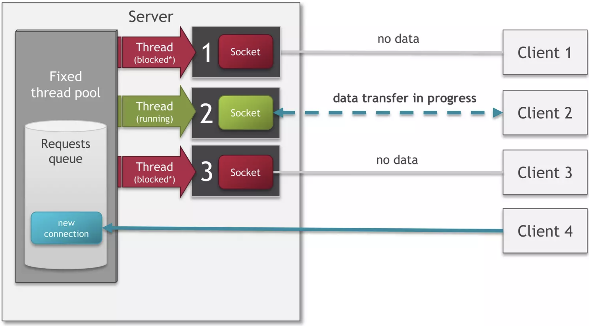
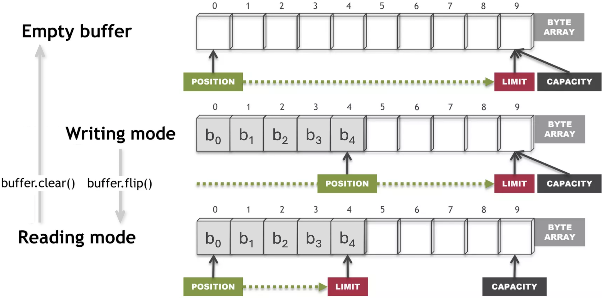
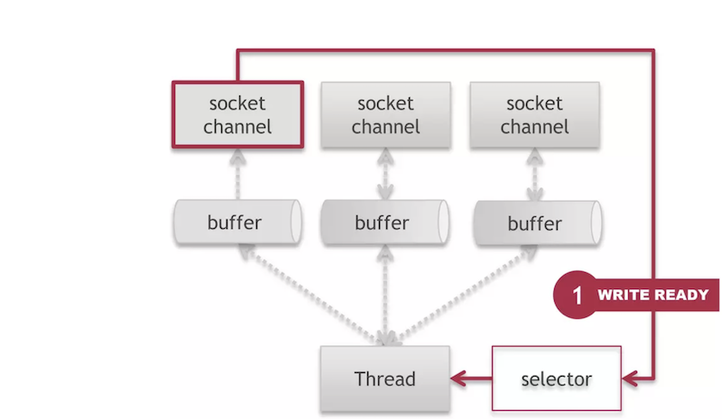
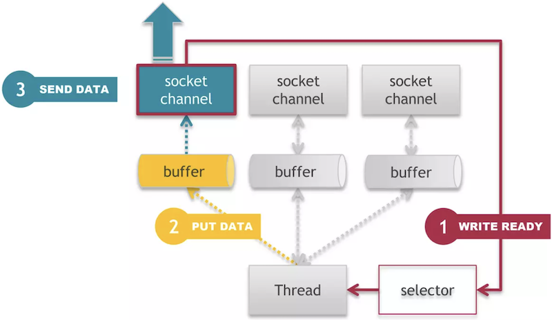
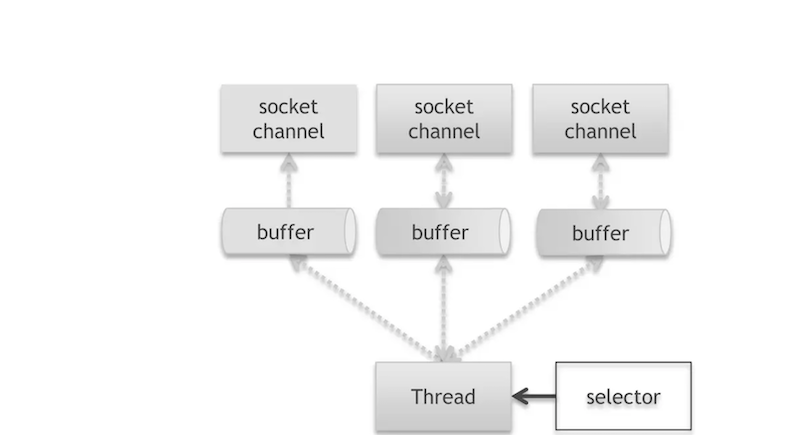
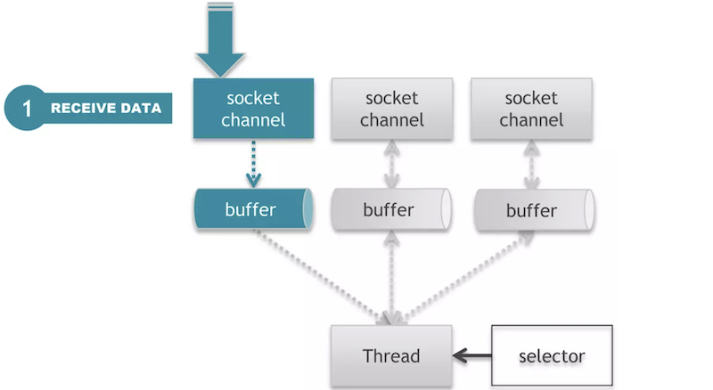
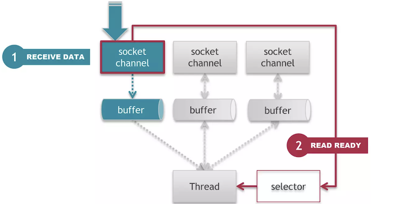

class: center, middle

# Мрежово програмиране с Java (част II)

18.12.2024

.center[]

---

### Предната лекция говорихме за:

- Thread pools & Executors API
- Thread-safe колекции
- Основи на компютърните мрежи

---

### Днес ще разгледаме:

- Синхронно мрежово програмиране с `java.net`
- Асинхронно мрежово програмиране с `java.nio`

---

### Клиент-сървър имплементация със сокети

---

### `java.net.ServerSocket`

```java
ServerSocket() // създава server socket, който не е свързан.
               // Изисква извикване на bind(), преди да се използва
ServerSocket(int port) // създава server socket, свързан с дадения порт.
                       // Стойноста на port е от 0 до 65535,
                       // като 0 означава автоматично определен
ServerSocket(int port, int backlog) // задава максимален брой чакащи
                                    // заявки за свързване
ServerSocket(int port, int backlog, InetAddress bindAddr)

void bind(SocketAddress endpoint) // свързва към конкретния IP адрес
void bind(SocketAddress endpoint, int backlog)

Socket accept() // блокира и чака заявка за свързване от клиент
```

---

### `java.net.Socket`

```java
Socket() // създава socket, който не е свързан
Socket(String host, int port) // създава socket и го свързва
                              // със зададения host и порт
Socket(InetAddress address, int port)

void connect​(SocketAddress endpoint) // свързва сокета към сървъра
void connect​(SocketAddress endpoint, int timeout)

InputStream getInputStream() // връща входен поток за четене
OutputStream getOutputStream() // връща изходен поток за писане
```

---

### Сокети (Sockets)


---

### java.net | TCP комуникация

.center[]

---

### java.net: blocking мрежова комуникация


---

### java.net | Клиент-сървър архитектура

.center[]

---

### java.net | Архитектура


---

### java.net | Архитектура



---

### java.net | Архитектура


---

### java.net | Предимства и недостатъци

- Предимства
    - Сравнително прост код: познатото I/O Stream API
    - Няма нужда от проверки за частично получени съобщения
        - нишката блокира, докато прочете цялото съобщение
- Недостатъци
    - Неефективно използване на нишките
        - Много нишки в waiting/blocked състояние, заради блокиращите операции
        - Допълнителна памет (за нишките)
    - Performance penalty заради context switching между нишките
    - Ограничен брой паралелни конекции, защото нишките на сървъра са краен брой

---

### Мрежово програмиране с Non-blocking I/O (NIO)

- Java NIO API-то реализира алтернативен начин за мрежова комуникация, който позволява неблокиращи (асинхронни) входно-изходни операции
- Чрез него се реализират мрежови приложения, които работят ефективно с огромен брой паралелни клиенти и заявки

---

### Относителна скорост на основните операции в една компютърна система

.center[]

---

### java.nio | Основни обекти

- **Буфер** (Buffer) - Блок от паметта, който се използва за временно съхранение на данни за четене или писане
- **Канал** (Channel) - Абстракция за комуникационна връзка (connection)
- **Селектор** (Selector) - Компонент, в който се регистрират множество канали, позволяващ обработката им в една нишка

---

### java.nio | Буфери

- Буферът е контейнер, който съдържа временно данни, които ще бъдат записани или прочетени
- Представлява масив от примитивен тип с фиксиран размер, който пази състояние: докъде е запълнен, колко свободно място има, докъде са прочетени или записани данните
- Класът `Buffer` е абстрактен, но има наследници за всички не-булеви примитивни типове: `ByteBuffer`, `CharBuffer`, `ShortBuffer`, `IntBuffer`, `LongBuffer`, `FloatBuffer`, `DoubleBuffer`
- `java.nio` комуникацията се основава на буфери, за разлика от `java.io` комуникацията, основана на входно-изходни потоци

---

### java.nio.Buffer

- Състоянието на буфера се определя от четири атрибута:
    - *капацитет* (capacity): максималния брой елементи, които може да съдържа буфера. Задава се при създаването му и не може да се променя
    - *лимит* (limit): първият индекс на буфера, който не трябва да се достъпва за четене или писане
    - *позиция* (position): индекса на следващия елемент на буфера за прочитане или за записване
    - *маркер* (mark): индекс, в който може да запомним текущата позиция, за да се върнем към нея по-късно
- Четирите индекса се намират в следната зависимост:
    0 <= mark <= position <= limit <= capacity

---

### java.nio.Buffer

```java
int capacity()
int position()
Buffer position(int newPosition)
int limit()
Buffer limit(int newLimit)
Buffer mark()
Buffer reset()
```

---

### java.nio.Buffer

```java
// Подготвя буфера за "източване" / прочитане.
// Лимитът става равен на позицията, а позицията на нула
Buffer flip()

// Подготвя буфера за ново запълване.
// Лимитът става равен на капацитета, а позицията на нула
Buffer clear()

// Подготвя буфера за повторно прочитане на данните,
// които вече съдържа. Лимитът остава без промяна,
// позицията се нулира
Buffer rewind()
```

---

### java.nio.ByteBuffer

```java
byte get()
byte get(int index)
ByteBuffer put(byte b)
ByteBuffer put(int index, byte b)
```

---

### java.nio | Как работи буферът



---

### java.nio | Индиректни и директни буфери

- Буферите биват *индиректни* и *директни* според това, в кой регион на паметта се намират

<br>

```java
// indirect buffer: allocated in the JVM heap
ByteBuffer buffer = ByteBuffer.allocate(1024);

// direct buffer: allocated outside of the JVM, in the native system memory.
// This allows it to be used more efficiently by the OS, and potentially by DMA operations,
// because this memory can be directly accessed by low-level I/O operations,
// without copying from native memory to JVM heap
ByteBuffer buffer = ByteBuffer.allocateDirect(1024);                    
```

<br>

<small><small><small><sup>*</sup>DMA (Direct Memory Access) е feature, който позволява да се трансферират данни между RAM паметта и определени периферни устройства чрез техните storage или мрежови адаптери, без намесата на процесора, освобождавайки го за други задачи. DMA се реализира на хардуерно ниво от т.нар DMA контролер, който се управлява от device drivers на дадената операционна система.</small></small></small>

---

### java.nio | Индиректни и директни буфери

- Директните буфери ще използват при възможност native I/O операции за четене и запис директно през операционната система
- Директният буфер представлява непрекъснат регион на постоянно място в паметта, индиректният е Java масив, може да не е непрекъснят регион и може да се мести от garbage collector-a
- Директният буфер е по-скъп за създаване, но ще работи по-ефективно за големи размери и ако живее дълго в паметта
- Индиректният буфер не е толкова ефективен като директният за повечето операции, но управлението на паметта му се осъществява от JVM-a (garbage collector-a) и е по-предсказуемо

---

### Java I/O performance

.center[]

---

### Канали (Channels)

- Каналите са абстракция за връзка ("тръба") за ефективно транспортиране на данни между byte буфери и обект на другия край на канала (най-често файл или сокет)
- Каналите позволяват с минимален overhead да се достъпват native входно-изходните API-та на операционна система, а буферите са вътрешните крайни точки, които каналите използват за изпращане и получаване на данни

---

### java.nio.channels.ServerSocketChannel

```java
// Opens a server-socket channel
static ServerSocketChannel open()

// Accepts a connection made to this channel's socket
SocketChannel accept()

// Binds the channel's socket to a local address
// and configures the socket to listen for connections
ServerSocketChannel bind(SocketAddress local) 

// Retrieves a server socket associated with this channel
ServerSocket socket()
```

---

### java.nio.channels.SocketChannel

```java
// Opens a socket channel
static SocketChannel open()
// Opens a socket channel and connects it to a remote address
static SocketChannel open(SocketAddress remote)

// Connects this channel's socket
boolean connect(SocketAddress remote)

// Retrieves a socket associated with this channel
Socket socket()

// Reads bytes from this channel into the given buffer
int read(ByteBuffer dst) 
// Writes bytes to this channel from the given buffer
int write(ByteBuffer src)
```

---

### Selector и SelectionKey

Селекторите осигуряват възможността за избор (селектиране) на канали според готовността им за I/O операции (*readiness selection*), което е предпоставка за *multiplexed I/O*, т.е. с една нишка да обслужваме голям брой канали.

.center[]

---

### Selector и SelectionKey

1. Регистрираме един или повече вече създадени канали с инстанция на селектор
2. Регистрирането връща ключ, който представлява релацията между канала и селектора
3. Ключът "помни" операциите върху даден канал, от които се интересуваме и следи готовността на канала да ги изпълнява
4. При извикване на `select()` метода на селектора, се актуализират всички асоциирани с този селектор ключове на канали
5. От селектора може да получим множеството от ключове, чиито канали са готови за операция
6. Итерираме това множество и обслужваме всеки от готовите канали

---

### java.nio.channels.Selector

```java
// Opens a selector
static Selector open()

// Selects a set of keys whose corresponding channels are ready for I/O operations
int select()

// Returns this selector's selected-key set
Set<SelectionKey> selectedKeys()
```

---

### java.nio.channels.SelectionKey

```java
public static final int OP_READ
public static final int OP_WRITE
public static final int OP_CONNECT
public static final int OP_ACCEPT

SelectableChannel channel();
Selector selector();
int interestOps();
int readyOps();

boolean isReadable()
boolean isWritable()
boolean isConnectable()
boolean isAcceptable()

Object attach(Object ob)
Object attachment()
```

---

### java.nio.channels.ServerSocketChannel

```java
// ServerSocketChannel е канал, който може да слуша
// за входящи TCP заявки за свързване, точно както ServerSocket

ServerSocketChannel serverSocketChannel = ServerSocketChannel.open();
serverSocketChannel.bind(new InetSocketAddress(9999));
serverSocketChannel.configureBlocking(false);

while (true) {
    SocketChannel socketChannel = serverSocketChannel.accept();
    // [...]
}
```

---

### java.nio | SocketChannel | Регистрация

```java
// SocketChannel представлява една TCP връзка. За да се използва
// асинхронно, трябва да се регистрира в селектор. Каналът трябва
// да се постави в nonblocking режим, преди да се регистрира със селектор.

Selector selector = Selector.open();
socketChannel.configureBlocking(false);
socketChannel.register(selector, SelectionKey.OP_READ | SelectionKey.OP_WRITE);
```

---

### java.nio | SocketChannel | Регистрация

- Когато регистрираме `SocketChannel`, трябва да укажем, за какви операции да бъдем известени:
    - `OP_READ` – когато се получи нещо за четене от канала
    - `OP_WRITE` – когато каналът е готов за запис
    - `OP_CONNECT` – когато каналът е готов да завърши последователността си за свързване към отдалечената система
    - `OP_ACCEPT` – когато пристигне заявка за нова конекция

---

### java.nio | SocketChannel | Notification

```java
// Получаване на известие за няколко канала
while (true) {
    int readyChannels = selector.select();
    if (readyChannels == 0) { continue; }

    Set<SelectionKey> selectedKeys = selector.selectedKeys();
    Iterator<SelectionKey> keyIterator = selectedKeys.iterator();
    while (keyIterator.hasNext()) {
        SelectionKey key = keyIterator.next();
        if (key.isReadable()) {
            // A channel is ready for reading
        }
        keyIterator.remove();
    }
}
```

---

### java.nio | SocketChannel | Notification | Четене

```java
// Четене на данните от канал
if (key.isReadable()) {
    SocketChannel sc = (SocketChannel) key.channel();
    while (true) {
        buffer.clear();
        int r = sc.read(buffer);
        if (r <= 0) { continue; }
        buffer.flip();
        sc.write(buffer);
    }
} else if (key.isWritable()) {
    // [...]
}
```

---

### java.nio | SocketChannel | Запис

```java
// Използваме SocketChannel канал (channel) и за изпращане на данни
// по TCP връзката (connection)

SocketChannel socketChannel = SocketChannel.open();
socketChannel.connect(new InetSocketAddress("127.0.0.1", 9999));

String newData = "Current time: " + System.currentTimeMillis();
ByteBuffer buf = ByteBuffer.allocate(48);

buf.put(newData.getBytes());
buf.flip();
while (buf.hasRemaining()) {
    socketChannel.write(buf);
}
```

---

### java.nio | Изпращане на данни

.center[]

---

### java.nio | Изпращане на данни

.center[]

---

### java.nio | Изпращане на данни

.center[]

---

### java.nio | Изпращане на данни

.center[]

---

### java.nio | Получаване на данни

.center[]

---

### java.nio | Получаване на данни

.center[]

---

### java.nio | Получаване на данни

.center[]

---

### java.nio | Получаване на данни

.center[]

---

### java.nio | Архитектура

- Нишка селектор (Selector), която позволява обработването на няколко канала от една нишка
- Намалява броя на нишките, като премахва нуждата от отделна нишка за всяка връзка (connection)
- Асинхронни (неблокиращи) операции

---

### java.nio | Архитектура

.center[]

---

### java.nio | Архитектура

.center[]

---

### java.nio | Архитектура

.center[]

---

### java.nio | Архитектура

.center[]

---

### IO vs. NIO

.center[]

---

### Production-ready NIO сървър архитектура

.center[]

---

### Полезни четива

.center[]

---

## Въпроси?

.font-xl[.ri-github-fill.icon-inline[[fmi/java-course](https://github.com/fmi/java-course)]]

.font-xl[.ri-youtube-fill.icon-inline[[MJT2025](https://www.youtube.com/playlist?list=PLew34f6r0Pxyldqe31Txob2V3M3m1MKCn)]]

.center[]
