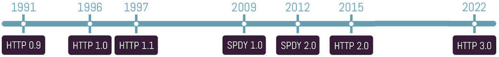

class: center, middle

# HTTP, REST и JSON

03.01.2024

.center[]

---

### Предната лекция говорихме за:

- Мрежово програмиране с Java NIO

---

### Днес ще разгледаме:

- HTTP
- REST
- JSON
- Библиотеки за работа с HTTP и JSON

---

### Как работи Интернет?

.center[]

---

### Характеристики на HTTP

- HTTP (Hypertext Transfer Protocol) e приложен протокол
- Модел заявка-отговор (request-response) - служи за комуникационен канал в клиент-сървър архитектура, като следва строги правила за ред и формат на съобщенията между участниците
- Като транспортен протокол, почти винаги се ползва ТCP/IP, в редки случаи и UDP<sup>*</sup>
- HTTP сървърите по подразбиране "слушат" на порт 80

---

### Характеристики на HTTP

- Не пази състояние (*stateless*) – всяка клиентска заявка е независима сама по себе си
- Сървърът не обвързва логически серия заявки от определен клиент
- Това води до липса на вграден в протокола механизъм за поддържане на сесии

---

### HTTP транзакция "от птичи поглед"

1. Клиентът отваря комуникационен канал (TCP socket)
2. Клиентът изпраща заявка към сървъра
3. Сървърът връща отговор на клиента
4. Сървърът затваря socket-а

---

### Видове HTTP съобщения: Заявки и отговори

- *Заявка* – инициатор е клиентът – подава информация на сървъра, достъп до кой ресурс иска да получи и каква операция иска да извърши с него (и евентуални входни параметри). Клиент (условно наречен *User-Agent* в HTTP) може да бъде всяко софтуерно приложение, спазващо правилата на протокола на комуникация
- *Отговор* – изпраща се от уеб сървъра, като резултат от изпълнението на клиентска заявка. Под уеб сървър разбираме софтуерно приложение, служещо като доставчик на дадени услуги върху определени негови ресурси

---

### HTTP Заявка

- Начален ред
- Хедъри (headers)
- Тяло (данни)

---

### HTTP Заявка: начален ред

- HTTP *Метод* (*Глагол*) – указва типа операция, която клиентът иска да извърши със заявения ресурс
- URL (Uniform Resource Locator) – уникален идентификатор на заявения ресурс
- Версия на HTTP – версията на протокола, която ще се ползва за комуникация

<br>

```http
GET en.wikipedia.org/w/index.php HTTP/1.1
```

---

### HTTP Заявка: хедъри и данни

- *Хедъри* - Възможно е да дефинира множество хедъри, като всеки от тях заема точно един ред и следва формата: “Име на хедър: Стойност на хедър”
- *Данни (Тяло)* – опционални, може да съдържат множество редове, включително и празни

<br>

```http
Connection: Keep-Alive
Host: en.wikipedia.org
```

---

### HTTP заявка - пример

.center[]

---

### HTTP ресурси

Унифициран локатор на ресурси (URL) - стандартизиран адрес на даден мрежов ресурс (документ или страница).

.center[]

---

### Основни HTTP методи

- GET – за зареждане на ресурс от сървъра
- HEAD – идентичен с GET, с разликата, че отговорът няма да върне тяло, а само хедъри

---

### Основни HTTP методи

- POST
    - изпраща данни (например от HTML форма) за обработка от сървъра. Данните се съдържат в тялото на заявката
    - в контекста на REST: създава ресурс (*create*)
- PUT – актуализира даден ресурс (*update*)
- PATCH – актуализира частично даден ресурс (*partial update*)
- DELETE – трие даден ресурс

---

### HTTP отговор

- Начален ред – съдържа три елемента, разделени с празно пространство помежду си:
    - Версия на HTTP
    - Статус код – обяснява резултата от изпълнението на заявката
    - Причина – кратко обяснение на статус кода
- Хедъри
- Данни (Тяло) – отговорите обикновено връщат данни, като тук най-често се съдържа HTML документът, получен на базата на клиентската заявка.

---

### HTTP отговор - пример

```http
HTTP/1.1 200 OK
Date: Tue, 03 Jan 2024 19:08:15 GMT
Server: Apache
```

---

### HTTP отговор - пример

.center[]

---

### HTTP статус кодове

- Трицифрени кодове, идентифициращи какъв е резултатът от обработката на клиентската заявка
- Групирани са в 5 категории, на базата на цифрата на стотиците

---

### HTTP статус кодове: група 100

Служат за "временни" кодове, т.е. заявката е пристигнала, но сървърът все още не е готов с резултата. Не дават индикация, дали заявката е била успешна или не.

<br>

```
100 Continue
101 Switching protocols
```

---

### HTTP статус кодове: група 200

Сървърът е обработил успешно клиентската заявка

<br>

```
200 OK
206 Partial content
```

---

### HTTP статус кодове: група 300

Ресурсът е наличен, но е разположен на друго място

<br>

```
301 Moved permanently
304 Not Modified
307 Temporary redirect
```

---

### HTTP статус кодове: група 400

Клиентска грешка

<br>

```
400 Bad Request
401 Not Authorized
404 Not Found
408 Request Timeout
```

---

### HTTP статус кодове: група 500

Сървърна грешка

<br>

```
500 Internal Server Error
501 Not Implemented
503 Service Unavailable
```

---

### HTTP хедъри: Общи (General Headers)

Могат да се ползват едновременно и в заявки, и в отговори. Съдържат информация (мета-данни) за самото съобщение или за метода на комуникация

<br>

```http
Connection: keep-alive
Date: Sat, 17 Nov 2018 16:08:15 GMT
```

---

### HTTP хедъри: Заявка (Request Headers)

Специфични са само за заявките и могат да съдържат данни за самата заявка или за клиента

<br>

```http
Accept: text/html
Accept-Charset: utf-8
Accept-Language: en-US
User-Agent: Mozilla/4.0 
```

---

### HTTP хедъри: Отговор (Response Headers)

Съдържат информация (мета-данни) за сървъра и формата на съобщението

<br>

```http
Server: Apache
Allow: GET, HEAD
```

---

### HTTP хедъри: Същински (Entity Headers)

Информация за самото съдържание на данни (тяло) и/или за ресурса, заявен от клиента

<br>

```http
Content-Language: en
Content-Encoding: gzip
Content-Length: 8582
Last-Modified: Tue, 15 Nov 2018 12:45:26 GMT
```

---

### HTTP хедъри: User Agent

*User Agent* е софтуер, който извършва действие от името на потребителя: E-mail клиенти, Web Browser-и, Месинджъри: Viber, WhatsApp.

Примерeн низ за Safari браузър на iPad:

<br>

```http
Mozilla/5.0 (iPad; U; CPU OS 3_2_1 like Mac OS X; en-us)
        AppleWebKit/531.21.10 (KHTML, like Gecko) Mobile/7B405
```

---

### HTTP сесии - механизми

Понеже HTTP протоколът няма вградена поддръжка на сесии, ако има нужда сървърът да може да корелира заявките, идващи от един и същи клиент като логически принадлежащи към една последователност, обикновенно се ползва един от следните начини:

- *Бисквитки* (*Cookies*): Cookie-тата са малки текстови файлове, генерирани от сървъра и изпратени на клиента в header-ите. Чрез информацията в тях може да се идентифицира сесията
- Hidden fields в HTML forms: HTML страницата съдържа форма с поле, което е скрито и не се визуализира в браузъра, но стойността му се праща като част от заявката и стойността му идентифицира сесията (`<input type="hidden">`)
- URL rewriting: добавяме в края на всяко URL данни, които да идентифицират сесията

---

### HTTP vs HTTPS

.center[]

---

### Еволюция на HTTP протокола

- Минало: **HTTP 1.x**
- Настояще: **HTTP/2** (2015) на базата на SPDY от Google (2010)
- Бъдеще: **HTTP/3** (2022) върху QUIC от Google (2012-2021) върху UDP

<br>

.center[]

---

### HTTP/2 vs HTTP 1.1

- двоичен, вместо текстови (⇨ по-компактен)
- напълно multiplexed, вместо подреден и блокиращ
- постига паралелизъм само с една TCP връзка между клиента и сървъра
- Използва компресия на хедърите
- Разрешава сървърите да "push"-ват HTTP response-и проактивно към клиента

---

### HTTP/2 Multiplexing

<br>

.center[]

---

### HTTP 1.1 vs. HTTP/2 response time

<br>

.center[]

---

### HTTP/2: поддръжка към днешна дата

- практически всички web browsers
- 36% от всички web sites (HTTP/3: 28%)
- HttpClient-a в Java 11

---

class: center, middle

# REST

---

### REpresentational State Transfer (REST)

- REST е стил софтуерна архитектура за реализация на уеб услуги.
  - REST не е спецификация или протокол
- Състои се от 6 принципа, които допринасят към това уеб услугата да бъде проста, бързодействаща и скалируема.
- Има за цел да подобри и улесни комуникацията между две системи.
- Уеб услугите, които покриват REST принципите, се наричат RESTful уеб услуги.

---

### Принципи на REST архитектурата

1. REST е клиент-сървър архитектура
1. REST предоставя единен интерфейс (контракт)
1. REST не пази състояние (stateless)
1. REST предлага възможности за кеширане
1. REST е многослойна система (optional)
1. REST предоставя code on demand (optional)

---

### REST е клиент-сървър архитектура

- Клиентът и сървърът са отделни компоненти
- Separation of concerns - клиентът и сървърът имат различни задачи
- Сървърът:
  - съдържа бизнес логиката
  - грижи се за съхранението на данните
- Клиентът:
  - извлича данни от сървъра и се грижи се за представянето на данните
  - позволява CRUD операции върху ресурсите
  - примери: уеб клиенти - браузъри, мобилни приложения, конзолни клиенти и др.

---

### REST е клиент-сървър архитектура (2)

- Единният интерфейс позволява разделянето на клиент и сървър.
- Клиентът и сървърът могат да бъдат променяни независимо един от друг, стига това да не променя единния интерфейс помежду им.

---

### Пример за клиент-сървър

- Дa предположим, че искаме да извлечем информация за даден потребител от GitHub. REST API документация за въпросната операция - [link](https://docs.github.com/en/rest/users/users?apiVersion=2022-11-28#get-a-user).
- Можем да го направим с:
  - уеб клиент - `https://github.com/{username}`
  - заявка към REST API-то
     ```bash
     $ curl https://api.github.com/users/{username}
     ```
  - Java клиент - [hub4j/github-api](https://github.com/hub4j/github-api/)

---

### Ресурси

- REST въвежда концепцията за ресурс.
- Всяка информация, която може да бъде именувана, може да бъде ресурс.
- Ние, като програмисти, дефинираме кои са ресурсите, с които ще оперира нашата уеб услуга.
- В примера, който разгледахме, ресурси бяха дадените GitHub потребители.
- Ресурси могат да бъдат html страници, js файлове, изображения, потребители и др.

---

### Идентификатори на ресурси

- Всеки ресурс се идентифицира чрез URI (Uniform Resource Identifier).
- Използвайки различни HTTP методи (`GET`, `PUT`, `DELETE` и др.) се извършват въпросните операции върху ресурса.
- Пример:
   ```bash
   # Get a repo
   $ curl -X GET https://api.github.com/repos/octocat/Hello-World

   # Update a repo
   $ curl -X PATCH https://api.github.com/repos/octocat/Hello-World -d "$REQUEST_BODY"

   # Delete a repo
   $ curl -X DELETE https://api.github.com/repos/octocat/Hello-World
   ```

- Забележете, че в примера URI-ът на ресурса не се променя. Променят се само HTTP методите.

---

### Представяне на ресурси

- Ресурсите са концептуално разделени от представянията, които се връщат към клиентите.
- Например, сървър пази ресурсите си в база от данни и на файловата система, а връща на клиентите ресурси под формата на HTML, JSON и XML.
- Не винаги върнатото представяне е вътрешното представяне.
- Ресурсите трябва да имат еднакви представяния в отговорите от сървъра. Ползвателите на REST API-то трябва да използват тези представяния, за да модифицират състоянието на ресурса в сървъра.

---

### REST предоставя единен интерфейс

- REST предоставя единен интерфейс (контракт) между клиента и сървъра.
- Контрактът се изгражда въз основа на ресурсите и техните представяния.
- Опити за неспазване на контракта на [Github REST API](https://docs.github.com/en/rest?apiVersion=2022-11-28)-то:

   ```bash
   # Github API does not support text/html
   # instead use application/json
   $ curl --header "Accept: text/html" \
      https://api.github.com/repos/fmi/java-course
   
   # repozzz resource does not exist
   $ curl https://api.github.com/repozzz/fmi/java-course
   ```

---

### Примери за REST API-та

- [Github REST API](https://developer.github.com/v3/)
- Полезен списък с публични REST API-та - [public-apis/public-apis](https://github.com/public-apis/public-apis)

---

### REST vs HTTP

- В практиката често термините HTTP и REST са взаимнозаменяеми.
- HTTP е най-използваният протокол за имплементиране на RESTful уеб услуги, но REST не налага използването на HTTP.
- HTTP по дефиниция покрива част от REST принципите, но не всяко HTTP API е RESTful. Примери:
  - Немалко HTTP API-та използват бисквитки (cookies), за да пазят някакво състояние. Това нарушава принципа, че  REST не пази състояние (stateless).
  - HTTP API може да наруши семантиката на HTTP метода и единния интерфейс.
   ```
   GET /products?id=22        # извличане на ресурс
   GET /products?delete_id=22 # изтриване на ресурс
   ```
   Семантично правилният начин:
   ```
   GET /products?id=22        # извличане на ресурс
   DELETE /products?id=22     # изтриване на ресурс
   ```

---

class: center, middle

# JSON

---

### Формати за обмен на данни

- Форматите за обмен на данни са зависими от използваната архитектура:
  - Уеб услуги, базирани на SOAP - само XML
  - Уеб услуги, базирани на REST - REST не налага използването на конкретен формат за обмен на данни
- Най-използваният формат при REST уеб услуги е JSON. Но и XML и други формати също намират приложение. 

---

### JavaScript Object Notation (JSON)

- един от най-популярните формати за обмен на данни
- произлиза от JavaScript
- използва се за предаване на структурирани данни по мрежова комуникация
- намира широко приложение в RESTful уеб услугите за представяне на данни

---

### JSON - характеристики

- web friendly - тривиално парсване (за разлика от XML)
- кратък и интуитивен
- разбираем едновременно от човек и машина
- езиково независима спецификация - [RFC 7159](https://tools.ietf.org/html/rfc7159)
- почти всички езици поддържат JSON

---

### Пример

```bash
$ curl https://api.github.com/users/kelseyhightower
```

<br>

```json
{
  "login": "kelseyhightower",
  "name": "Kelsey Hightower",
  "company": "Google, Inc",
  "location": "Portland, OR",
  "email": null,
  "hireable": true,
  "followers": 10041,
  "following": 13
}
```

---

### Типове данни

- Boolean - `true` / `false`
- Number - `42`, `3.14156`, `-1`
- String - `"foo"`, `"bar"`
- Array - `["John", "Anna", "Peter"]`
- Object - `{"name": "John", "age": 30}`
- Поддържа `null`, `{}`, но не и функция, дата или `undefined`

---

### Пример (2)

```bash
$ curl https://api.github.com/repos/kubernetes/kubernetes/tags
```

<br>

```json
[
  {
    "name": "v1.14.0-alpha.0",
    "commit": {
      "sha": "1f56cd801e795fd063ec3e61fe4f6fa8841f4222"
    }
  },
  {
    "name": "v1.13.2-beta.0",
    "commit": {
      "sha": "efe48f3cd6436737d37fd2fcd6beb9e2328f7cce"
    }
  }
]
```

---

### Java библиотеки за работа с JSON

- [google/gson](https://github.com/google/gson)
- [FasterXML/jackson](https://github.com/FasterXML/jackson)
- ...

---

### google/gson

- Предоставя лесен механизъм за преобразуване от Java обект към JSON и обратно
    - `.toJson()` и `.fromJson()`
- Не изисква добавяне на анотации или прекомпилиране
- Позволява вмъкването на custom serializer/deserializer
- Поддържа Builder, който позволява конфигуриране на различни опции
- [Gson User Guide](https://github.com/google/gson/blob/main/UserGuide.md)

---

### `.toJson(Object src)`

```java
public class Developer {
    private String name;
    private int age;
    public Developer(String name, int age) {
        this.name = name;
        this.age = age;
    }
}
```

<br>

```java
Developer dev = new Developer("Kelsey", 28);
Gson gson = new Gson();
String json = gson.toJson(dev);
// {"name":"Kelsey","age":28}
System.out.println(json);
```

---

### `.fromJson(String json, Class<T> classOfT)`

```java
String json = "{\"name\": \"Wesley\", \"age\": 20 }";
Gson gson = new Gson();
Developer dev = gson.fromJson(json, Developer.class);
// Wesley, 20 years old
System.out.printf("%s, %d years old%n",
    dev.getName(), dev.getAge());
```

---

### `.fromJson(Reader json, Class<T> classOfT)`

```java
Gson gson = new Gson();

try (var reader = new FileReader(new File("devs.json"))) {
    // unchecked conversion
    List<Developer> devs = gson.fromJson(reader, List.class);
}
```

---

### `.fromJson(String json, Type typeOfT)`

```java
List<Developer> devs = List.of(
        new Developer("Kelsey", 28),
        new Developer("Wesley", 20));

Gson gson = new Gson();
String json = gson.toJson(devs);

Type type = new TypeToken<List<Developer>>(){}.getType();
List<Developer> devsAgain = gson.fromJson(json, type);

System.out.println(devsAgain.size()); // 2
```

---

class: center, middle

## Java HTTP Client

---

### Java HTTP Client

- Част от JDK-то от Java 11 (септември 2018)
- Използва се за request-ване на HTTP ресурси по мрежата и обработка на response-а
- Поддържа HTTP 1.1 и HTTP/2
- Поддържа както синхронни, така и асинхронни заявки
- Състои се от няколко класа и интерфейса в пакета `java.net.http`

---

### Пример: GET заявка, която печата тялото на reponse-a като низ

```java
HttpClient client = HttpClient.newHttpClient();

HttpRequest request = HttpRequest.newBuilder()
      .uri(URI.create("http://wikipedia.org/"))
      .build();

client.sendAsync(request, BodyHandlers.ofString())
      .thenApply(HttpResponse::body)
      .thenAccept(System.out::println)
      .join();
```

---

### `HttpClient`

- "Входната точка" на API-то. Представлява клиент за пращане на HTTP заявки и обработка на съответните отговори
- Инстанция на `HttpClient` се създава от статичен builder метод на класа
- Builder-ът може да се ползва за конфигуриране на клиента (предпочитана версия на протокола, да следва ли redirects, ползва ли прокси и т.н.)
- веднъж създаден, е immutable, но може да се ползва за пращане на много заявки

<br>

```java
var client = HttpClient.newHttpClient();
var client = HttpClient.newBuilder().build(); // equivalent
```

---

### Пример

```java
HttpClient client = HttpClient.newBuilder()
      .version(Version.HTTP_2)
      .followRedirects(Redirect.SAME_PROTOCOL)
      .proxy(ProxySelector.of(new InetSocketAddress("www-proxy.com", 8080)))
      .authenticator(Authenticator.getDefault())
      .build();
```

---

### `HttpRequest`

- Клас, представляващ HTTP заявка, включително URI, метод, хедъри и т.н.
-  `HttpRequest` инстанция се създава от статичен builder метод на класа
- Builder-ът може да се ползва за конфигуриране на
    - URI и метод на заявката, хедъри, тяло (ако има)
- съдържа тези "готови" методи: `GET()`, `POST()`, `DELETE()` и `PUT()`. Останалите се конфигурират с `method()`
    - методът по подразбиране е GET() и може да се пропусне
- веднъж създаден, е immutable, но може да се праща многократно

---

### Пример: Създаване на `HttpRequest`

```java
var request1 = HttpRequest.newBuilder(URI.create("https://www.apple.com/"))
        .build();

var request2 = HttpRequest.newBuilder()
        .uri(URI.create("https://www.apple.com/"))
        .build(); // equivalent

var request3 = HttpRequest.newBuilder()
        .uri(URI.create("http://openjdk.java.net/"))
        .timeout(Duration.ofMinutes(1))
        .header("Content-Type", "application/json")
        .POST(BodyPublishers.ofFile(Paths.get("file.json")))
        .build();
```

---

### `HttpRequest.BodyPublisher`

- Ако заявката има тяло (например POST заявка), този клас отговаря за "публикуването" на съдържанието на тялото от даден източник, например низ
- В класа `BodyPublishers` има factory методи за получаване на готови често използвани типове

<br>

```java
BodyPublishers::ofString
BodyPublishers::ofFile
BodyPublishers::ofByteArray
BodyPublishers::ofInputStream
```

---

### `HttpResponse<T>`

- Интерфейс, представляващ HTTP response, включително header-а и body-то (ако има)
- Инстанции на имплементации на този интерфейс се получават в резултат на пращане на `HttpRequest` от `HttpClient`

<br>

```java
T body()                     // тялото на отговора
HttpHeaders headers()        // хедърите на отговора
HttpRequest request()        // HttpRequest-а, отговарящ на този отговор
int statusCode()             // HTTP статус кода
URI uri()                    // URI-то на заявката
HttpClient.Version version() // версията на HTTP протокола
```

---

### `HttpResponse.BodyHandler`

- Функционален интерфейс, който приема информация за response-a (статус код и хедъри) и връща `BodySubscriber`, който се грижи за "консумирането" (т.е. обработката) на тялото на response-a
- В класа `BodyHandlers` има factory методи за получаване на готови често използвани типове

<br>

```java
BodyHandlers::ofByteArray
BodyHandlers::ofFile
BodyHandlers::ofString
BodyHandlers::ofInputStream
```

---

### `HttpResponse.BodySubscriber`

- "Абонира се" за тялото на response-a и трансформира байтовете му в друга форма (низ, файл и т.н.)
- В класа `BodySubscribers` има factory методи за получаване на готови често използвани типове

---

### Синхронни и асинхронни заявки

- Заявките могат да се пращат синхронно или асинхронно
- Синхронното API блокира, докато не се върне `HttpResponse`
- Асинхронното API връща веднага инстанция на `CompletableFuture`, което завършва с `HttpResponse`, когато стане наличен
- `BodyHandler`-ът за всяка заявка определя как да се обработи тялото на response-а, ако има такова

---

### Синхронни и асинхронни заявки

```java
HttpResponse<String> response = client.send(request, BodyHandlers.ofString());

System.out.println(response.statusCode());
System.out.println(response.body());
```

<br>

```java
client.sendAsync(request, BodyHandlers.ofString())
      .thenApply(response -> { System.out.println(response.statusCode());
                               return response; } )
      .thenApply(HttpResponse::body)
      .thenAccept(System.out::println);
```

---

### HTTP/2

- Java HTTP Client-ът поддържа както HTTP 1.1, така и HTTP/2
- По подразбиране, клиентът праща заявките по HTTP/2
- Заявките към сървъри, които не поддържат HTTP/2, автоматично се "downgrade"-ват до HTTP 1.1

---

### Полезни четива

- [A closer look at the Java 11 HTTP Client](https://golb.hplar.ch/2019/01/java-11-http-client.html)

- [Exploring the New HTTP Client in Java](https://www.baeldung.com/java-9-http-client)

---

## Въпроси?

.font-xl[.ri-github-fill.icon-inline[[fmi/java-course](https://github.com/fmi/java-course)]]

.font-xl[.ri-youtube-fill.icon-inline[[MJT2024](https://www.youtube.com/playlist?list=PLew34f6r0Pxyldqe31Txob2V3M3m1MKCn)]]
