class: center, middle

# Design Patterns

14.01.2026

.center[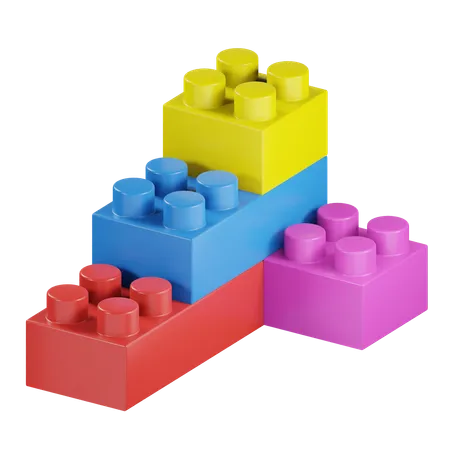]

---

### Предната лекция говорихме за:

- HTTP
- REST
- JSON
- Библиотеки за работа с HTTP и JSON

---

### Днес ще разгледаме:

- S.O.L.I.D. дизайн принципите
- Design Patterns

---

### S.O.L.I.D дизайн принципи

The goal of S.O.L.I.D. design is

> "The goal of S.O.L.I.D. design is to create code 
> that is easy to understand, maintain, and test, enabling
>multiple developers to work collaboratively on it."

---

### S.O.L.I.D дизайн принципи

.center[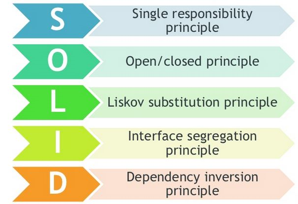]

---

### S.O.L.I.D: Single responsibility principle

.center[]

.center[]

- A responsibility is defined as a reason for change. If a class has multiple reasons to change, it likely has multiple responsibilities.

---

### S.O.L.I.D: Open/Closed principle

.center[]

.center[]

- software entities (classes, functions, etc.) should be open for extension, but closed for modification

---

### S.O.L.I.D: Open/Closed principle

.center[]

.center[]

- For instance, adding a new feature, such as a new type of report generation, should be done by creating new classes (extending existing ones) instead of modifying the code of existing classes.

---

### S.O.L.I.D: Liskov substitution principle

.center[]

.center[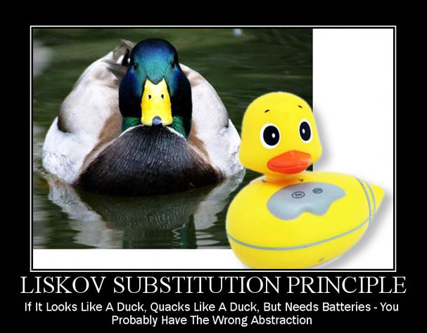]

- objects in a program should be replaceable with instances of their subtypes without altering the correctness of that program

---

### S.O.L.I.D: Liskov substitution principle

.center[]

.center[]

- If you have a class Bird and a subclass Penguin, substituting Penguin for Bird shouldn't cause unexpected behavior (e.g., if Penguin cannot fly, methods dependent on flying should be adapted or not applicable).

---

### S.O.L.I.D: Interface segregation principle

.center[]

.center[]

- A client should not be forced to implement an interface that it doesn't use
- Many client-specific interfaces are better than one general-purpose interface

---

### S.O.L.I.D: Interface segregation principle

.center[]

.center[]

- Imagine a class `Printer` that implements a Machine interface with methods `print()`, `scan()` and `fax()`. If `Printer` does not need scanning or faxing but is forced to implement these methods, it violates ISP.

---

### S.O.L.I.D: Dependency inversion principle

.center[]

.center[]

- high level modules must not depend on low level modules, but they should depend on abstractions
- one should "depend upon abstractions, not concretions"

---

### S.O.L.I.D: Dependency inversion principle

.center[]

.center[]

- For example, instead of `OrderService` directly depending on `PaymentService`, we introduce an abstraction like `PaymentGateway` (e.g. an interface) that both modules depend on, making it easier to replace or extend.

---

class: center, middle

# Design Patterns

---

### Design Patterns

Шаблоните за дизайн са

- обобщени добри практики
- стандартни решения на общи / често срещани проблеми

---

### Design Patterns

.center[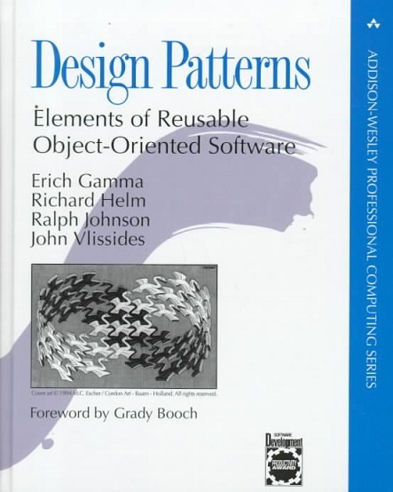]

---

### Design Patterns - ползи

- Използване на колективния опит за софтуерно проектиране за доказани решения на често срещани проблеми
- Поощряват reusability на кода, което води до по-качествен и лесен за поддръжка код
- Обща терминология, която помага на програмистите да се разбират лесно

---

### Design Patterns - видове

- Creational Patterns
- Structural Patterns
- Behavioral Patterns

 

Creational шаблоните се занимават със създаването на обекти, Structural шаблоните помагат за организиране на класове и обекти в по-сложни структури, а Behavioral шаблоните се фокусират върху комуникацията между обектите.

---

### Creational Patterns

- Тези шаблони предоставят решения на проблема с гъвкавото и многократно създаване на обекти, като избягват директното "хардкодване" на създаването им
- Осигуряват начин да се създават обекти на класове, скривайки логиката по създаването им (вместо да се инстанцират директно чрез оператора `new`)
- Factory, Abstract Factory, Builder, Singleton, Prototype

---

### Structural Patterns

- Осигуряват различни начини за създаване на по-сложни класове чрез наследяване и композиция на по-прости класове
- Adapter, Composite, Proxy, Flyweight, Facade, Bridge, Decorator

---

### Behavioral Patterns

- Свързани са с комуникацията между обекти
- Template Method, Mediator, Chain of Responsibility, Observer, Strategy, Command, State, Visitor, Interpreter, Iterator, Memento

---

class: center, middle

# Creational Design Patterns

---

### Factory

.center[]

---

### Factory

- creational pattern
- създаваме обект без да expose-ваме логиката по създаването му на клиента
- използва се и когато имаме родителски клас или интерфейс с няколко наследници / имплементиращи класове и искаме да създаваме един от наследниците според подаден параметър
- примери от JDK-то: `valueOf()` метода на wrapper класовете като `Boolean`, `Integer` и т.н., `of()` методите на `List`, `Set`, `Map`, `of()` метода на `Path`, `of()` метода на `Stream`, `allocate()` и `allocateDirect()` методите на `ByteBuffer`

---

### Factory

.center[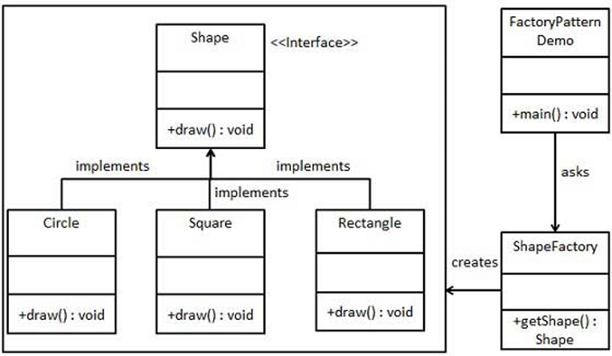]

---

### Builder

.center[]

---

### Builder

- creational pattern
- решава някои проблеми на Factory pattern-а за класове с много атрубути, от които много са optional
- примери от JDK-то: `StringBuilder`, `StringBuffer`, `HttpClient`, `HttpRequest`

---

### Builder - имплементация

- Създаваме `static` вложен клас и копираме всички параметри от външния клас в builder класа
- builder класът трябва да има публичен конструктор с всички задължителни атрибути като параметри
- setter методи за всички опционални параметри, които връщат същата builder инстанция
- `build()` метод, който връща обекта (`this`)

---

### Singleton

.center[]

---

### Singleton

- creational pattern
- клас, от който може да съществува най-много една инстанция
- имплементация
    - `private` конструктор
    - `private static` член-променлива от тип същия клас, която реферира единствената инстанция на класа
    - `public static` метод, който връща инстанцията на класа

 

Въпреки че Singleton гарантира само една инстанция, трябва да се внимава при многонишков код или lazy инициализиране, за да се избегнат thread-safety проблеми.

---

### Singleton

- типични употреби: logging, caching, thread pools
- В други design patterns (Factory, Builder, Facade, Prototype, …)

---

class: center, middle

# Structural Design Patterns

---

### Flyweight

.center[]

---

### Flyweight

- structural pattern
- позволява да се съберат повече обекти в наличната памет чрез споделяне на общите части на state-a между множество обекти
- намалява memory footprint-а на програмата
- може също да подобри бързодействието в приложения, където инстанцирането на обектите е скъпа операция

---

### Flyweight

- flyweight обектите са immutable: всяка операция, която променя състоянието им трябва да се изпълнява от factory-то
- примери от JDK-то: `String` с имплементацията на string pool-a, `Integer.valueOf(int)`, `Byte.valueOf(byte)` и подобните на останалите wrapper типове

---

### Flyweight - имплементация

- интерфейс, който дефинира операциите, които клиентския код може да извършва върху flyweight обектите
- една или повече конкретни имплементации на този интерфейс
- factory, което отговаря за инстанциране и кеширане

---

### Decorator

.center[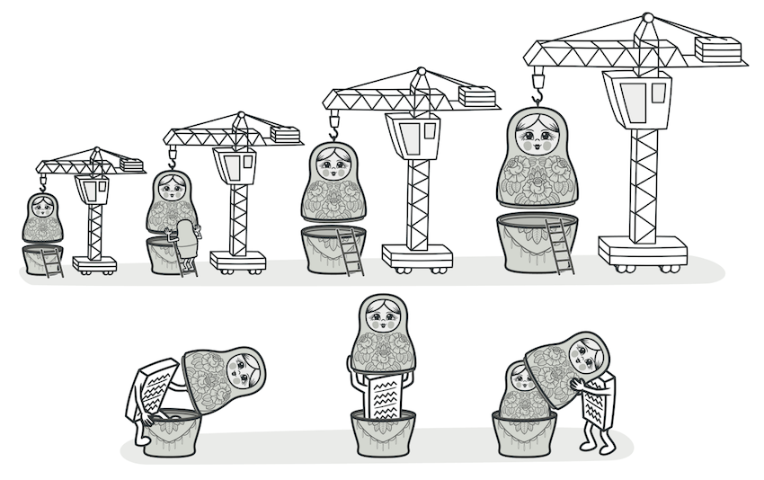]

---

### Decorator

- structural pattern
- позволява динамично добавяне на нова функционалност към обект, без да променяме съществуващите класове
- обикновено се използва за разширяване на функционалността на обекти чрез “опаковане” (wrapping) около тях с нови обекти, които добавят допълнителна функционалност
- пример от JDK-то: wrap-ване на входно-изходни потоци като `BufferedInputStream` или `DataInputStream`, които обвиват базови потоци като `FileInputStream`, добавяйки допълнителни функционалности като буфериране или парсване на данни.

---

### Decorator - имплементация

- създава се абстрактен клас или интерфейс, който дефинира основния функционален интерфейс
- създава се конкретен клас "декоратор", който също имплементира интерфейса и съдържа референция към обекта, който декорира
- декораторът добавя нова функционалност, но не променя основния обект

---

class: center, middle

# Behavioral Design Patterns

---

### Iterator

.center[]

---

### Iterator

- behavioral pattern
- позволява последователното обхождане на поредица от обекти
- примери от JDK-то: `java.util.Iterator` и обхождането на колекции

---

### Iterator

.center[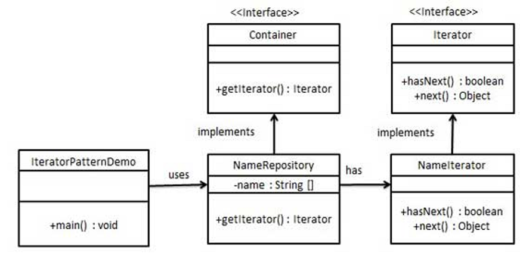]

---

### Command

.center[]

---

### Command

- behavioral pattern
- използва се за имплементиране на loose coupling в модел тип заявка-отговор
- пример от JDK-то: `java.lang.Runnable`

---

### Command

.center[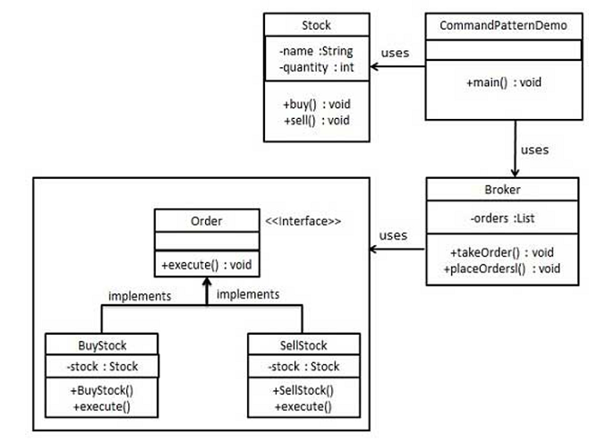]

---

### Observer

.center[]

---

### Observer

- behavioral pattern
- удобен е, когато се интересуваме от състоянието на даден обект и искаме да бъдем нотифицирани, когато има промяна в състоянието
- Например, услуга за цена на акции може да уведоми множество наблюдатели (като инвеститори, новинарски агенции или аналитични услуги) когато цената се промени, без да е нужно да взаимодействат директно със самата услуга за цена
- обектът, който наблюдава за промяна на състоянието на друг обект, се нарича *Observer*, а наблюдаваният обект се нарича *Subject*
- пример от JDK-то: `java.util.Observer`, `java.util.Observable`

---

### Observer

.center[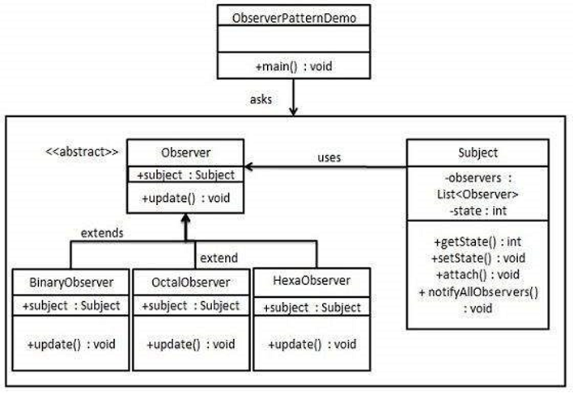]

---

### Strategy

.center[]

---

### Strategy

- behavioral pattern
- прилага се, когато имаме множество алгоритми за дадена задача и клиентът решава по време на изпълнение, коя имплементация на алгоритъм да се ползва
- Например, OrderService може да използва различни стратегии за отстъпки в зависимост от типа на клиента, като позволява гъвкавост при избора на най-добрия алгоритъм по време на изпълнение
- примери от JDK-to: `Collections.sort()`, който сортира по различен критерий/алгоритъм в зависимост от подадения `Comparator`

---

### Design Patterns - примери с код

- може да разгледате приложените [code snippets](https://github.com/fmi/java-course/tree/master/13-design-patterns/snippets/design-patterns)
- хубави обяснения и примери с псевдокод [Refactoring Guru: Design Patterns](https://refactoring.guru/design-patterns)
- тук може да намерите информация и примери с код на Java за голям брой design patterns (не само 23-те от *Gang-of-Four*): [Java Design Patterns](https://github.com/iluwatar/java-design-patterns)

---

## Въпроси?

---

## Нашето пътешествие

.center[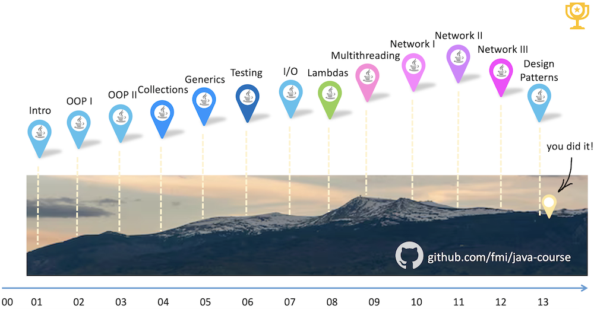]

---

## Оттук накъде?

.center[]

---

.center[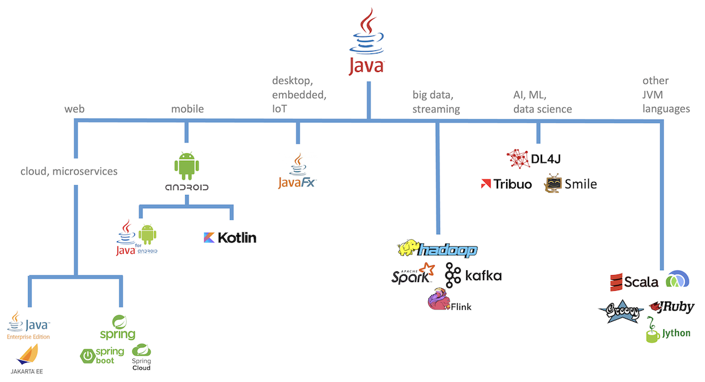]

---

### Java екосистемата

- Java се разработва отворено в [OpenJDK](https://openjdk.java.net/) проекта
- Дефинирането на всички спецификации става през т.нар. Java Community Process
- JDK не е всичко
  - Open Source обществата играят голяма роля в екосистемата на Java
    - [Eclipse](https://projects.eclipse.org) - 400+ проекта, основно Java
    - [Apache](https://projects.apache.org/projects.html) - 350+ проекта, не само Java

---

### Включи се и ти!

- Стани член на BGJUG (http://jug.bg)
- Участвай в Java събития: meetups, конференции, семинари
- Допринасяй към развитието на Java езика и платформата

 

.center[]

---

## На добър час!

.center[]

---

## Въпроси?

.font-xl[.ri-github-fill.icon-inline[[fmi/java-course](https://github.com/fmi/java-course)]]

.font-xl[.ri-youtube-fill.icon-inline[[MJT2026](https://www.youtube.com/playlist?list=PLew34f6r0Pxx6LmzYcc9-8-_-T3ZPZTXg)]]