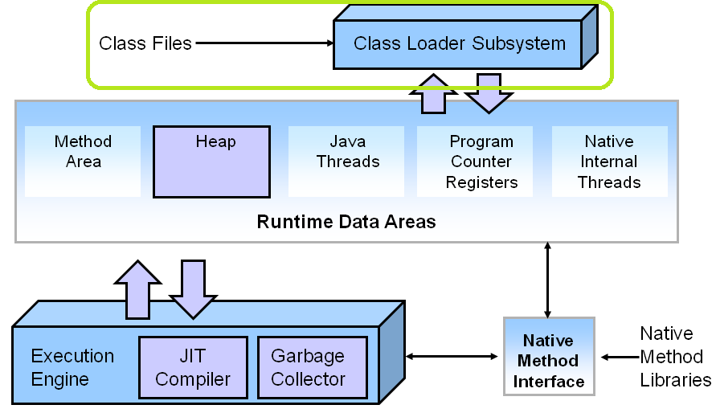
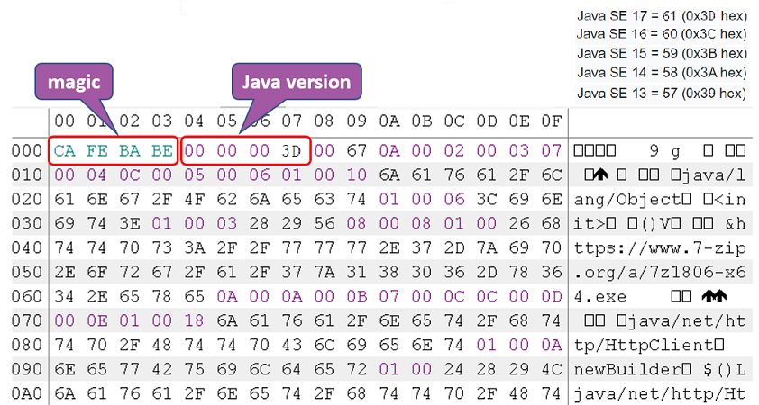
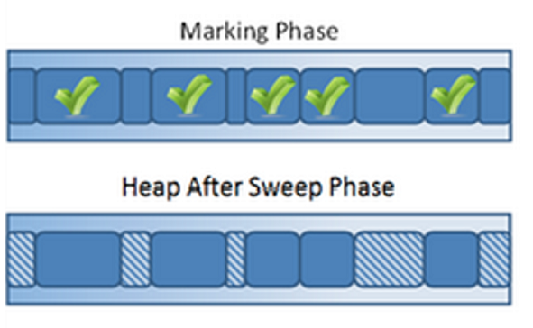
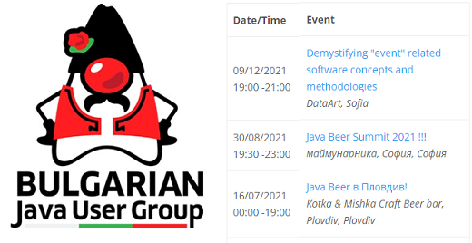

## Reactive Programming
## Java Virtual Machine

_15.01.2020_

---

#### Предната лекция говорихме за:

@ul

- HTTP
- REST
- JSON
    - gson
- Java API за работа с HTTP
    - `HttpClient`
    - `HttpRequest`
    - `HttpResponse`

@ulend

---

#### Днес ще разгледаме:

@ul

- Що е то реактивно програмиране
- Java Virtual Machine

@ulend

---

#### `CompletableFuture<T>` под лупа

<small>
- `CompletableFuture<T>` е клас в пакета `java.util.concurrent`
- имплементира интерфейсите `Future<T>` и `CompletionStage<T>`
- позволява chain-ване на CompletableFutures, т.е. изпълнението им един след друг

</small>

```java
// Връща нов CompletionStage, който ще се изпълни след дадения с резултата
// му като аргумент на дадената функция
<U> CompletionStage<U> thenApply​(Function<? super T,​? extends U> fn)

// Връща нов CompletionStage, който ще се изпълни след дадения с резултата
// му като аргумент на дадения action
CompletableFuture<Void> thenAccept​(Consumer<? super T> action)

// Блокира и изчаква завършването на операцията, и връща резултата ѝ
T get()
// Блокира и връща резултата след успешно приключване на операцията,
// или хвърля uncheck exception при неуспех
T join()
```

---

#### Асинхронна обработка на заявки и резултата им

<small>
- `sendAsync()` изпраща заявката в отделна нишка (взима се от default-ния (common) thread executor на JVM-a или от custom executor-a, зададен при конструирането на `HttpClient`-a) и връща веднага инстанция на `CompletableFuture<HttpResponse>`
- dependent методите на този `CompletableFuture` (`thenApply()`, `theAccept()`, ...) се изпъляват в отделна нишка
  - ако са няколко chained, chain-ът се изпълява от една нишка
  - ако държим chained метод да се изпълни в различна нишка, асинхронно спрямо останалия chain, може да ползваме async вариантите на dependent методите: `thenApplyAsync()`, `thenAcceptAsync()`
  - ако искаме да се изпълнят не само в различна нишка, но и тази нишка да е от избран от нас thread pool, трябва да ползваме overloaded вариантите им, които приемат `executor`

</small>

---

#### Reactive Programming

<small>
- Реактивното програмиране е свързано с концепциите за
    - паралелна и асинхроннa обработка на данни
    - non-blocking APIs
- До тези концепции се докоснахме в темите за Stream API-то, позволяващо паралелна обработка, в Java NIO API-тата и в HttpClient-a
- Event/run loop

</small>

---

#### Reactor Design Pattern

<small>
- https://en.wikipedia.org/wiki/Reactor_pattern
- Той е свързан с обработката на конкурентни събития (events) и заявки (service requests)
- Дал е името на реактивното програмиране и реактивните системи
- Event loop дизайна се използва широко в операционните системи и GUIs, наличен е в Spring 5 (WebFlux), имплементиран е в JavaScript и Node.js
- Една имплементация на този pattern е неблокиращата мрежова комуникация в Java NIO чрез канали и селектори

</small>

---

#### Reactive

<small>
- Терминът *reactive* обикновено се ползва с контекста на reactive programming и reactive systems
- Реактивното програмиране се базира на асинхронни потоци от данни (*реактивни потоци*)
- В Java света е въведен първоначално с библиотеката Reactive Extension (RX) of Java, наричана също [RxJava](http://reactivex.io/)
- Поддръжка за RxJava се появява в Java 9, в пакета `java.util.concurrent`
- `Publisher` генерира поток от данни, към който `Subsrcriber` би могъл асинхронно да се "абонира"

</small>

---

#### Publisher - Subscriber

- Основна разлика със стандартните потоци (java.util.stream) е, че източникът на данните (publisher) в реактивните потоци праща (push-ва) елементи към subcriber-ите със свое "темпо", докато в станратрните потоци, нов елемент се pull-ва от потока едва след като предишният елемент е обработен

---

#### Reactive Streams Initiative

- *"Reactive Streams is an initiative to provide a standard for asynchronous stream processing with non-blocking back pressure."* (https://www.reactive-streams.org/)
- RxJava библиотеката е имплементация на Reactive Streams API-то

---

#### The Reactive Manifesto

<small>
- https://www.reactivemanifesto.org/
- Реактивното програмиране реализира целите, декларирани от Reactive Manifesto-то: изграждане на реактивни системи, които са
    - responsive
    - resilient
    - elastic
    - message-driven

</small>


---

## Въпроси?

---

## Java виртуалната машина


---

#### Java виртуалната машина (JVM)

<small>
- Интерпретира и изпълнява byte код инструкции
- Компилира по време на изпълнението байт кода до машинен код
- Заделя памет за оперативните данни
- Автоматично изчиства паметта
- Зарежда класове
- Стартира нишки
- Взаимодейства с операционната система

</small>

---

#### Архитектура на JVM


---

#### Classloader подсистема



---

#### Формат на .class файл

```bash
ClassFile {
    u4             	magic;
    u2             	minor_version;
    u2             	major_version;
    u2             	constant_pool_count;
    cp_info        	constant_pool[constant_pool_count-1];
    u2             	access_flags;
    u2             	this_class;
    u2             	super_class;
    u2             	interfaces_count;
    u2             	interfaces[interfaces_count];
    u2             	fields_count;
    field_info     	fields[fields_count];
    u2             	methods_count;
    method_info    	methods[methods_count];
    u2             	attributes_count;
    attribute_info 	attributes[attributes_count];
}
```

---

#### Съдържание на .class файл



---

#### Фази на зареждане на класа

<small>
- Зареждане
- Свързване
- Инициализация

</small>

---

### Runtime Data подсистема


---

#### Организация на паметта


---

#### Паметта по време на изпълнение на метод


---

#### Execution подсистема


---

#### Execution подсистема

<small>
- Създава инстанция на обектите в heap-a
- Инициализира статичните и нестатичните член-данни на обекта
- Добавя и маха stack frames в Java стека
- Актуализира PC регистъра със следващата инструкция за изпълнение
- Поддържа native метод стека
- Брои извикванията на методи и оптимизира най-често извикваните*
- Финализира обекти
- Стартира garbage collection
- Терминира приложението

</small>

---

#### Just-In-Time (JIT) компилация

<small>
- Стартира се автоматично при наличие на многократно изпълнение на даден метод
- Генерира машинен код
- Ако компилиран код вика некомпилиран, изпълнението се връща на интерпретатора
- Компилиран код може да бъде де-оптимизиран до интерпретиран

</small>

---

#### Изпълнение на Java програма

<small>
1. Parse-ват се параметрите на командната линия
2. Заделя се паметта
3. Прочитат се environment променливите
4. Открива се главният клас (main class)
5. Създава се и се инициализира виртуалната машина
6. Зарежда се главния клас
7. Изпълнява се неговия main метод
8. Когато изпълнението му свърши, се подава връщания от него резултат
9. Унищожава се виртуалната машина

</small>

---

## Garbage Collection

---

#### Преди създаването на JVM-a...

<small>
- Програмистите сами се грижeли за паметта, която ползват
- Цял клас грешки, които могат да бъдат допуснати
- Чрез Garbage Collection (GC), самата JVM се грижи за паметта, която е заделила за нас

</small>

---

#### Garbage Collection

<small>
- Java обектите имат живот...
    - някои дълъг, други кратък
- Те живеят в паметта, която виртуалната машина е запазила (heap)
    - -Xmx:2g
- Какво става като се напълни heap-a?
- Трябва да изхвърлим "боклука"
- От ефективността на GC зависи responsiveness-a и throughput-a на приложението

</small>

---

#### Garbage Collection

<small>
- Не всеки момент е подходящ за GC
- Виртуалната машина се грижи да избере момент, в който е безопасно
- Например, когато не тече заделяне на памет за нови обекти (т.нар *safe points*)
- Stop the world проблем

</small>

---

#### Кои обекти са "боклук"?

<small>
- Обекти, до които никой “жив” обект няма връзка.
- GC процесът гарантира, че никой “жив” обект няма да бъде събран, но няма гаранция, че “умрелите” обекти ще бъдат събрани веднага
- Предизвикателството пред GC е да открие кой обект е “жив”

</small>

---

#### Reference counting GC

<small>
- Ранна и интуитивна техника
- Тези GC следят колко референции сочат към даден обект
- Когато броят им стане 0, паметта веднага се освобождава
- Ползва се в езици като PHP и Perl. Java разчита на по-advanced подходи

</small>

---

#### Reference counting GC - проблеми

<small>
- Oсновната трудност е да се поддържат връзките актуални
- Сложно се справят с циклични референции между обекти

</small>


---

#### Generational GC

<small>
- Повечето обекти умират... млади
- Heap-ът се разделя на части (*генерации*) - най-често две (young и old)
- Обектите преминават от младото към старото поколение, ако са оцелели след определено време или брой GCs
- Времето за събиране на младата генерация е по-кратко

</small>

---

#### Tracing GC

<small>
- Базират се на идеята, че можем да открием всички активни обекти като вървим по графа от връзки
    - Съставя се начално множество сигурни активни обекти (roots), чрез анализ на регистрите, глобалните полета, статичните полета и други
    - След това се обхожда всичко, свързано с root обектите, и се отбелязва като активно
    - Останала заета неотбелязана памет се освобождава

</small>


---

#### Tracing GC

<small>
- Предимство: справят се лесно с циклични структури
- Недостатък: фазата на отбелязване предизвиква изчакване (stop-the-world)
- Най-популярния избор за подход при имплементация на GC
- Използват се широко и са доказани в продуктивни условия

</small>

---

#### Техники за tracing GC

<small>
- Mark-sweep-compact
- Mark-copy

</small>

---

#### Mark-sweep-compact GC

<small>
- Състои се от три фази:
    - Mark: отбелязва с по един bit всички активни обекти, обикаляйки heap-a по референциите
    - Sweep: обикаля целия heap и паметта, която не е отбелязана, може да се ползва (freelists)
    - Compact: паметта се дефрагментира

</small>

---

#### Mark-sweep-compact GC



---

#### Mark-sweep-compact GC

<small>
- Mark фазата е зависима от количеството активни обекти в heap-a
- Sweep е зависима от размера на целия heap
- Тъй като GC чака и двете да приключат, това би могло да доведе до сериозни паузи
- Истинското предизвикателство обаче не е garbage collection-ът, а фрагментацията на паметта и как collector-ът се справя с нея

</small>

---

#### Фрагментация на паметта

<small>Памет има, но не в достатъчно големи парчета</small>


---

#### Compaction

<small>
- Стратегия за местене по време на GC
- Освобождава по-големи парчета памет
- Stop-the-world операция, влияе на performance
- Колкото по-популярен е даден обект, толкова по-голяма пауза

</small>

---

#### Compaction


---

#### Copying GC

<small>
- Heap-ът се разделя на две развни половини: “from” и “to”
- Текущият “to” регион се държи винаги напълно празен
- Всички заделяния на памет се случват във “from” региона, докато не се запълни
- При стартиране на GC:
    - обхождат се всички достижими обекти
    - всички достигнати (т.е. живи) обекти се местят от “from” региона в “to”
    - после GC обръща ролите на “from” и “to” регионите

</small>


---

#### Copying GC

<small>
- Предимства
    - обектите са компактни: няма фрагментация
    - при GC се обхождат само "живите" обекти, които в общия случай са малка част от всички обекти
- Недостатъци
    - stop-the-world
    - неефикасни откъм памет

</small>

---

#### GC в Java

<small>
- Two-region GC
    - Серийни
    - Паралелни
    - Конкурентни
- Multi-region GC
    - Garbage First

</small>

---

#### Two-region GC

<small>
- Паметта е разделена на два региона: Young и Old (Tenured)
- Нови обекти се създават в Еden space
- Когато Eden се напълни, обектите отиват в празния Survivor space
- Когато Survivor се напълни, оцелелите обекти се "promote"-ват (преместват в Tenured)

</small>


---

#### Two-region GC

<small>
- Отделните региони могат да ползват различен GC алгоритъм
  - Copying GC за Young, Mark&Sweep за Tenured
      - В следствие, Eden е напълно компактен регион и заделянето на нова памет става изключително бързо (значително по-бързо отколкото в С например)

</small>

---

#### Serial two-region GC

<small>
- Най-простият
    - -XX:+UseSerialGC
- Copy collector за Young и Mark&Sweep за Tenured
- Stop the world подход
- Подходящ за машини с едно CPU

</small>

---

#### Parallel two-region GC

<small>
- Наричат се още throughput
- Default за Java 8
- Copy collector за Young и Mark&Sweep за Tenured
- Всички налични ресурси се използват паралелно за изпълнение на GC
- Stop-the-world подход
- Неподходящо за приложения, чувствителни към време за връщане на отговор

</small>

---

#### Concurrent two-region GC

<small>
- XX:+UseConcMarkSweepGC
- Copy stop the world collector за Young generation
- Mark и sweep фазите на Tenured generation вървят, докато приложението продължава да работи
- Много по-подходящи за приложения, изискващи бързо връщане на отговор

</small>

---

#### Serial, Parallel & Concurrent GC


---

#### Multi-region GC

<small>
- Heap-ът се разделя на множество парчета с еднакъв размер, всеки заемащ последователен регион от паметта
- На някои множества от парчета се присвояват еднакви роли (eden, survivor, old), но няма фиксиран размер за тях

</small>


---

#### G1 (Garbage First) GC

<small>
- Default от Java 9 натам
    -XX:+UseG1GC
- Глобална конкурентна mark фаза
- Прави sweep и compact на регионите с повече garbage
- Копира и compact-ва данните от тези региони в нов
- Подходящ за многопроцерсовни машини и големи обеми памет

</small>

---

#### Z Garbage Collector (ZGC)

<small>
- това е най-новият GC: наличен е като експериментален от JDK 11
- scalable и low-latency
- извършва всички скъпи операции конкурентно, без спиране на application нишките
- подходящ е за приложения, изискващи ниско latency (паузи под 10 ms) и/или използват много голям heap (терабайти)
- -XX:+UseZGC

</small>>

---

## Въпроси?

---

## Оттук накъде?


---


---

#### Java екосистемата

<small>
- Java се разработва отворено в [OpenJDK](https://openjdk.java.net/) проекта
- Дефинирането на всички спецификации става през т.нар. Java Community Process
- JDK не е всичко
  - Open Source обществата играят голяма роля в екосистемата на Java
    - Eclipse - 300+ проекта, основно Java
    - Apache - 250+ проекта, не само Java

</small>

---

#### Включи се и ти!

<small>
- Стани член на BGJUG (http://jug.bg)
- Участвай в Java събития: meetups, конференции, семинари
- Допринасяй към развието на Java езика и платформата
    - Включи се в *Adopt a JSR*

</small>



---

## На добър час!


---

## Въпроси

@snap[south span-100]
@fab[github] [fmi/java-course](https://github.com/fmi/java-course)
@snapend
