class: center, middle

# Java виртуалната машина

17.01.2024

.center[]

---

### Предната лекция говорихме за:

- S.O.L.I.D. дизайн принципите
- Design Patterns

---

### Днес ще разгледаме:

- Java виртуалната машина (JVM)

---

### Java виртуалната машина (JVM)

- Интерпретира и изпълнява byte код инструкции
- Компилира по време на изпълнението байт кода до машинен код
- Заделя памет за оперативните данни
- Автоматично изчиства паметта
- Зарежда класове
- Стартира нишки
- Взаимодейства с операционната система

---

### Архитектура на HotSpot JVM

.center[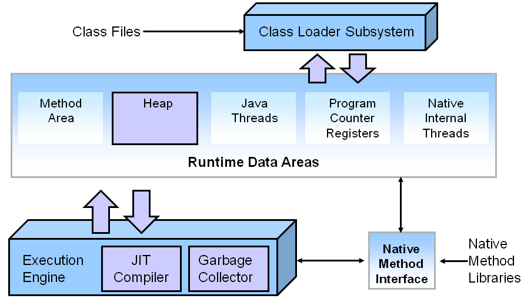]

---

### Classloader подсистема

.center[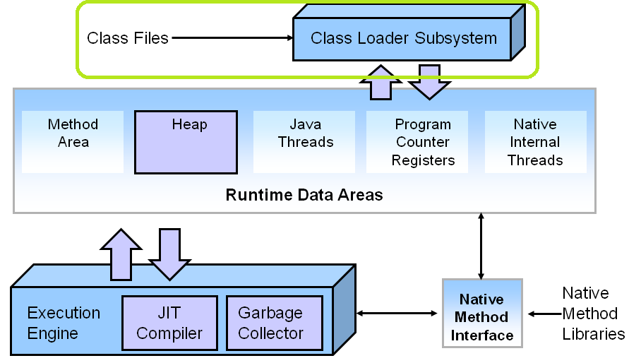]

---

### Формат на .class файл

```bash
ClassFile {
    u4              magic;
    u2              minor_version;
    u2              major_version;
    u2              constant_pool_count;
    cp_info         constant_pool[constant_pool_count-1];
    u2              access_flags;
    u2              this_class;
    u2              super_class;
    u2              interfaces_count;
    u2              interfaces[interfaces_count];
    u2              fields_count;
    field_info      fields[fields_count];
    u2              methods_count;
    method_info     methods[methods_count];
    u2              attributes_count;
    attribute_info  attributes[attributes_count];
}
```

---

### Съдържание на .class файл

.center[]

---

### Фази на зареждане на класа

- Зареждане
- Свързване
- Инициализация

---

### Runtime Data подсистема

.center[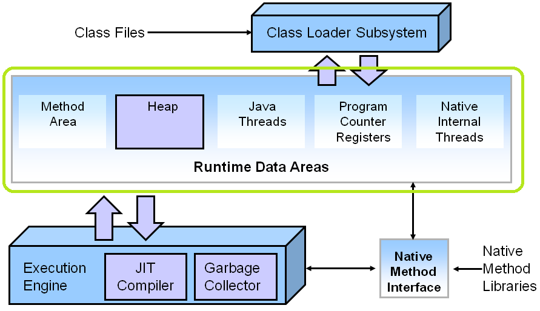]

---

### Организация на паметта

.center[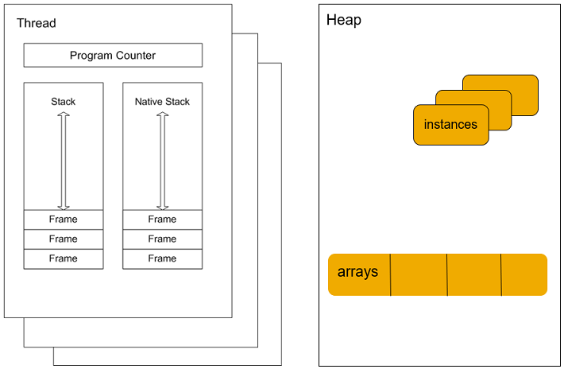]

---

### Паметта по време на изпълнение на метод

<br>

.center[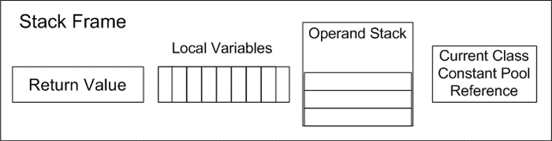]

---

### Execution подсистема

.center[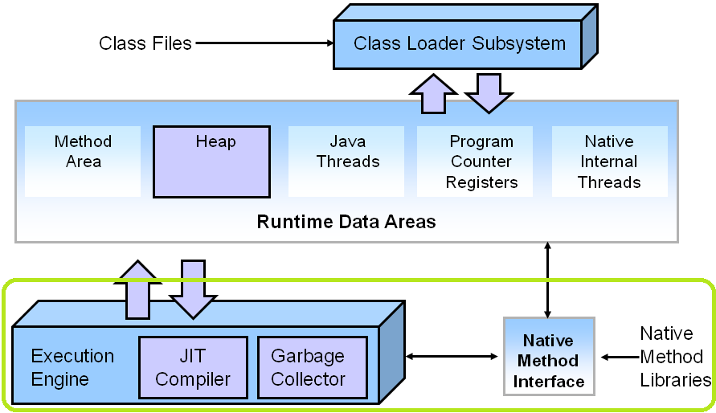]

---

### Execution подсистема

- Създава инстанция на обектите в heap-a
- Инициализира статичните и нестатичните член-данни на обекта
- Добавя и маха stack frames в Java стека
- Актуализира PC регистъра със следващата инструкция за изпълнение
- Поддържа native метод стека
- Брои извикванията на методи и оптимизира най-често извикваните*
- Финализира обекти
- Стартира garbage collection
- Терминира приложението

---

### Just-In-Time (JIT) компилатор

- Стартира се автоматично при наличие на определени обстоятелства, например многократно изпълнение на дадено парче код ("hot spot")
- Генерира машинен код
- Ако компилиран код вика некомпилиран, изпълнението се връща на интерпретатора
- Компилиран код може да бъде де-оптимизиран до интерпретиран
- Изполва runtime profiling данни, за да взима решения за оптимизация

---

### Just-In-Time (JIT) компилатор - оптимизации

- пренареждане на операции
- премахване на проверки за null
- предсказване на вероятния път на разклонение (branch prediction)
- loop unrolling
- inlining на методи
- елиминиране на dead код
- common subexpression elimination
- type specialization
- escape analysis
- ...

---

### Изпълнение на Java програма

1. Parse-ват се параметрите на командната линия
2. Заделя се паметта
3. Прочитат се environment променливите
4. Открива се главният клас (main class)
5. Създава се и се инициализира виртуалната машина
6. Зарежда се главният клас
7. Изпълнява се неговият main метод
8. Когато изпълнението му свърши, се подава връщания от него резултат
9. Унищожава се виртуалната машина

---

class: center, middle

## Garbage Collection

---

### Преди създаването на JVM-a...

- Програмистите сами се грижeли за паметта, която ползват
- и се борили с цял клас от грешки, които могат да бъдат допуснати
- Чрез Garbage Collection (GC), самата JVM се грижи за паметта, която е заделила за нас

---

### Garbage Collection

- Java обектите имат живот...
    - някои дълъг, други кратък
- Те живеят в паметта, която виртуалната машина е запазила (heap)
    - -Xmx:2g
- Какво става като се напълни heap-ът?
- Трябва да изхвърлим "боклука"
- От ефективността на GC зависи responsiveness-ът и throughput-ът на приложението

---

### Garbage Collection

- Не всеки момент е подходящ за GC
- Виртуалната машина се грижи да избере момент, в който е безопасно
- Например, когато не тече заделяне на памет за нови обекти (т.нар. *safe points*)
- Stop-the-world проблем

---

### Кои обекти са "боклук"?

- Обекти, до които никой "жив" обект няма връзка.
- GC процесът гарантира, че никой "жив" обект няма да бъде събран, но няма гаранция, че "умрелите" обекти ще бъдат събрани веднага
- Предизвикателството пред GC е да открие кой обект е "жив"

---

### Reference counting GC

- Ранна и интуитивна техника
- Тези GC следят колко референции сочат към даден обект
- Когато броят им стане 0, паметта веднага се освобождава
- Ползва се в езици като PHP и Perl. Java разчита на по-advanced подходи

---

### Reference counting GC - проблеми

- Oсновната трудност е да се поддържат връзките актуални
- Сложно се справят с циклични референции между обекти

<br>

.center[]

---

### Tracing GC

- Базират се на идеята, че можем да открием всички активни обекти като вървим по графа от връзки
    - Съставя се начално множество сигурни активни обекти (roots), чрез анализ на регистрите, глобалните полета, статичните полета и други
    - След това се обхожда всичко, свързано с root обектите, и се отбелязва като активно
    - Останала заета неотбелязана памет се освобождава

.center[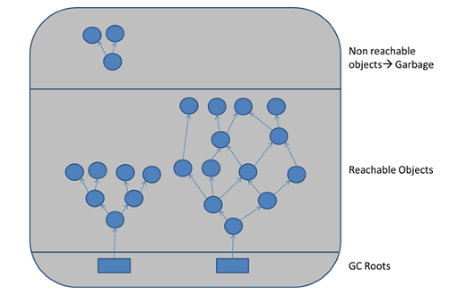]

---

### Tracing GC

- Предимство: справят се лесно с циклични структури
- Недостатък: фазата на отбелязване предизвиква изчакване (stop-the-world)
- Най-популярния избор за подход при имплементация на GC
- Използват се широко и са доказани в продуктивни условия

---

### Техники за tracing GC

- Mark-sweep-compact
- Mark-copy

---

### Mark-sweep-compact GC

- Състои се от три фази:
    - Mark: отбелязва с по един bit всички активни обекти, обикаляйки heap-a по референциите
    - Sweep: обикаля целия heap и паметта, която не е отбелязана, може да се ползва (freelists)
    - Compact: паметта се дефрагментира

.center[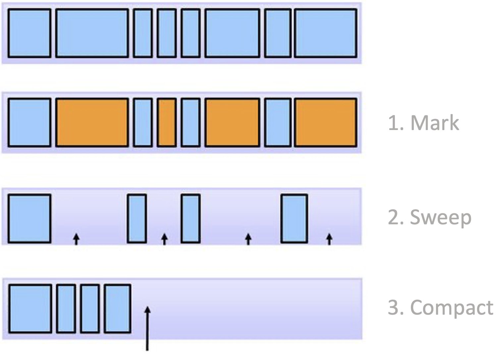]

---

### Mark-sweep-compact GC

- Mark фазата е зависима от количеството активни обекти в heap-a
- Sweep фазата е зависима от размера на целия heap
- Тъй като GC чака и двете да приключат, това би могло да доведе до сериозни паузи
- Истинското предизвикателство обаче не е garbage collection-ът, а фрагментацията на паметта и нуждата от compaction
    - обектите се местят в паметта, за да се освободят по-големи парчета памет
    - stop-the-world операция ⇨ влияе на performance-a
    - Колкото по-популярен е даден обект, толкова по-голяма e паузата, защото трябва да се update-нат всички референции към всеки преместен обект

---

### Mark-copy GC

- Heap-ът се разделя на две равни половини: "from" и "to"
- Текущият "to" регион се държи винаги напълно празен
- Всички заделяния на памет се случват във "from" региона, докато не се запълни
- При стартиране на GC:
    - обхождат се всички достижими обекти
    - всички достигнати (т.е. живи) обекти се местят от "from" региона в "to"
    - после GC обръща ролите на "from" и "to" регионите

.center[]

---

### Mark-copy GC

- Предимства
    - обектите са компактни: няма фрагментация
    - при GC се обхождат само "живите" обекти, които в общия случай са малка част от всички обекти
- Недостатъци
    - stop-the-world
    - неефикасни откъм памет

---

### Generational GC

- Повечето обекти умират... млади (*Generational Hypothesis of Garbage Collection*)
- Heap-ът се разделя на части (*генерации*) - най-често две (*young* и *old*)
- Обектите преминават от младото към старото поколение, ако са оцелели след определено време или брой GCs
- Времето за GC на младата генерация е по-кратко, защото тя обикновено е много по-малка 

---

### GC в Java

- Two-region GC
    - Серийни
    - Паралелни
    - Concurrent Mark-Sweep (CMS)
- Multi-region GC
    - Garbage First

---

### Serial, Parallel & Concurrent Mark-Sweep GC

.center[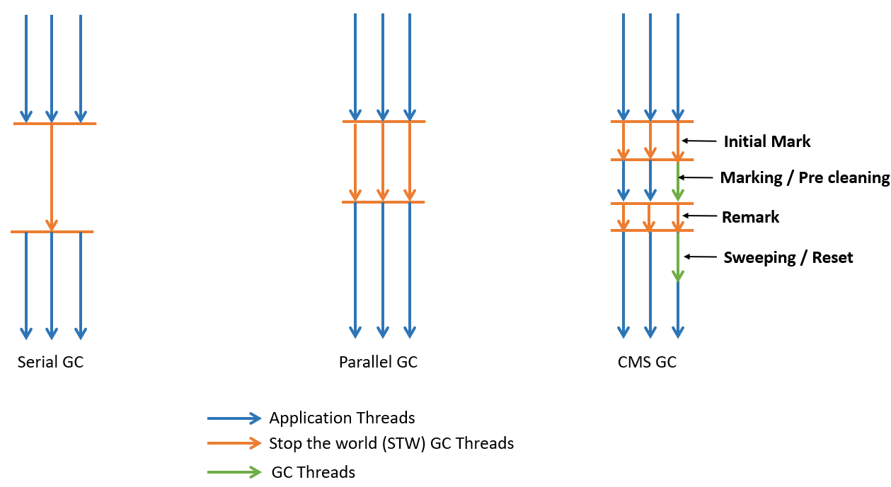]

---

### Фактори за избор на GC

- throughput
- latency
- footprint

---

### Two-region GC

- Паметта е разделена на два региона: *Young* и *OldО* (*Tenured*)
- *Young* регионът има три части: *Eden* и два (еднакви) *Survivor* области
- Нови обекти се създават в *Еden* space-а
- Когато *Eden* се напълни, обектите отиват в празния *Survivor* space
- Когато *Survivor* се напълни, оцелелите обекти се "promote"-ват (преместват в *Tenured*)

<br>

.center[]

---

### Two-region GC

- Отделните региони могат да ползват различен GC алгоритъм
  - Mark-copy GC за *Young*, Mark-sweep-compact за *Tenured*
      - В следствие, *Eden* е напълно компактен регион и заделянето на нова памет става изключително бързо (значително по-бързо, отколкото в С например)

---

### Serial two-region GC

- Най-простият
    - `-XX:+UseSerialGC`
- Copy collector за *Young* и *Mark-sweep-compact* за *Tenured*
- Подходящ за машини с едно CPU

---

### Parallel two-region GC

- Наричат се още *Throughput*
    - `-XX:+UseParallelGC`
- Mark-copy collector за *Young* и Mark-sweep-compact за *Tenured*
- Неподходящо за приложения, чувствителни към време за връщане на отговор

---

### Multi-region GC

- Heap-ът се разделя на множество парчета с еднакъв размер, всеки заемащ последователен регион от паметта
- На някои множества от парчета се присвояват еднакви роли (*Eden*, *Survivor*, *Old*), но няма фиксиран размер за тях

.center[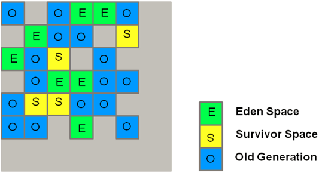]

---

### G1 (Garbage First) GC

- Default от Java 9 натам
    - `-XX:+UseG1GC`
- Подходящ за многопроцесорни машини и големи обеми памет

---

### Z Garbage Collector (ZGC)

- един от най-новите GC: експериментален от JDK 11, продуктивен от JDK 15
- scalable и low-latency
- извършва всички скъпи операции concurrently, без спиране на application нишките
- подходящ е за приложения, изискващи ниско latency (паузи под 10 ms) и/или използват много голям heap (терабайти)
- `-XX:+UseZGC`

---

## Въпроси?

---

## Оттук накъде?

.center[]

---

.center[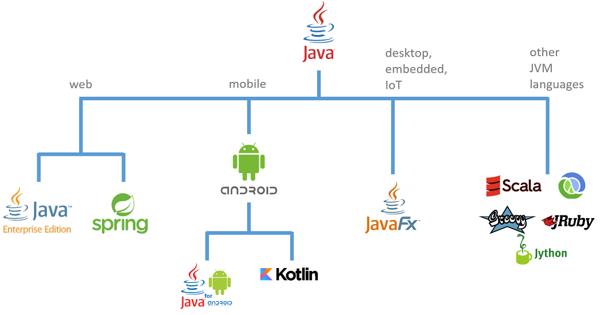]

---

### Java екосистемата

- Java се разработва отворено в [OpenJDK](https://openjdk.java.net/) проекта
- Дефинирането на всички спецификации става през т.нар. Java Community Process
- JDK не е всичко
  - Open Source обществата играят голяма роля в екосистемата на Java
    - Eclipse - 375+ проекта, основно Java
    - Apache - 340+ проекта, не само Java

---

### Включи се и ти!

- Стани член на BGJUG (http://jug.bg)
- Участвай в Java събития: meetups, конференции, семинари
- Допринасяй към развитието на Java езика и платформата

<br>

.center[]

---

## На добър час!

.center[]

---

## Въпроси

.font-xl[.ri-github-fill.icon-inline[[fmi/java-course](https://github.com/fmi/java-course)]]

.font-xl[.ri-youtube-fill.icon-inline[[MJT2024](https://www.youtube.com/playlist?list=PLew34f6r0Pxyldqe31Txob2V3M3m1MKCn)]]
