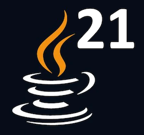

# Съвременни Java Технологии @ ФМИ

[График на курса](https://github.com/fmi/java-course/tree/master/docs/00-schedule)

### Лекции и упражнения 2023/2024

| # | Тема | Лекция | Видео | Дата | Упражение | Видео | Дата |
| - | :--- | :----- | :---- | :--- | :-------- | :---- | :--- |
| 1 | Въведение в Java | [слайдове](https://fmi.github.io/java-course/01-intro-to-java/lecture/slides.html) |  | 11.10 | [задача](https://github.com/fmi/java-course/tree/master/01-intro-to-java/lab) |  | 14.10 |
| 2 | ООП с Java (част I) | [слайдове](https://fmi.github.io/java-course/02-oop-in-java-i/lecture/slides.html) |  | 18.10 | [задача](https://github.com/fmi/java-course/tree/master/02-oop-in-java-i/lab) |  | 21.10 |
| 3 | ООП с Java (част II) | [слайдове](https://fmi.github.io/java-course/03-oop-in-java-ii/lecture/slides.html) |  | 25.10 | [задача](https://github.com/fmi/java-course/tree/master/03-oop-in-java-ii/lab) |  | 28.10 |
| 4 | Collections \| Clean Code | [слайдове](https://fmi.github.io/java-course/04-collections-clean-code/lecture/slides.html) |  | 02.11 | [задача](https://github.com/fmi/java-course/tree/master/04-collections-clean-code/lab) |  | 04.11 |
| 5 | Generics | [слайдове](https://fmi.github.io/java-course/05-generics/lecture/slides.html) |  | 08.11 | [задача](https://github.com/fmi/java-course/tree/master/05-generics/lab) |  | 11.11 |
| 6 | Unit Testing & Mocking  | [слайдове](https://fmi.github.io/java-course/06-unit-testing-and-mocking/lecture/slides.html) |  | 15.11 | [задача](https://github.com/fmi/java-course/tree/master/06-unit-testing-and-mocking/lab) |  | 18.11 |
| 7 | Входно-изходни потоци и файлове  | [слайдове](https://fmi.github.io/java-course/07-io-streams-and-files/lecture/slides.html) |  | 22.11 | [задача](https://github.com/fmi/java-course/tree/master/07-io-streams-and-files/lab) |  | 25.11 |
| 8 | Ламбда изрази и Stream API | [слайдове](https://fmi.github.io/java-course/08-lambdas-and-stream-api/lecture/slides.html) |  | 29.11 | [задача](https://github.com/fmi/java-course/tree/master/08-lambdas-and-stream-api/lab) |  | 02.12 |
| 8 | Многонишково програмиране (част I) | [слайдове](https://fmi.github.io/java-course/09-threads/lecture/slides.html) |  | 06.12 |  |  | 11.12 |

### Материали от предходни издания

- [2022/2023](https://github.com/fmi/java-course/tree/mjt-2022-2023)
- [2021/2022](https://github.com/fmi/java-course/tree/mjt-2021-2022)
- [2020/2021](https://github.com/fmi/java-course/tree/mjt-2020-2021)
- [2019/2020](https://github.com/fmi/java-course/tree/mjt-2019-2020)
- [2018/2019](https://github.com/fmi/java-course/tree/mjt-2018-2019)
- [2017/2018](https://github.com/fmi/java-course/tree/mjt-2017-2018)
