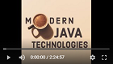

# Материали към курса "Съвременни Java технологии" във ФМИ, 2020-2021

### Лекции

| # | Лекция                                                                                                           | Дата       | Видео |
|---| ---------------------------------------------------------------------------------------------------------------- |:----------:|:------:|
| 1 | [Въведение в Java](https://gitpitch.com/fmi/java-course?p=01-intro-to-java/lecture/#/1)                   | 14.10.2020 |  |
| 2 | [ООП с Java (част I)](https://gitpitch.com/fmi/java-course?p=02-oop-in-java-i/lecture/#/1)                   | 21.10.2020 |  |
| 3 | [ООП с Java (част II)](https://gitpitch.com/fmi/java-course?p=03-oop-in-java-ii/lecture/#/1)                   | 28.10.2020 |  |
| 4 | [Clean Code \| Collections](https://gitpitch.com/fmi/java-course?p=04-clean-code-collections/lecture/#/1)                   | 04.11.2020 |  |
| 5 | [Generics](https://gitpitch.com/fmi/java-course?p=05-generics/lecture/#/1)                   | 11.11.2020 |  |
| 6 | [Unit Testing & Mocking](https://gitpitch.com/fmi/java-course?p=06-unit-testing-and-mocking/lecture/#/1)                   | 18.11.2020 |  |
| 7 | [Входно-изходни потоци \| Работа с файловата система](https://gitpitch.com/fmi/java-course?p=07-io-streams-and-files/lecture/#/1)                   | 25.11.2020 |  |
| 8 | [Ламбда изрази и Stream API](https://gitpitch.com/fmi/java-course?p=08-lambdas-and-stream-api/lecture/#/1)                   | 02.12.2020 |  |
| 9 | [Многонишково програмиране](https://gitpitch.com/fmi/java-course?p=09-threads/lecture/#/1)                   | 09.12.2020 |  |
| 10 | [Многонишково програмиране (част II)](https://gitpitch.com/fmi/java-course?p=10-network/lecture/#/1)                   | 16.12.2020 |  |
| 10 | [Мрежово програмиране](https://gitpitch.com/fmi/java-course?p=10-network/lecture/#/19)                   | 16.12.2020 |  |

### Материали от предходни издания

- [2019/2020](https://github.com/fmi/java-course/tree/mjt-2019-2020)
- [2018/2019](https://github.com/fmi/java-course/tree/mjt-2018-2019)
- [2017/2018](https://github.com/fmi/java-course/tree/mjt-2017-2018)
