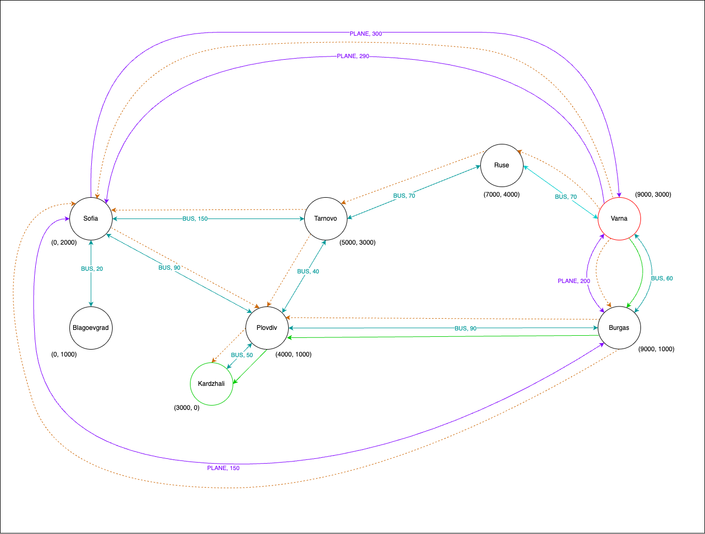

# Домашно 1

## RideRight :busstop:

`Краен срок: 29.11.2023, 23:59`

### Условие

Ще създадем приложение за планиране на пътуване между два града с възможни прекачвания. Използваните
превозни средства могат да бъдат самолети, влакове или автобуси. Приложението ще
поддържа функционалност за намиране на най-евтин начин за пътуване.

Имплементацията ще бъде приложима за вселена със следните особености:

- Земята е плоска, с целочислени координати, изразени като метри разстояние от центъра, и граници `[- 2^31, 2^31 - 1]`.
- Пътуването между два града винаги е успоредно на една от координатните оси (завои под прав ъгъл са позволени по време
  на пътуване).
- Използва се само една валута - "плосък долар".

### Задължителни интерфейси и класове

По-долу сме изброили задължителните класове и интерфейси, които трябва да съдържа решението ви. Свободни сте да добавяте
свои класове и интерфейси, като не забравяте да следвате принципите за чист код.
Както винаги, дефинираните в условието интерфейси **не бива да бъдат променяни**.

В пакета `bg.sofia.uni.fmi.mjt.itinerary` създайте клас `RideRight`, който има конструктор, приемащ списък от всички
директни маршрути между градове:

```java
public RideRight(List<Journey> schedule)
```

и имплементира интерфейса `ItineraryPlanner`:

```java
package bg.sofia.uni.fmi.mjt.itinerary;

import bg.sofia.uni.fmi.mjt.itinerary.exception.CityNotKnownException;
import bg.sofia.uni.fmi.mjt.itinerary.exception.NoPathToDestinationException;

import java.util.SequencedCollection;

public interface ItineraryPlanner {

    /**
     * Returns a sequenced collection of Journeys representing the cheapest path from the start to the destination City.
     *
     * @param start         - City, from which the itinerary begins
     * @param destination   - the City that needs to be reached
     * @param allowTransfer - a flag parameter whether multiple Journeys with transfer can be returned as a result, or
     *                      only a direct route is expected
     * @throws CityNotKnownException        if the start or destination City is not present
     *                                      in the list of provided Journeys
     * @throws NoPathToDestinationException if there is no path satisfying the conditions
     */
    SequencedCollection<Journey> findCheapestPath(City start, City destination, boolean allowTransfer)
        throws CityNotKnownException, NoPathToDestinationException;
}
```

#### Record `Journey`

Директно пътуване без прекачване между два града се моделира от следния record:

```java
public record Journey(VehicleType vehicleType, City from, City to, BigDecimal price)
```

:exclamation: Обявената цена `price` в record `Journey` е в долари и НЕ включва такса за замърсяване на околната среда.
Тази такса е необходимо да се вземе предвид при търсенето на най-евтин маршрут, като за различните видове превозни
средства тя е различна и се изчислява като процент от обявената цена:

- Самолет: 25%
- Влак: 0%
- Автобус: 10%

:exclamation: Възможно е между два града да има транспорт само в едната посока. За представяне на възможност за
двупосочно пътуване, са необходими поне два `Journey` обекта.

Гарантирано е, че:

- В подаваните входни данни няма повторение на информация за директен маршрут между два града чрез дадено превозно
  средство, т.е. информацията за цената е непротиворечива.
- Всички обявени цени за пътуване са положителни числа.

#### Record `City`

Един град притежава име и е разположен на дадена локация. Моделира се чрез следния record:

```java
public record City(String name, Location location)
```

Гарантирано е, че:

- В подаваните входни данни на една локация има точно един град.
- Няма два града с едно и също име.

#### Record `Location`

Точка от пространството се моделира чрез следния record:

```java
public record Location(int x, int y)
```

**Уточнение:** Стойностите на x и y са метри разстояние от центъра.

#### Enum `VehicleType`

Вид превозно средство се моделира чрез следния enum, който съдържа и информация за такса за замърсяване на околната
среда (като процент от цената за пътуване):

```java
public enum VehicleType {

    PLANE(new BigDecimal("0.25")),
    TRAIN(new BigDecimal("0")),
    BUS(new BigDecimal("0.1"));

    private final BigDecimal greenTax;

    VehicleType(BigDecimal greenTax) {
        this.greenTax = greenTax;
    }

    public BigDecimal getGreenTax() {
        return greenTax;
    }

}
```

### Алгоритъм

За намиране на най-евтин път, използвайте алгоритъма A* и евристиката
[Manhattan distance](https://xlinux.nist.gov/dads/HTML/manhattanDistance.html).
Следните материали могат да са ви полезни:

- https://en.wikipedia.org/wiki/A*_search_algorithm
- https://stackabuse.com/graphs-in-java-a-star-algorithm/
- https://www.youtube.com/watch?v=ySN5Wnu88nE

Ако по време на търсене срещнете съседни градове, такива, че през който и от тях да минете потенциално би било
еднакво евтино, то изследвайте ги по азбучен ред на техните имена.

При изчисляване на реалните разходи по маршрут до даден град използвайте цените, предоставени в `Journey`, и таксите за
замърсяване на околната среда според вида превозно средство. При правене на оценка за цена до крайната точка използвайте
обща средна цена за километър = 20 долара.

### Бележки

- :exclamation::exclamation: **Решения,
  използващи [Java Stream API](https://docs.oracle.com/en/java/javase/21/docs/api/java.base/java/util/stream/package-summary.html),
  [lambdas](https://docs.oracle.com/javase/tutorial/java/javaOO/lambdaexpressions.html), и всичко останало, което не е
  покрито до момента, няма да се приемат за това домашно.**

### Пакети

```
src
└── bg.sofia.uni.fmi.mjt.itinerary
    ├── exception
    │   ├── CityNotKnownException.java
    │   ├── NoPathToDestinationException.java
    │   └── (...)
    ├── vehicle
    │   ├── VehicleType.java
    │   └── (...)
    ├── City.java
    ├── ItineraryPlanner.java
    ├── Journey.java
    ├── Location.java
    ├── RideRight.java
    └── (...)
```

### Пример

<details>
  <summary>Подаден списък от маршрути между градове</summary>

```java
City sofia = new City("Sofia", new Location(0, 2000));
City plovdiv = new City("Plovdiv", new Location(4000, 1000));
City varna = new City("Varna", new Location(9000, 3000));
City burgas = new City("Burgas", new Location(9000, 1000));
City ruse = new City("Ruse", new Location(7000, 4000));
City blagoevgrad = new City("Blagoevgrad", new Location(0, 1000));
City kardzhali = new City("Kardzhali", new Location(3000, 0));
City tarnovo = new City("Tarnovo", new Location(5000, 3000));

List<Journey> schedule = List.of(
    new Journey(BUS, sofia, blagoevgrad, new BigDecimal("20")),
    new Journey(BUS, blagoevgrad, sofia, new BigDecimal("20")),
    new Journey(BUS, sofia, plovdiv, new BigDecimal("90")),
    new Journey(BUS, plovdiv, sofia, new BigDecimal("90")),
    new Journey(BUS, plovdiv, kardzhali, new BigDecimal("50")),
    new Journey(BUS, kardzhali, plovdiv, new BigDecimal("50")),
    new Journey(BUS, plovdiv, burgas, new BigDecimal("90")),
    new Journey(BUS, burgas, plovdiv, new BigDecimal("90")),
    new Journey(BUS, burgas, varna, new BigDecimal("60")),
    new Journey(BUS, varna, burgas, new BigDecimal("60")),
    new Journey(BUS, sofia, tarnovo, new BigDecimal("150")),
    new Journey(BUS, tarnovo, sofia, new BigDecimal("150")),
    new Journey(BUS, plovdiv, tarnovo, new BigDecimal("40")),
    new Journey(BUS, tarnovo, plovdiv, new BigDecimal("40")),
    new Journey(BUS, tarnovo, ruse, new BigDecimal("70")),
    new Journey(BUS, ruse, tarnovo, new BigDecimal("70")),
    new Journey(BUS, varna, ruse, new BigDecimal("70")),
    new Journey(BUS, ruse, varna, new BigDecimal("70")),
    new Journey(PLANE, varna, burgas, new BigDecimal("200")),
    new Journey(PLANE, burgas, varna, new BigDecimal("200")),
    new Journey(PLANE, burgas, sofia, new BigDecimal("150")),
    new Journey(PLANE, sofia, burgas, new BigDecimal("250")),
    new Journey(PLANE, varna, sofia, new BigDecimal("290")),
    new Journey(PLANE, sofia, varna, new BigDecimal("300"))
);

RideRight rideRight = new RideRight(schedule);
```

</details>

| Извикване                                             | Резултат                                                                                                                                               |
|:------------------------------------------------------|:-------------------------------------------------------------------------------------------------------------------------------------------------------|
| `rideRight.findCheapestPath(varna, kardzhali, true)`  | `[Journey{BUS, from=Varna, to=Burgas, price=60}, Journey{BUS, from=Burgas, to=Plovdiv, price=90}, Journey{BUS, from=Plovdiv, to=Kardzhali, price=50}]` |
| `rideRight.findCheapestPath(varna, kardzhali, false)` | `NoPathToDestinationException`                                                                                                                         |
| `rideRight.findCheapestPath(varna, burgas, false)`    | `[Journey{BUS, from=Varna, to=Burgas, price=60}]`                                                                                                      |

<details>
  <summary>Примерна диаграма с оптимални и неоптимални пътища</summary>



* С непрекъсната **лилава** стрелка са изобразени пътищата между два града, които са възможни чрез самолет.
* С непрекъсната **цианова** стрелка са изобразени пътищата между два града, които са възможни чрез автобус
* С прекъсната **оранжева** стрелка са изобразени неоптималните пътища, кандидати за решение
* С непрекъсната **зелена** стрелка е изобразен оптималният път в примера

</details>

### Предаване

За да предадете решението си, качете цялата `src` директория на проекта в съответния assignment в грейдъра
(или я архивирайте в **zip** файл и качете него).

### Оценяване

Решението може да ви донесе до 100 точки, като ще бъде оценявано за:

* функционална пълнота и коректност: чрез автоматични тестове (80% от оценката)
* добър обектно-ориентиран дизайн, спазване на правилата за чист код и подбиране на оптимални за задачата структури от
  данни (20% от оценката)

Обърнете внимание, че при качване на решението ви, в грейдъра ще се изпълни само _smoke_ тест, чиято цел е да изчистите
евентуални проблеми с компилацията. Референтите тестове и Checkstyle статичният код анализ ще се изпълнят еднократно
след изтичане на крайния срок за предаване. За функционалната коректност и качеството на кода ще трябва да се погрижите
без тяхната помощ.

### Желаем ви успех! :four_leaf_clover: 
