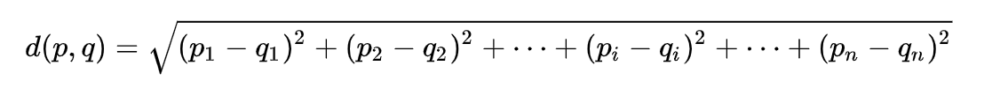
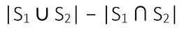

# Домашно 2

## **Board Games Recommendation Engine** :chess_pawn:

`Краен срок: 09.01.2022, 23:45`

[Препоръчващите системи](https://en.wikipedia.org/wiki/Recommender_system) са станали неизменна част от ежедневието ни и почти всички интернет услуги, до които имаме достъп, било то социални мрежи, онлайн магазини или стрийминг платформи, ги използват.

Както повечето програмисти, екипът на MJT също обичаме да играем бордови игри, но често не знаем какво точно ни се играе.
Задачата този път е да направим своя собствена препоръчваща система за бордови игри.

### **Данни**

Отново ще използваме предварително обработен dataset от [kaggle](https://www.kaggle.com/gabrio/board-games-dataset), съдържащ над 12.000 бордови игри от сайта [BoardGameGeek](https://www.boardgamegeek.com/), който може да свалите от [тук](data/data.zip) - той е под формата на zip-нат `.csv` файл.

**В имплементацията си, ще трябва програматично да четете директно от `.zip` файла.**

Ще се ограничим до следните атрибути на игрите:

* `id` - уникален идентификатор на играта
* `details.name` - име на играта
* `details.description` - описание на играта
* `details.playingtime` - време за игра в минути
* `details.maxplayers` - максимален брой играчи
* `details.minage` - минимална възраст на играчите
* `details.minplayers` - минимален брой играчи
* `attributes.boardgamecategory` - списък от категории, към които се отнася играта, разделени със запетая
* `attributes.boardgamemechanic` - игровата механика, като множество елементи, разделени със запетая

Примерни редове от файла:
```
id;details.maxplayers;details.minage;details.minplayers;details.name;details.playingtime;attributes.boardgamecategory;attributes.boardgamemechanic;details.description
31;5;10;2;Dark World;90;Adventure,Exploration,Fantasy,Fighting,Miniatures;Dice Rolling,Grid Movement;Along the lines of HeroQuest comes a much more heavily produced game called Dark World. One player is the evil lord who controls the dungeon in which the rest of the players move their characters from room to room, fighting monsters and gaining treasure. Real working treasure chests with magic weapons inside and the figures even get to put their new weapons in their character's hands...
33;8;12;1;Arkham Horror;180;Adventure,Horror,Novel-based;Co-operative Play;Arkham Horror is a cooperative adventure game themed around H.P Lovecraft's Cthulhu Mythos.  The game has players exploring the town of Arkham as they attempt to stop unmentionable horrors from spilling into the world. It's possible for everyone to go insane and lose in this game...Re-implemented in:..Arkham Horror (2005)..
```

### **Similarity**

Най-простичкият алгоритъм за намиране на степен на подобност е [K-Nearest Neighbors](https://en.wikipedia.org/wiki/K-nearest_neighbors_algorithm). Там имаме дадени dataset с елементи и елемент, на който търсим подобни.
Логиката е следната:
- Представяме си, че всеки ред от dataset-a е точка в N-мерното пространство (N = брой на атрибутите)
- Използваме функция за пресмятане на разстоянието от елемента, на който търсим подобни, до всеки един елемент от dataset-a
- Избираме K-те най-близки елементи: с distance, възможно най-близко до 0

При атрибути, които имат стойности, които са част от изброимо множество, обикновено използваме т.нар. [one hot encoding](https://hackernoon.com/what-is-one-hot-encoding-why-and-when-do-you-have-to-use-it-e3c6186d008f). В случая, няма да го правим - ще можете да го упражните в някой курс по Изкуствен Интелект.

В алгоритъма, който ще реализираме, ще пресмятаме близостта на базата на числовите и типизираните атрибути на бордовите игри:

1. разстоянието за числените атрибути (`details.playingtime`, `details.maxplayers`, `details.minage` и `details.minplayers`) се смята по класическия начин чрез [Евклидово разстояние](https://en.wikipedia.org/wiki/Euclidean_distance):



2. за типизираните атрибути (`attributes.boardgamecategory` и `attributes.boardgamemechanic`) ще използваме формула, базирана на броя съвпадащи елементи и общия брой елементи: разликата между мощността на обединението и мощността на сечението на двете множества:



Общото разстояние се пресмята като съберем разстоянията спрямо числените и спрямо типизираните атрибути.

### **Търсене по ключови думи**

Ще дадем възможност и за търсене на бордова игра по ключови думи от описанието ѝ. За разделители между думите в описанието, приемаме whitespaces и пунктуационните символи (може да използвате следния regex: `"[\\p{IsPunctuation}\\p{IsWhite_Space}]+"`). Всяка дума се състои от поне един символ. При търсенето, пренебрегваме разликата в капитализацията на буквите.

За да се увеличи качеството на търсенето по ключови думи, този тип алгоритми обикновено пренебрегват определено множество от думи, които носят твърде малко семантика и внасят "щум": т.нар. *стоп думи*: определителни членове, местоимения, предлози, съюзи и т.н. Няма еднозначна дефиниция (или речник), коя дума е stopword в даден език. В нашия алгоритъм, ще ползваме списъка от 174 stopwords в английския език, записани по една на ред в текстовия файл [stopwords.txt](data/stopwords.txt), който сме заимствали от сайта [ranks.nl](https://www.ranks.nl/stopwords).

При търсене по ключови думи, ще пренебрегваме евентуалните срещания на стоп думи, както в множеството думи, по които търсим, така и в описанията на игрите.

### **Индекс**

Тъй като в подобна система, търсенето по ключови думи трябва да бъде много ефективно, ще поддържаме индекс, чрез който по дадена дума да намираме бързо множеството от игри, които я съдържат в описанието си. Индексът съдържа всички думи, срещащи се в описанията на игрите, с изключение на stopwords. Индексът ще се съхранява в подходяща структура в паметта, а ще има възможност и да се запазва в текстов формат, например във файл.

### **Board Games Recommender**

Създайте класа `BoardGamesRecommender`, който ще върши същинската работа на една препоръчваща система. Той има два публични конструктора:

```java
/**
* Constructs an instance using the provided file names.
*
* @param datasetZipFile  ZIP file containing the board games dataset file
* @param datasetFileName the name of the dataset file (inside the ZIP archive)
* @param stopwordsFile   the stopwords file
*/
BoardGamesRecommender(Path datasetZipFile, String datasetFileName, Path stopwordsFile)
```
и

```java
/**
* Constructs an instance using the provided Reader streams.
*
* @param dataset   Reader from which the dataset can be read
* @param stopwords Reader from which the stopwords list can be read
*/
BoardGamesRecommender(Reader dataset, Reader stopwords)
```

и имплементира следния интерфейс:

```java
package bg.sofia.uni.fmi.mjt.boardgames.recommender;

import bg.sofia.uni.fmi.mjt.boardgames.BoardGame;

import java.io.Writer;
import java.util.Collection;
import java.util.List;

public interface Recommender {

    /**
     * @return all board games in the dataset as an unmodifiable view.
     */
    Collection<BoardGame> getGames();

    /**
     * @param game the game we want the recommendation to be based on
     * @return a list of top n similar games to the provided one, ordered in descending order by their match.
     * Note that the game passed as argument should not be part of the result, even if present in the dataset.
     * The returned games share at least one common category. The similarity metric is described in the assignment.
     * In case of ties, the relative order of the respective games with equal match according to the metric, is undefined.
     */
    List<BoardGame> getSimilarTo(BoardGame game, int n);

    /**
     * @param keywords the keywords to search for in games' description
     * @return a list of games with description containing at least one of the provided keywords, ordered by
     * decreasing number of matching keywords.
     * In case of ties, the relative order of the respective games with equal number of matching keywords is undefined.
     */
    List<BoardGame> getByDescription(String... keywords);

    /**
     * Stores the game index to a Writer, representing a persistent storage.
     * Each line in the output contains a word and the list of game IDs and has the following format:
     * <word1>: <gameId11>, <gameId12>,..., <gameId1N>
     * <word2>: <gameId21>, <gameId22>, ..., <gameId2N>
     * The capitalization of words, the order of words and the order of game IDs per word are all undefined.
     * 
     * @param writer the writer stream to output the index to
     */
    void storeGamesIndex(Writer writer);

}
```

където `BoardGame` моделира ред от dataset-a:

```java
public record BoardGame(int id, String name, String description, int maxPlayers, int minAge, int minPlayers,
                        int playingTimeMins, Collection<String> categories, Collection<String> mechanics) {
    // [...]
}
```

и има публичен каноничен конструктор.

### **Board Games Statistics Analyzer**

Създайте клас `BoardGamesStatisticsAnalyzer`, който анализира метрики на dataset-a, който използваме.
Той има публичен конструктор `BoardGamesStatisticsAnalyzer(Collection<BoardGame> games)` и имплементира следния интерфейс:

```java
package bg.sofia.uni.fmi.mjt.boardgames.analyzer;

import java.util.List;
import java.util.Map;

public interface StatisticsAnalyzer {

    /**
     * @param n the max number of categories we should return. If n > categories count, returns all categories.
     * @return the most popular games categories in the dataset.
     */
    List<String> getNMostPopularCategories(int n);

    /**
     * @return the average minimal age to play among the games in the dataset.
     * In case the dataset contains no games, returns 0.0.
     */
    double getAverageMinAge();

    /**
     * @param category the category name.
     * @return the average playtime for the games in the given category.
     * In case there are no games in the specified category, returns 0.0
     */
    double getAveragePlayingTimeByCategory(String category);

    /**
     * @return the average playtime for all game categories - the map key matches a category name.
     */
    Map<String, Double> getAveragePlayingTimeByCategory();

}
```

### **Тестване**

Създайте автоматични тестове, с които да тествате решението си.

### **Структура на проекта**

Спазвайте имената на пакетите на всички по-горе описани класове, тъй като в противен случай решението ви няма да може да бъде тествано от грейдъра.

```
src
└─ bg.sofia.uni.fmi.mjt.boardgames
    ├── analyzer
    │      ├─ BoardGamesStatisticsAnalyzer.java
    │      ├─ StatisticsAnalyzer.java
    │      └─ (...)
    ├── recommender
    │      ├─ BoardGamesRecommender.java
    │      ├─ Recommender.java
    ├── BoardGame.java
    └── (...)
test
└─ bg.sofia.uni.fmi.mjt.boardgames
    └── (...)
```

### **Предаване**

За да предадете решението си, архивирайте в **zip** архив **src** и **test** папките на проекта и го качете в съответния assignment в грейдъра.

✒️ *Бележка*:  Grader-ът има upload size limit на submission-ите от 3 MB - т.е. няма да може да качите оригиналните data и stopwords файлове като част от вашите тестове. Препоръчваме ви да тествате с малка извадка от думи/стоп-думи, ако ползвате статични файлове. Ако пакетирате статични файлове за тестване, те трябва да се намират в корена на архива на проекта (т.е. на едно ниво със `src` и `test` директориите). Най-лесно бихте тествали с входно-изходни потоци с алтернативен източник/дестинация на данните, вместо файлове.

### **Оценяване**

Решението може да ви донесе до 100 точки, като ще бъде оценявано за:

* функционална пълнота и коректност, и за автоматични тестове с добър code coverage (50% от оценката)
* добър обектно-ориентиран дизайн, спазване на правилата за чист код и подбиране на оптимални за задачата структури от данни (50% от оценката: 10% от инструментите за статичен код анализ на грейдъра и 40% от code review от асистент)

**Успех!** :four_leaf_clover:
